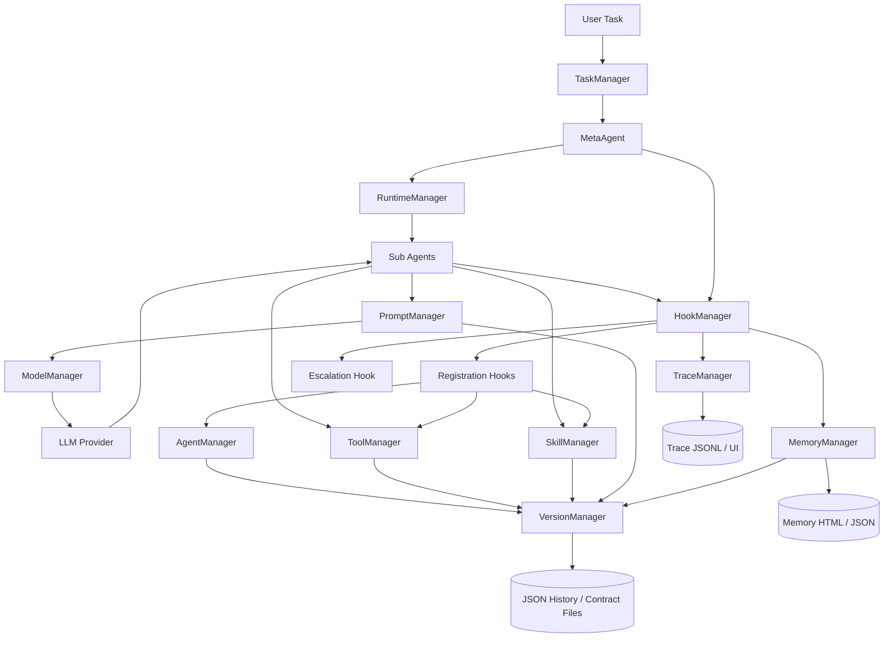

# AgentEvolver 项目设计说明

本文档基于当前代码库整理，目标是说明 AgentEvolver 的总体设计、核心运行链路、全局自演化闭环，以及各模块之间的边界。

## 1. 项目定位

AgentEvolver 是一个自演化多智能体框架。它的核心思路是：

1. 用 `MetaAgent` 作为全局编排器，把用户任务拆成可并行或串行执行的子任务。
2. 用不同类型的子 Agent 执行任务，包括通用推理、代码修改、生成、评估和优化。
3. 把工具、Agent、Skill、Prompt、Memory、Environment 等能力统一纳入 Manager + Context + Config + Version 的生命周期。
4. 通过 Hook、Trace、Memory、Constraint、Permission 等横向机制，为每一步执行提供观测、记忆、安全和资源限制。
5. 通过 Generator/Evaluator/Optimizer Agent 让系统可以生成新能力、评估能力质量、优化已有能力，并把演化结果持久化到版本历史中。

这里的“全局自演化”不是单个 Agent 自己改自己，而是由全局编排器调度一组专门的演化 Agent，对工具生态、Agent 生态和 Skill 生态进行生成、验证、注册和版本化。

## 2. 设计目标

### 2.1 可组合

项目把能力拆成多个协议层：

- Agent 负责决策和任务执行。
- Tool 负责可调用的具体动作。
- Skill 负责可复用的 SOP、资料包和脚本说明。
- Prompt 负责 Agent 的运行协议。
- Memory 负责会话状态和上下文续写。
- Hook 负责横向副作用。
- Trace 负责事件流和可观测性。
- Constraint 负责资源预算。
- Permission 负责安全授权。
- Environment 负责外部交互环境，例如浏览器。

这些组件都通过对应的 Manager 统一注册、调用、持久化和版本管理。

### 2.2 可持久化演化

生成出来的工具、Agent、Skill 和 Prompt 不只存在于当前进程。项目会把组件配置、源码字符串、版本历史和 contract 写入 `work_dir/.../default/...` 下的 JSON 和 Markdown 文件。下次启动时，Manager 会同时加载内置注册表和 JSON 历史，并用版本号决定是否使用演化版本。

### 2.3 事件驱动可观测

Agent 每次启动、思考、动作、停止都会经由 Hook 转换为 `TraceEvent`。Trace 是原始事实流，Memory 则把事实流投影成 Todo、Flow Chart、Recent History、Working Memory 和 Final Result。

### 2.4 受控执行

工具调用、文件读写、Bash 执行、资源预算都被集中控制：

- `PermissionManager` 按实体权限模式检查操作。
- `ConstraintManager` 在每个 Agent step 前检查步数、token、墙钟时间。
- `HookManager` 可以在 action 前后拦截、记录或阻断。

## 3. 目录结构总览

```text
AgentEvolver/
├── PROJECT.md                 # 现有项目概览
├── PROJECT_DESIGN.md          # 本设计说明
├── configs/                   # mmengine 配置
│   ├── base.py
│   ├── meta_agent.py          # 主入口配置
│   ├── agents/                # 各 Agent 配置片段
│   ├── tools/                 # 各 Tool 配置片段
│   └── memory/                # Memory 配置片段
├── examples/                  # 可运行入口脚本
│   ├── run_meta_agent.py
│   ├── run_tool_generate_agent.py
│   ├── run_agent_generate_agent.py
│   └── ...
├── src/
│   ├── agent/                 # Agent 协议、Manager、内置 Agent
│   ├── tool/                  # Tool 协议、Manager、内置工具
│   ├── skill/                 # Skill 协议、Manager、默认 Skill
│   ├── prompt/                # Prompt 协议、HTML 模板
│   ├── memory/                # Memory 协议和两层记忆系统
│   ├── hook/                  # Hook 协议和默认 Hook
│   ├── trace/                 # Trace 事件、JSONL 写入和 Web UI
│   ├── runtime/               # AgentRef mailbox 和事件泵
│   ├── task/                  # 顶层任务队列和调度器
│   ├── version/               # 版本历史
│   ├── dynamic/               # 动态源码加载和 schema 生成
│   ├── constraint/            # 资源约束
│   ├── permission/            # 权限控制
│   ├── model/                 # 模型客户端统一入口
│   ├── environment/           # 环境协议，当前包含浏览器环境
│   └── registry.py            # mmengine Registry 定义
└── tests/                     # 运行时、Prompt、模型、浏览器等测试
```

## 4. 总体架构



架构上可以分成四层：

1. 入口调度层：`TaskManager`、`RuntimeManager`、`MetaAgent`。
2. 能力执行层：各种 Agent、Tool、Skill、Environment。
3. 组件治理层：Agent/Tool/Skill/Prompt/Memory/Constraint/Environment Manager。
4. 横向基础设施层：Model、Hook、Trace、Memory、Version、Dynamic、Permission、Config。

## 5. 启动流程

主入口是 `examples/run_meta_agent.py`，默认配置是 `configs/meta_agent.py`。

启动顺序大致如下：

1. `config.initialize()` 读取 mmengine 配置，并规范化 `work_dir`、`default_dir`、日志路径等。
2. `logger.initialize()` 初始化日志。
3. `version_manager.initialize()` 创建版本历史目录。
4. `trace_manager.initialize()` 和 `trace_manager.start()` 启动 TraceWriter 和 Web UI。
5. `hook_manager.initialize()` 发现并实例化默认 Hook。
6. `model_manager.initialize()` 注册各 Provider 模型。
7. `prompt_manager.initialize()` 加载 HTML Prompt 模板。
8. `memory_manager.initialize()` 加载 Memory 系统。
9. `tool_manager.initialize()` 加载 Tool。
10. `skill_manager.initialize()` 加载 Skill。
11. `agent_manager.initialize()` 加载 Agent。
12. 创建 `SessionContext`。
13. 启动 `TaskManager` worker。
14. 提交用户任务。
15. `TaskManager` 调用 `agent_manager(name="meta_agent", ...)`。

`configs/meta_agent.py` 里配置了主流程需要的组件：

- Agents: `meta_agent`、`code_agent`、`reason_act_agent`、`tool_generate_agent`、`tool_evaluate_agent`、`tool_optimize_agent`。
- Tools: `bash_tool`、`done_tool`、读写编辑文件、目录列表、git。
- Memory: `file_system_memory`。
- Model: 默认走 `int_openrouter/gemini-3.1-pro-preview`。

## 6. 核心组件协议

项目大部分模块都遵循同一种生命周期模式：

```text
Base Type
  ├── Config: 描述组件、源码、schema、版本、实例配置
  ├── Context: 调用时上下文
  ├── ContextManager: 发现、构建、注册、更新、持久化
  └── ManagerServer: 对外单例门面
```

| 组件 | Base Type | Manager | 持久化 | 主要职责 |
| --- | --- | --- | --- | --- |
| Agent | `Agent` | `agent_manager` | `agent.json`、`contract.md` | 决策、调用工具和技能、完成任务 |
| Tool | `Tool` | `tool_manager` | `tool.json`、`contract.md` | 原子动作，例如 Bash、读写文件 |
| Skill | `SkillConfig` | `skill_manager` | `skill.json`、`contract.md` | 可复用 SOP 和资料包 |
| Prompt | `Prompt` | `prompt_manager` | `prompt.json`、`contract.md` | HTML Prompt 渲染 |
| Memory | `Memory` | `memory_manager` | `memory.json`、会话 HTML/JSON | 会话记忆和状态投影 |
| Hook | `Hook` | `hook_manager` | 内存注册 | 横向事件处理 |
| Constraint | `Constraint` | `constraint_manager` | `constraint.json`、`contract.md` | 步数、token、时间限制 |
| Environment | `Environment` | `environment_manager` | `environment.json`、`contract.md` | 外部环境交互 |
| Model | `ModelConfig` | `model_manager` | 内存注册 | LLM Provider 统一调用 |
| Task | `TaskRecord` | `task_manager` | `tasks.json`、`tasks_archive.json` | 顶层任务调度 |
| Trace | `TraceEvent` | `trace_manager` | JSONL、`index.json` | 执行事件流和 Web UI |

这个模式带来的好处是：新增能力时，只要实现对应 Base Type 并注册到 `src/registry.py` 中的 Registry，就能被 Manager 发现、写入 contract、暴露给 Prompt，并纳入版本管理。

## 7. Agent 设计

### 7.1 AgentContext

`AgentContext` 是 Agent 调用时的上下文，关键字段包括：

- `id`: 本次 Agent 调用的唯一 ID。
- `name`: 调用名。
- `work_dir`: 文件工具和 git 工具使用的工作目录。
- `input`: 输入 payload。
- `extra`: 扩展字段。
- `parent_session_id`: 父 MetaAgent 的 runtime ref 名称，用于 Trace 和升级求助。
- `subtask_id`: 当前子任务在 MetaAgent 计划里的 ID。

### 7.2 AgentConfig

`AgentConfig` 记录 Agent 的运行和演化信息：

- 基本信息：`name`、`description`、`metadata`。
- 版本信息：`version`、`require_grad`。
- 权限信息：`permission_mode`。
- 运行信息：`cls`、`config`、`instance`。
- 动态信息：`code`。
- Prompt/工具可调用表示：`function_calling`、`text`、`args_schema`。

其中 `code` 是动态演化的关键。Manager 会把 Agent 源码序列化到 JSON，之后通过 `dynamic_manager.load_class()` 恢复类。

### 7.3 Agent 基类的两条执行路径

`Agent` 基类同时支持直接调用和事件驱动：

1. 直接调用路径：子类实现 `__call__()`。
2. 事件驱动路径：子类实现 `on_start()`、`on_event()`、`on_stop()`，由 runtime mailbox 驱动。

框架层的 `handle(msg, ref)` 会接收 runtime 消息：

- `TaskMessage` 触发 `on_start()`。
- 其他消息触发 `on_event()`。
- 如果 `on_start()` 返回 Response，则自动设置 reply future 并调用 `on_stop()`。
- 如果返回 `None`，说明该 Agent 会异步完成，例如 `MetaAgent` 和 `MonitorAgent`。

### 7.4 通用 think-and-act 循环

大多数工具调用型 Agent 复用 `Agent._think_and_act()`：

```text
step start
  -> 检查 Constraint
  -> trace_hook PRE_STEP
  -> 调用 ModelManager，要求输出 AgentThinkOutput
  -> 解析 reasoning 和 plan
  -> 对每个 plan step 执行动作
       -> trace_hook PRE_ACTION
       -> action.type == text: 返回文本
       -> action.type == skill: skill_manager(...)
       -> action.type == tool: tool_manager(...)
       -> done_tool: 标记任务完成
       -> memory_hook POST_ACTION
       -> trace_hook POST_ACTION
  -> memory_hook POST_STEP
  -> trace_hook POST_STEP
  -> 记录本 step token 用量
step end
```

Agent 的结构化输出是 `AgentThinkOutput`：

```json
{
  "reasoning": "Past / Present / Future reasoning",
  "plan": [
    {
      "description": "One-line action description",
      "action": {
        "type": "tool | skill | text",
        "name": "exact tool or skill name",
        "args": "{\"json\": \"string\"}"
      }
    }
  ]
}
```

`done_tool` 是完成信号。它返回 `Response(type=TOOL, success=True, message=result, data={"reasoning": ..., "result": ...})`，Agent 循环看到 `done_tool` 后结束。

### 7.5 内置执行型 Agent

主要内置 Agent 包括：

- `ReasonActAgent`: 通用推理和工具/技能调用 Agent。
- `CodeAgent`: 面向代码仓库读写、测试和 git 操作的 Agent。
- `MonitorAgent`: 启动长时间 Bash 子进程，并定期向父 MetaAgent 发送进度。
- `MetaAgent`: 全局编排器。

`ReasonActAgent` 和 `CodeAgent` 都是标准 think-and-act Agent，只是在 Prompt 和上下文中强调的任务类型不同。

## 8. MetaAgent 编排设计

`MetaAgent` 是系统的全局调度中心。它不直接调用工具，也不直接写代码，而是输出结构化的编排决策。

### 8.1 MetaAgent 状态

一次 MetaAgent 调用会创建一个隔离的 `MetaState`：

- `session_id`: runtime ref 名称。
- `user_task`: 用户原始任务。
- `user_files`: 用户附带文件。
- `plan`: round 级执行计划。
- `subtask_records`: 子任务状态表。
- `final_answer`: 最终回答。
- `_running_tasks`: 正在执行的 asyncio Task。
- `_pending_escalations`: 等待回复的升级求助。
- `_events_since_think`: 上次思考后发生的新事件。
- `_available_agents`: 当前可调度子 Agent 列表。
- `_project_context`: 从 `PROJECT.md` 读取的项目背景。

### 8.2 Round 计划模型

MetaAgent 的计划是有序 round：

```text
Round 1
  - task A
  - task B

Round 2
  - task C
```

规则是：

- round 按顺序执行。
- 同一个 round 内的任务并发执行。
- 只有当前 round 的所有任务进入终态后，才启动下一个 round。
- replanning 只替换尚未启动的 pending round，不会重写已完成或正在运行的 round。

每个子任务包括：

- `name`: 精确的子 Agent 名。
- `category`: `actor`、`evaluator`、`optimizer` 或 `generator`。
- `task`: 给子 Agent 的自包含指令。
- `files`: 传入的已有文件路径。
- `target_name`: 生成、评估或优化目标名。

### 8.3 事件驱动调度

`MetaAgent.__call__()` 实际调用 `runtime_manager.invoke(self, ...)`。Runtime 会 spawn 一个 `AgentRef`，并用 `_pump()` 循环消费 mailbox。

`MetaAgent.on_start()` 做初始化，然后执行第一次 `_think_and_act()` 生成初始计划。

子任务完成后，`_run_subtask()` 会向父 ref 的 inbox 投递：

- `SubtaskDoneMessage`
- `SubtaskFailedMessage`
- `EscalationMessage`
- `MonitorProgressMessage`

`MetaAgent.on_event()` 根据事件更新 `MetaState`，然后在合适的边界重新思考：

- 子任务完成或失败：更新 record 和 Trace/Memory。
- 当前 round 仍在运行且没有升级求助：暂不 replan。
- round 完成：调用模型生成下一轮计划或停止。
- 发生升级求助：立即思考并回复子 Agent。
- 进度更新：只更新状态，不触发 replan。

### 8.4 MetaAgent 输出协议

MetaAgent 的结构化输出是 `MetaReactOutput`：

```json
{
  "reasoning": "Past / Present / Future",
  "decision": "continue | stop",
  "plan": [
    {
      "goal": "Round goal",
      "tasks": [
        {
          "name": "exact_agent_name",
          "category": "actor | evaluator | optimizer | generator",
          "task": "self-contained instruction",
          "files": [],
          "target_name": null
        }
      ]
    }
  ],
  "escalation_replies": [
    {
      "task_id": "exact task id",
      "reply": "guidance"
    }
  ],
  "final_answer": ""
}
```

`decision == "stop"` 时，MetaAgent 汇总最终结果并结束 runtime ref。

## 9. 全局自演化闭环

自演化由三类专用 Agent 组成，覆盖 Tool、Agent、Skill 三种能力对象。

| 能力对象 | 生成 Agent | 评估 Agent | 优化 Agent |
| --- | --- | --- | --- |
| Tool | `tool_generate_agent` | `tool_evaluate_agent` | `tool_optimize_agent` |
| Agent | `agent_generate_agent` | `agent_evaluate_agent` | `agent_optimize_agent` |
| Skill | `skill_generate_agent` | `skill_evaluate_agent` | `skill_optimize_agent` |

### 9.1 生成流程

以 Tool 生成为例：

```text
MetaAgent 发现需要新工具
  -> 派发 tool_generate_agent，带 target_name
  -> tool_generate_agent 先调用 generate_tool_skill
  -> skill 返回生成说明和模板路径
  -> Agent 写入 src/tool/extended/{target_name}.py
  -> 运行 py_compile 或其他验证
  -> 调用 done_tool，并在 reasoning 中包含生成文件路径
  -> tool_registration_hook 解析路径
  -> dynamic_manager.load_class(code, context="tool")
  -> tool_manager.register() 或 tool_manager.update()
  -> version_manager 记录新版本
  -> tool.json 和 contract.md 更新
```

Agent 生成类似，但目标文件更多：

- `src/agent/extended/{target_name}.py`
- `src/prompt/extended/{target_name}.html`，仅工具调用型 Agent 需要。
- `configs/agents/{target_name}.py`

Skill 生成的目标是目录：

```text
src/skill/extended/{skill_name}/
├── SKILL.md
├── resources/
├── scripts/
├── references/
└── examples/
```

Skill 不是 Python 类，而是可注入给 Agent 的 Markdown 指令、资料、脚本和参考文件。

### 9.2 评估流程

Evaluator Agent 只观察和报告，不修改目标。

例如 `tool_evaluate_agent` 会：

1. 读取目标工具源码。
2. 写一个综合评估脚本到 `work_dir`。
3. 测试 correctness、robustness、interface compliance、code quality、performance。
4. 输出分项评分、失败证据和优化建议。

Agent 和 Skill 的评估也是同样思路：读取目标、验证结构、执行样例或检查质量，最后生成报告。

### 9.3 优化流程

Optimizer Agent 用于改进已经存在的组件。典型流程：

```text
MetaAgent 派发 optimizer task
  -> Optimizer 检查 target_name
  -> Manager 确认目标存在
  -> 检查 require_grad
  -> 读取目标源码或 SKILL.md
  -> 做最小必要修改
  -> 运行验证
  -> done_tool
  -> registration_hook 重新注册
  -> 版本号递增
```

`require_grad` 是是否允许被优化的开关。内置基础能力通常设置为 `False`，生成出来的能力可以设置为 `True`，从而进入演化范围。

### 9.4 版本选择策略

Manager 初始化时会加载两类来源：

1. 内置 Registry 中的类，例如 `@TOOL.register_module()` 或 `@AGENT.register_module()`。
2. JSON 历史中的动态源码版本。

合并规则是：

- 如果 JSON 中同名组件版本号严格大于内置版本，则使用 JSON 动态版本。
- 如果版本号相同或更低，则保留内置版本。
- 如果 JSON 中有内置不存在的新组件，则加载该动态组件。

因此，自演化结果可以覆盖内置实现，但必须通过版本号表达“更新”。

## 10. Manager 和动态加载

### 10.1 Registry 发现

`src/registry.py` 定义了全局 Registry：

```python
MEMORY_SYSTEM = Registry("memory_system", locations=["src.memory"])
TOOL = Registry("tool", locations=["src.tool"])
AGENT = Registry("agent", locations=["src.agent"])
PROMPT = Registry("prompt", locations=["src.prompt"])
SKILL = Registry("skill", locations=["src.skill"])
HOOK = Registry("hook", locations=["src.hook"])
CONSTRAINT = Registry("constraint", locations=["src.constraint"])
ENVIRONMENT = Registry("environment", locations=["src.environment"])
```

各 ContextManager 在 initialize 时 import 对应包，触发注册装饰器，然后从 Registry 读取类列表。

### 10.2 动态类加载

`DynamicModuleManager` 提供：

- 从源码字符串创建虚拟 Python module。
- 从源码中提取 class name。
- 验证类是否继承指定 Base Type。
- 根据上下文自动注入 `Tool`、`Agent`、`Response`、Registry 等符号。
- 从类签名提取参数 schema。
- 生成 OpenAI-compatible function calling 表示。
- 序列化和反序列化 Pydantic args schema。

这个模块让生成出来的源码不必立即成为 Python 包的一部分，也可以在 JSON 历史中恢复为可运行类。

### 10.3 Contract 文件

每个 Manager 都会生成 `contract.md`。Contract 是面向 Prompt 的能力清单，通常包含组件名称、描述、参数 schema 或文本表示。

Agent 在构造 Prompt 时会把工具和技能 contract 注入上下文：

- `### Available Tools`
- `### Available Skills`

这让模型只能看到当前真正加载的能力，而不是凭空猜测工具名。

## 11. Prompt 系统

Prompt 使用 HTML 文件描述。每个文件包含：

- `<meta name="name">`
- `<meta name="description">`
- `<meta name="version">`
- `<meta name="require_grad">`
- `<div class="system">`
- `<div class="user">`

`PromptContextManager` 会扫描：

- `src/prompt/default/*.html`
- `src/prompt/extended/*.html`
- JSON 历史中的 prompt 版本

然后使用 Jinja2 渲染 system 和 user message。

Agent 调用 `_get_messages()` 时会传入：

- `system_modules`: `project_root`、`work_dir`、`max_actions` 等。
- `agent_modules`: `agent_context`、`tool_context`、`skill_context`、目标信息等。

Prompt 是 Agent 行为的协议层。比如：

- `meta_agent.html` 定义 round 编排规则。
- `reason_act_agent.html` 定义通用 think-and-act 输出格式。
- `tool_generate_agent.html` 要求先调用 `generate_tool_skill`。
- `tool_evaluate_agent.html` 定义五维评估标准。
- `tool_optimize_agent.html` 定义读源文件、最小编辑、验证、完成的优化流程。

## 12. Tool 系统

`Tool` 是可调用的原子动作。每个 Tool 实现 async `__call__()`，返回统一 `Response`。

`ToolConfig` 会保存：

- 工具名、描述、版本、权限模式。
- Python 类、初始化配置、实例。
- 源码字符串和源文件路径。
- function calling schema、文本表示和 args schema。

默认工具包括：

- `bash_tool`: 执行 Bash 命令。
- `done_tool`: 标记任务完成。
- `read_file_tool`: 读文件并附带行号。
- `write_file_tool`: 新建或覆盖文件。
- `edit_file_tool`: 精确字符串替换。
- `list_dir_tool`: 列目录。
- `git_tool`: 在工作目录内执行 git 操作。
- `grep_search_tool`、`glob_search_tool`、`mdify_tool` 等辅助工具。

工具调用路径：

```text
Agent plan step
  -> tool_manager(name, input, ctx)
  -> ToolContextManager.__call__()
  -> 取出 Tool 实例
  -> 执行 __call__(**input, ctx=ctx)
  -> 返回 Response
```

## 13. Skill 系统

Skill 是 Markdown 化的可复用工作流，不是 Tool 类。一个 Skill 目录必须包含 `SKILL.md`，可以包含：

- `scripts/`: 可执行脚本。
- `resources/`: 运行时资源。
- `references/`: 模板、规范、参考文档。
- `examples/`: 使用样例。

`SkillManager` 执行 Skill 时不会直接运行脚本，而是返回包含 SKILL.md 内容和资源路径的 instructions。随后 Agent 根据 instructions 再用工具执行。

默认 Skill 包括：

- `generate_tool_skill`
- `generate_agent_skill`
- `generate_skill_skill`
- `hello_world_skill`

这种设计把“过程知识”和“执行能力”分开：

- Tool 是原子能力。
- Skill 是如何组合能力完成任务的 SOP。

## 14. Runtime 和 TaskManager

### 14.1 RuntimeManager

Runtime 是轻量 mailbox 层。核心对象是 `AgentRef`：

- `name`: runtime ref 名称。
- `agent_name`: 对应 Agent 名。
- `status`: running/stopping/stopped/dead。
- `_inbox`: asyncio.Queue。
- `_pump_task`: 消费队列的后台任务。
- `_pending_reply`: 当前等待回复的 future。

`RuntimeManager` 支持：

- `spawn(agent, name=...)`
- `send(ref, msg)`
- `ask(ref, msg, timeout=...)`
- `invoke(agent, ...)`
- `stop(ref)`
- `shutdown()`

`invoke()` 是一次性调用：spawn -> ask TaskMessage -> stop。

### 14.2 TaskManager

`TaskManager` 是顶层任务调度器，使用 asyncio priority queue。它支持两类任务：

- `USER`: 用户任务，优先级更高。
- `EVOLVER`: 自演化任务，带 `entity_key` 限流，避免同一实体同时触发多个优化任务。

`TaskRecord` 包含：

- `Task`
- category
- entity_key
- depends_on
- result/error
- retry_count
- started_at/finished_at

当前主入口把用户任务提交到 TaskManager，并设置 handler 为调用 MetaAgent。

## 15. Hook 系统

Hook 是 Agent 执行过程中的横向扩展点。事件类型定义在 `HookEvent`：

- `ON_START`
- `ON_STOP`
- `PRE_STEP`
- `POST_STEP`
- `PRE_ACTION`
- `POST_ACTION`
- `ON_ESCALATE`
- `ON_CALL`
- `PRE_MESSAGES`

默认 Hook 包括：

- `trace_hook`: 把 Agent 生命周期和 action 转换成 TraceEvent。
- `memory_hook`: 把 TraceEvent 写入 Memory。
- `compact`: 对历史记录做摘要压缩。
- `escalation_hook`: 子 Agent 卡住时向父 MetaAgent 求助。
- `tool_registration_hook`: 生成或优化 Tool 后自动注册。
- `agent_registration_hook`: 生成或优化 Agent 后自动注册，并尝试注册 HTML Prompt。
- `skill_registration_hook`: 生成或优化 Skill 后自动注册。

Hook 返回 `HookResult`：

- `ALLOW`: 继续。
- `BLOCK`: 阻断。
- `MODIFY`: 修改消息或 action。
- `additional_context`: 注入下一轮上下文。
- `output`: request/response 型 Hook 的文本输出，例如 compact 摘要。

## 16. Trace 和 Memory

### 16.1 Trace

Trace 的基本单元是 `TraceEvent`：

- Agent lifecycle: `AGENT_START`、`AGENT_CALL`、`AGENT_END`
- Tool lifecycle: `TOOL_START`、`TOOL_CALL`、`TOOL_END`
- Skill lifecycle: `SKILL_START`、`SKILL_CALL`、`SKILL_END`
- `ERROR`
- `CUSTOM`

`TraceManager` 负责：

- 创建事件队列。
- 启动 `TraceWriter`。
- 启动 FastAPI + WebSocket UI。
- 非阻塞 emit 事件。

`TraceWriter` 按 session 写 JSONL：

```text
work_dir/<tag>/default/trace/
├── index.json
└── <session_id>.jsonl
```

Trace UI 默认端口是 `8765`。

### 16.2 Memory

Memory 使用 TraceEvent 作为输入。`TieredMemory` 是共享状态机，派生出：

- `GeneralMemorySystem`: JSON 持久化。
- `FileSystemMemory`: HTML 持久化。

每个 session 会维护：

- `todos`: 子任务和 step 的 todo 列表。
- `flow_steps`: round 和 action 的流程图。
- `recent`: 有界近期历史。
- `working`: 压缩后的工作记忆。
- `final_result`: 最终结果。

当 recent 超过阈值时，Memory 会调用 `compact` hook 把旧记录压缩为 working memory。Agent 下一步构造 Prompt 时，会从 Memory 读取最近历史和工作记忆，从而避免重复输出已经执行过的 plan。

MetaAgent 的 `subtask_planned`、`subtask_dispatch`、`subtask_done`、`subtask_failed` 等事件会被 Memory 投影成 Todo 和 Flow Chart。

## 17. Constraint 资源约束

Constraint 用于防止任务无限执行。当前默认约束包括：

- `StepConstraint`: 限制 think-and-act step 数。
- `TokenConstraint`: 限制累计 LLM token。
- `WallTimeConstraint`: 限制总墙钟时间。

Agent 初始化时可以传入：

- `max_step`
- `max_token`
- `timeout`
- `constraints`

每个 step 前，Agent 会调用 ConstraintManager。检查结果里的 `ConstraintStatus` 会被渲染到 Prompt 的 `### Constraint Rules` 中，让模型知道预算余量。

当预算状态超过阈值时，Prompt 会引导 Agent 收缩范围或立刻结束：

- NORMAL: 正常执行。
- TIGHT: 停止扩展范围，优先完成关键路径。
- CRITICAL: 立即整理当前结果并结束。

## 18. Permission 权限控制

权限系统对实体统一生效，实体包括 Tool、Agent、Skill 等。

权限模式：

- `read_only`
- `workspace_write`
- `danger_full_access`

检查对象：

- Bash 命令。
- 文件读取。
- 文件写入。

Bash 检查会识别：

- 只读命令。
- 写操作。
- 破坏性命令。
- 网络命令。
- 包管理命令。
- 系统管理命令。
- git 写子命令。
- 重定向写入和 `sed -i` 等特殊风险。

文件检查会限制：

- 大文件读取，默认 10 MB。
- 二进制文件读取。
- read_only 模式下禁止写入。
- workspace_write 模式下限制写入路径在 workspace 或 `/tmp` 内。

默认工具如 `bash_tool`、`read_file_tool`、`write_file_tool`、`edit_file_tool` 都会先调用 `permission_manager.check()`。

## 19. ModelManager

`ModelManager` 统一管理多个 Provider 和模型类型：

- OpenAI chat/completions
- OpenAI responses
- OpenAI embeddings/transcriptions
- OpenRouter
- Anthropic
- AWS Claude
- Google
- NewAPI
- Internal OpenRouter

`ApiKeyPool` 支持从环境或 Vault-like `hvac_client` 中读取 API key，并按 Provider 做 round-robin。

模型调用输入通常包含：

- `messages`
- `tools`
- `response_format`
- `stream`
- `plugins`
- `max_retries`

返回统一 `Response`：

- `message`: 文本结果。
- `parsed_model`: 结构化输出。
- `usage`: token 用量。
- `success`: 是否成功。

Agent 的 structured output 依赖 `response_format`，例如 `AgentThinkOutput` 和 `MetaReactOutput`。

## 20. Environment 系统

Environment 是外部交互环境协议。当前主要实现是 `BrowserEnvironment`。

BrowserEnvironment 基于 Playwright，支持：

- local Chromium。
- OpenSandbox Chrome。

可用 action 包括：

- click
- double_click
- scroll
- type
- wait
- move
- keypress
- drag
- get_state

`get_state()` 返回当前 URL、标题、tab 列表和截图。Environment 的 action 通过 `environment_manager.action()` 装饰器注册，整体结构和 Tool 类似，但面向长生命周期状态环境。

## 21. 配置设计

配置使用 mmengine。`src/config/config.py` 负责：

- 加载配置文件。
- 合并命令行 `--cfg-options`。
- 规范化 `work_dir`、`default_dir`、`extended_dir`。
- 处理 Tool、Memory、Agent 等子配置中的路径和模型名。

主配置 `configs/meta_agent.py` 定义了：

- `tag`
- `work_dir`
- `default_dir`
- `extended_dir`
- `log_path`
- `model_name`
- `memory_names`
- `agent_names`
- `tool_names`
- `skill_names`
- 各 Tool/Agent/Memory 的 update 参数

专项配置包括：

- `configs/tool_generate_agent.py`
- `configs/tool_evaluate_agent.py`
- `configs/tool_optimize_agent.py`
- `configs/agent_generate_agent.py`
- `configs/agent_evaluate_agent.py`
- `configs/agent_optimize_agent.py`
- `configs/skill_generate_agent.py`
- `configs/skill_evaluate_agent.py`
- `configs/skill_optimize_agent.py`

## 22. 持久化布局

一次运行通常会在 `work_dir/<tag>/default/` 下生成：

```text
default/
├── agent/
│   ├── agent.json
│   └── contract.md
├── tool/
│   ├── tool.json
│   └── contract.md
├── prompt/
│   ├── prompt.json
│   └── contract.md
├── skill/
│   ├── skill.json
│   └── contract.md
├── memory/
│   ├── memory.json
│   └── file_system/
│       └── *.memory.html
├── trace/
│   ├── index.json
│   └── *.jsonl
├── version/
│   └── version.json
└── tasks/
    ├── tasks.json
    └── tasks_archive.json
```

源代码级生成物落在仓库里的 extended 目录：

```text
src/tool/extended/
src/agent/extended/
src/prompt/extended/
src/skill/extended/
src/environment/extended/
```

运行数据和组件历史落在 `work_dir`，实际可 import 的生成物通常落在 `src/*/extended`。

## 23. 典型运行方式

主流程：

```bash
python examples/run_meta_agent.py
```

自定义用户任务：

```bash
python examples/run_meta_agent.py --task "Write a Python function to reverse a string and add unit tests."
```

覆盖配置：

```bash
python examples/run_meta_agent.py --task "..." --cfg-options model_name=openai/o3
```

专项 Agent 入口：

```bash
python examples/run_tool_generate_agent.py
python examples/run_tool_evaluate_agent.py
python examples/run_tool_optimize_agent.py
python examples/run_agent_generate_agent.py
python examples/run_agent_evaluate_agent.py
python examples/run_agent_optimize_agent.py
python examples/run_skill_generate_agent.py
python examples/run_skill_evaluate_agent.py
python examples/run_skill_optimize_agent.py
python examples/run_code_agent.py
python examples/run_reason_act_agent.py
python examples/run_monitor_agent.py
```

## 24. 测试与验证

当前测试入口包括：

- `tests/test_runtime.py`: RuntimeManager 和 AgentRef 生命周期。
- `tests/test_prompt_manager.py`: Prompt 渲染。
- `tests/test_models.py`: 模型、多模态、embedding、PDF、音视频调用。
- `tests/test_browser_environment.py`: 浏览器环境。

建议的验证层次：

1. 无外部依赖优先验证：Runtime、Prompt、纯本地工具。
2. 有 API key 后验证：ModelManager、Agent think-and-act。
3. 有 Playwright 或 OpenSandbox 后验证：BrowserEnvironment。
4. 端到端验证：`examples/run_meta_agent.py`。

需要注意：部分测试会依赖模型 API、浏览器二进制、OpenSandbox 或外部服务，不应默认假定所有测试在离线环境下都能通过。

## 25. 关键设计取舍

### 25.1 统一 Response

Tool、Agent、Skill、Prompt、Constraint、LLM 都返回统一 `Response`，降低了 Hook、Trace、Memory 和 Manager 的适配复杂度。

### 25.2 Prompt 作为行为协议

Agent 的 Python 类负责执行框架和上下文注入，Prompt 负责定义行为规范、输出结构、停止条件和任务策略。这样可以演化 Prompt，而不必总是改 Python 代码。

### 25.3 Trace 作为事实流，Memory 作为投影

Trace 保留原始事件，Memory 生成适合人和 Agent 阅读的状态视图。这让可观测性和上下文记忆共享一套数据来源。

### 25.4 生成物进入 extended，版本历史进入 work_dir

生成物源码落到 `src/*/extended`，便于人类审阅和正常 import。Manager 历史落到 `work_dir`，便于按运行配置隔离。

### 25.5 自演化不直接绕过注册

Generator/Optimizer 不是写完文件就结束，而是通过 registration hook 进入 Manager，并更新版本、contract 和 JSON 历史。这样演化结果才能被后续 Agent 发现和使用。

## 26. 实现注意点和后续完善建议

以下是阅读当前代码时发现的设计层注意事项，适合作为后续维护清单：

1. README 目前非常简略，`PROJECT.md` 已有目录说明，但缺少完整设计说明。本文件补上了系统级设计。
2. Runtime 相关测试看起来可能与当前 `RuntimeManager` 接口存在差异，建议同步测试中的 parent ref/current ref 预期和当前实现。
3. Skill evaluator/optimizer 代码中引用了 `skill_config.reference_files`，而 `SkillConfig` 当前字段名是 `references`，建议统一字段命名。
4. Registration Hook 对 Manager 的调用签名应保持和 ManagerServer 一致，尤其是 Tool update/register 的参数名，建议增加覆盖测试。
5. `configs/meta_agent.py` 当前主流程只加载 Tool 生成、评估、优化 Agent。Agent/Skill 自演化 Agent 已实现，但是否纳入主 MetaAgent 配置需要按产品目标决定。
6. `TaskManager` 已设计 EVOLVER 后台任务类别和 entity throttle，但主入口当前主要把用户任务交给 MetaAgent，后台自演化策略可以进一步明确。
7. 动态代码执行能力很强，建议在生产形态中补充更严格的 sandbox、签名校验、review gate 或 allowlist。

## 27. 一句话总结

AgentEvolver 的核心设计是：用 MetaAgent 做全局事件驱动编排，用统一 Manager 模式治理所有可演化组件，用 Generator/Evaluator/Optimizer 闭环扩展能力，再用 Hook、Trace、Memory、Constraint、Permission 把执行过程变成可观测、可持久化、可限制、可恢复的系统。
