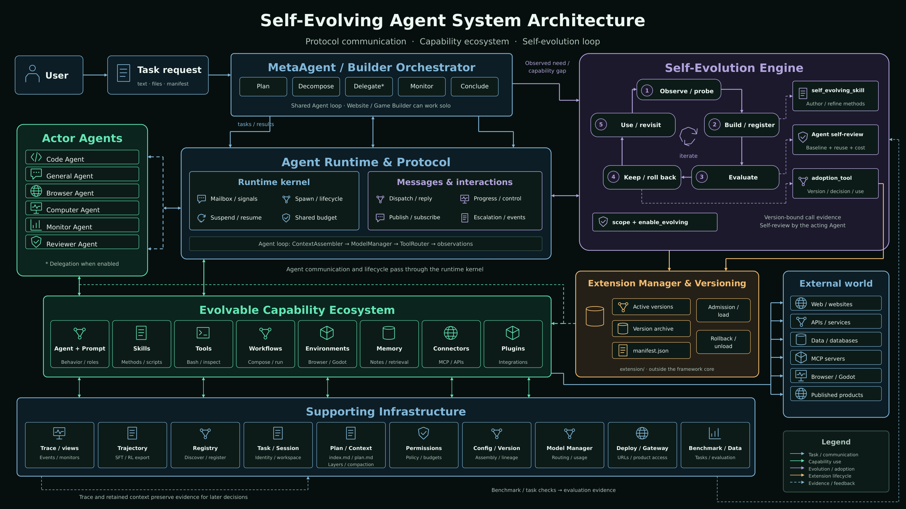

<div align="center">

# AgentEvolver

### Multi-agent execution that evolves reusable capabilities and turns real runs into training data

AgentEvolver is a **self-evolving multi-agent framework** for complex engineering and research tasks.
A MetaAgent plans, delegates, and reviews the work. When execution reveals a verified capability gap,
dedicated generator, evaluator, and optimizer agents can create or improve tools, skills, agents,
connectors, environments, workflows, and memory components. In parallel, `trajectory` turns real
executions into reward-annotated SFT/RL records, preserving the data foundation for future model
training and feedback into the runtime.

[](LICENSE)
[](pyproject.toml)
[](.github/workflows/quality.yml)
[](https://dvampire.github.io/AgentEvolver/)

**[Website](https://dvampire.github.io/AgentEvolver/)** ·
**[Quick start](#quick-start)** ·
**[How it works](#how-it-works)** ·
**[Training data loop](#from-task-trajectories-to-end-to-end-training)** ·
**[Fit and trade-offs](#fit-and-trade-offs)** ·
**[Web workbench](#web-workbench)**

中文：**[README_zh.md](README_zh.md)**



</div>

---

## Understand it in one minute

Most multi-agent frameworks answer one question: **How can several agents collaborate on the task in
front of them?**

AgentEvolver asks one more: **How can a capability gap discovered in this task become a reusable
component for future tasks?**

A typical run contains two deliberately separate paths:

| Current task | Capability evolution |
| --- | --- |
| The MetaAgent decomposes the goal and delegates to coding, general, browser, and review agents | Generator, evaluator, and optimizer agents run only after a check establishes a real capability gap |
| Produces the code, report, experiment, or site requested by the user | Produces a tool, skill, agent, connector, environment, workflow, or memory component |
| Prioritizes finishing the current task | Evaluates a new component before adoption, with rollback available |
| Writes task files into an isolated session workspace | Writes reusable components into external `extension/`; the core package stays unchanged |

In the current release, online “self-evolution” happens first at the **runtime component layer**. An
ordinary task does not update model weights, and agents do not receive unrestricted permission to
rewrite the framework source. Model evolution is still part of the design: the system already captures
trainable trajectories, with training, evaluation, model registration, and serving feedback planned as
the next stage.

> **Mental model:** AgentEvolver = a multi-agent task runtime + a versioned capability extension system + an SFT/RL data flywheel. Today the loop reaches trainable data; the goal is to close it with trained models serving agents again.

## What problem does it solve?

Complex tasks often fail because the system lacks a dependable method, not because the model cannot
produce another answer. It may need a missing tool, a reusable procedure, a domain connector, or a
reliable acceptance test. A longer prompt rarely prevents the same failure next time.

AgentEvolver makes those methods first-class components:

- **Orchestrate first.** The MetaAgent breaks down the goal, delegates through one runtime, and gathers and reviews results.
- **Require evidence before evolving.** A first fixable mistake is retried. Evolution is reserved for a missing capability, repeated structural failure, or a measured quality ceiling.
- **Persist the improvement.** New capabilities live in `extension/`, where they can be hot-loaded, versioned, compared, and rolled back without mutating the hand-written core.
- **Make the process inspectable and trainable.** `trace` preserves raw observation events; `trajectory` projects runs into reward-annotated, step-level records for SFT/RL pipelines.

## Core characteristics

| Characteristic | What it means in practice |
| --- | --- |
| **Evidence-driven self-evolution** | Detect a gap → generate or optimize → evaluate under a read-only guard → compare with a baseline → adopt or roll back. “It looks better” is not validation. |
| **Immutable core, mutable extensions** | Hand-written capabilities live in `agentevolver/`; evolved content lives in external `extension/`. Versions are archived and restorable. |
| **One multi-agent runtime** | `spawn`, `send`, `ask`, `suspend/resume`, and `publish/subscribe` support delegation, progress, control, and escalation. |
| **A step is a decision, not a wait** | A long command, a terminal send, or a delegated child can be started in the background and collected later by job id; reminders that come due are kept in the same registry. A step spent blocking is a decision the agent never got to make. |
| **State that survives the call that made it** | A terminal keeps its shell between calls — a directory change, an activated environment, an ssh hop, a REPL. A continuable sub-agent keeps its own session and can be handed more work. An image the agent read is re-attached to later requests instead of vanishing with the step that read it. |
| **Code mode** | Instead of one call per turn, the model can write a program whose calls are bridged back through a guarded dispatch, so a batch of tool work costs one turn. The program runs in its own interpreter, where no framework object is one `import` away from model-written code. |
| **Plan mode** | A person can hold a run to reading and reasoning until they approve what it intends to do. The gate reads each capability's own `mutates` / `permission_mode` declaration and never its name; a capability that declares neither is refused. |
| **Crash-safe continuation** | Structured, portable execution checkpoints are written atomically. After an interrupted run, both the browser and CLI show the recovered state and require an explicit resume-or-restart decision when automatic continuation is unsafe. |
| **One approval and lifecycle surface** | Tools, connectors, and environment actions share the same side-effect classification and approval path; undeclared effects fail closed. A typed lifecycle Hook bus exposes prompt, session, task, capability, and rollout events without coupling them to the agent loop. |
| **Project memory and live agent threads** | Project memory survives individual sessions, while delegated agents keep addressable runtime threads for direct messaging, progress, control, and follow-up work. Completed blocking agents release their driver and context resources promptly. |
| **Progressive rollout and observability** | Extensions can run through shadow and canary stages with persisted health evidence and automatic rollback. Trace remains authoritative and can optionally export paired spans through OpenTelemetry. |
| **Training-oriented data interface** | `TrajectoryHook` captures the effective context, reasoning and tool calls, observations, token use, and reward for every step; it exports OpenAI Chat SFT records and pluggable RL formats, including a built-in text-level VERL episode format. |
| **Inspectable, HTML-native artifacts** | Prompts, dynamic workflows, task documents, memory reports, and step snapshots are used by the runtime and readable by people. |
| **Budgets inside the agent context** | Step, token, and wall-time budgets appear as `NORMAL / TIGHT / CRITICAL`, helping agents converge before a hard limit is reached. |
| **A prompt prefix a cache can keep** | The capability catalogs are frozen at their first render and placed ahead of the volatile agent state, with a cache breakpoint after them, so a component generated mid-session does not invalidate the conversation behind it. |
| **Four views over one project** | Chat, Canvas, browser-based VS Code, and Science/Jupyter share a session workspace and Gateway protocol. |
| **Layered safety boundaries** | Sandbox isolation, host-side egress policy, command-intent authorization, and crash cleanup address different risks. |
| **Registry-driven extension surface** | Agents, tools, skills, environments, memory systems, and related components follow consistent registration, schema, and lifecycle conventions. |

The model reaches most of this by calling tools itself: starting a job and collecting it
later, opening a terminal and typing into it, backgrounding a sub-agent and picking its
answer up, reading an image, searching
what earlier runs tried. [`docs/tool-catalog.md`](docs/tool-catalog.md) is generated from
the live registry and lists every one of them with its parameters and permission mode.

## Fit and trade-offs

### A good fit for

- long-running engineering, data, or scientific tasks that benefit from specialist agents;
- teams that want methods discovered during a task to become reusable tools, skills, or workflows;
- research into agent runtimes, self-improvement strategies, SFT/RL data construction, evaluation loops, and human oversight;
- deployments that need a visual workbench, detailed run records, rollback, and a broad extension surface.

### Probably not the right fit for

- **Simple Q&A or one-step automation:** a single agent or script will usually be lighter and faster;
- **Strict low-latency or low-token workloads:** orchestration and comparative evaluation add model calls and wall time;
- **A zero-operations hosted product:** this is a framework you deploy and extend, not a turnkey SaaS;
- **Environments that cannot tolerate experimental API changes:** the current package version is `0.1.0`;
- **Tasks with no credible acceptance criteria:** versioning and rollback control change, but cannot replace tests, benchmarks, or human review.

### Benefits and costs

| What you gain | What it costs |
| --- | --- |
| Capabilities can accumulate instead of every task starting from zero | Component contracts, evaluation rules, and extension versions need maintenance |
| Execution, evolution, evaluation, and rollback form one loop | More architecture and model usage than a single-agent system |
| A rich UI, sandboxes, connectors, and research-oriented capabilities | A larger installation; the full experience needs Docker, Node.js, and relevant credentials |
| Inspectable artifacts and exportable traces | More logs and artifacts to store and govern |
| Clear separation between core and evolved content | Rollback reduces risk; it does not make unverified extensions production-safe |

## Quick start

### Requirements

- Python 3.11+ (3.12 recommended);
- conda, or the installer's `--uv` mode;
- an API key for at least one supported model provider;
- Docker for the full Model X sandbox and container-backed environments;
- Node.js only for the Web UI; the installer handles it by default.

### 1. Install

```bash
git clone https://github.com/DVampire/AgentEvolver.git
cd AgentEvolver
bash scripts/install.sh
conda activate agentos
```

Without conda, run `bash scripts/install.sh --uv`. Heavy dependencies for browser automation,
chemistry, sandboxes, and benchmarks are opt-in:

```bash
bash scripts/install.sh --extras browser
bash scripts/install.sh --extras sandbox
bash scripts/install.sh --extras all
```

See [`scripts/INSTALL.md`](scripts/INSTALL.md) for every option.

### 2. Configure a model

Set the provider you actually use in `.env` at the repository root. The default configuration uses a
Google model; select another one through config or `--cfg-options model_name=...`.

```bash
GOOGLE_API_BASE='https://generativelanguage.googleapis.com'
GOOGLE_API_KEY='...'

# Or configure another provider
ANTHROPIC_API_BASE='...'
ANTHROPIC_API_KEY='...'
OPENROUTER_API_BASE='...'
OPENROUTER_API_KEY='...'
```

Teams may manage secrets in Vault. The framework falls back to `.env` when Vault is not configured or
reachable.

### 3. Run the first task

Start with the shortest host-based path:

```bash
python examples/run_meta_agent.py \
  --task "Write a Python function that reverses a string and add unit tests."
```

You can also run an HTML or Markdown task document:

```bash
python examples/run_meta_agent.py \
  --task-file examples/tasks/qsar_egfr_experiment.html
```

Common options:

| Option | Purpose |
| --- | --- |
| `--task "<text>"` | Submit inline task text; takes precedence over `--task-file` |
| `--task-file <path>` | Run a `.html` or `.md` task document |
| `--config <path>` | Select a configuration; defaults to `configs/meta_agent.py` |
| `--cfg-options key=value ...` | Override the model, budgets, or other config values for this run |

Every run gets an isolated session. Work files, logs, task views, and memory reports are written under
`output/<owner>/sessions/<session-id>/`.

### 4. Use the full containerized mode

AgentEvolver calls the “entire framework in one base container” setup **Model X**. The MetaAgent,
sub-agents, and tools share a reproducible environment; browser and desktop services start as peer
containers when required.

```bash
docker build -f docker/base/Dockerfile -t agentevolver/base:latest .

scripts/run-in-sandbox.sh -- python examples/run_meta_agent.py \
  --task "Analyze this repository and propose improvements backed by tests."
```

Add `--gpus` for NVIDIA GPU access. The launcher requires a reachable Docker daemon and never silently
falls back to host execution.

### 5. Start the Web workbench

```bash
scripts/run-in-sandbox.sh -- scripts/serve-ui.sh
```

Open `http://127.0.0.1:5173`. The default Gateway is `ws://127.0.0.1:9876/ws`.
When binding outside loopback, set `AGENTEVOLVER_GATEWAY_TOKEN` and restrict allowed browser origins.

### 6. Verify the installation

```bash
pytest -q
pytest -m integration   # requires external credentials, services, or peer containers
```

The default suite excludes integration tests and therefore needs no external API keys. The installer
also runs a quick verification pass.

## How it works

### Task execution path

```text
User / Web UI
      │
      ▼
Gateway / Task Manager
      │
      ▼
MetaAgent ── plan, decompose, delegate, review
      │
      ├── Code / General / Browser / Computer / Reviewer agents
      │       └── Tools · Skills · Connectors · Environments · Workflows
      │
      └── only when evidence establishes a capability gap
              └── Generate / Evaluate / Optimize
                        └── versioned extension/ → adopt or roll back
```

Runtime defines how messages move; Protocol defines what a conversation means. Each live agent is
wrapped in its own inbox, pump task, state, and pending reply, so it can be invoked, paused, resumed,
cancelled, or subscribed to.

### The self-evolution loop

```text
1. Decide          2. Generate or optimize   3. Evaluate          4. Keep or revert
What is missing? → write into extension/   → compare to baseline → adopt or roll back
Why is retry not    keep the core unchanged   preserve evidence     archive every version
enough?
```

Evolution should be triggered only by one of these signals:

1. **Missing capability:** the task requires an operation that does not exist and cannot succeed by retrying existing capabilities;
2. **Repeated structural failure:** the same failure recurs after explicit corrective guidance;
3. **Measured quality ceiling:** the current method systematically misses a defined metric.

A first fixable defect, transient failure, capability that was never enabled, or already-tight budget
should lead to retrying, fixing configuration, or finishing the current task—not expanding the system.

### Extensions and versions

- hand-written built-ins live under `agentevolver/<module>/default/`;
- generated and optimized components live under external `extension/<module>/`;
- `ExtensionManager` handles dynamic loading, registration, archiving, and rollback;
- an already-registered component with `enable_evolving=False` cannot be overwritten by evolution;
- Gateway sessions stage extension changes under their own output and require an explicit promotion into shared `extension/`.

This design limits the mutation surface, but it **does not automatically prove that a new component is
correct**. Tests, benchmarks, read-only evaluators, and human approval remain necessary in high-risk
settings.

## From task trajectories to end-to-end training

AgentEvolver does more than record what happened. It maintains a training-oriented projection of each
run. `TrajectoryHook` consumes the agent lifecycle and aggregates an execution into a sequence of
steps:

```text
s_t = (z_t, a_t, o_t, r_t)

z_t  effective context actually sent to the model
a_t  model reasoning and native tool calls
o_t  result or error from each action
r_t  reward backfilled by a benchmark or evaluator after the run
```

Implemented today:

- capture each step's effective prompt, reasoning, tool calls, observations, and token usage by `task_id`;
- preserve session/task identity, task outcome, success state, and parent/subtask metadata;
- backfill a task-level reward after a benchmark or evaluator finishes, propagating it to every step;
- persist to `<log_root>/trajectory/<task_id>.jsonl`;
- export step-level OpenAI Chat SFT records through `export_sft()`, retaining reasoning and native `tool_calls` in the assistant target;
- export RL episodes through the pluggable `RLFormat` interface. The built-in `VerlFormat` emits text-level `prompt / response / reward` fields; token ids and masks are intentionally left for a training provider that owns the tokenizer.

The current data loop therefore reaches **real task → reward-annotated trajectory → SFT records / RL
format episodes**. The next stage is to integrate training execution, checkpoints and model versions, offline
and online evaluation, approval/promotion, and serving into the same system:

```text
Task execution
   ↓
Trajectory capture and reward backfill        ← implemented
   ↓
SFT / RL datasets and VERL-style export       ← implemented
   ↓
Training and checkpoint management            ← planned integration
   ↓
Benchmarking, comparison, model promotion     ← planned integration
   ↓
The new model serves agents again              ← planned integration
   └──────────────────────────────────────→ produces the next trajectories
```

This is the fuller meaning of evolution in AgentEvolver: **component evolution gives the system new
methods; model training internalizes successful behavior. Both are ultimately connected by the same
tasks, evaluation signals, and data interfaces.** This repository already provides the capture and
export foundation; it should not imply that the in-system trainer is complete today.

## Web workbench

<div align="center">

<a href="https://dvampire.github.io/AgentEvolver/ui.html"></a>

**[Watch the 11-part feature tour](https://dvampire.github.io/AgentEvolver/ui.html)**

</div>

| View | What it is for |
| --- | --- |
| **Chat** | Submit tasks, upload files, inspect live events, approve sensitive operations, cancel, and reconnect |
| **Canvas** | Edit JSON flows with React Flow and execute them on the shared Workflow Runtime |
| **Code** | Use VS Code in the browser to edit the exact same session workspace |
| **Science** | Share a Jupyter kernel with the agent and inspect execution history, MIME output, and compute state |
| **Machines** | Watch browser/desktop environments over noVNC or manage explicitly configured SSH hosts |

The conversation column carries what is true *now*, not only what was said: the goal the
session is working toward sits above the thread and stays there while the transcript
scrolls; a bar above it counts the background jobs and opens the list of what is still
running or coming due; and the plan-mode control sits against the composer, because what
it decides is what the next message will be allowed to do. From the same bar, any run in
the conversation opens as a trajectory — every step with its reasoning, arguments, results
and errors, wall time, token use, and the share of the prompt that was served from cache.

The capability catalog, model manager, file editor, extension staging/promotion, and deployment status
all use the same versioned Gateway protocol. See [`frontend/README.md`](frontend/README.md) and
[`docs/canvas.md`](docs/canvas.md).

## Safety, budgets, and observability

### Security boundaries

| Layer | Responsibility |
| --- | --- |
| Sandbox | Isolate code, browser, or desktop environments; backends provide different capability and isolation levels |
| Network policy | Task containers have no public route by default; allowed requests cross a Unix socket to a host-side relay that decides and records |
| Permission | Classify read, write, destructive, network, process, package-management, and related intent before Tool or Sandbox execution |
| Lifecycle | A write-ahead container ledger cleans leaked resources; a shared port registry reduces service conflicts |

“Supports sandboxing” does not mean “safe for every high-risk workload.” Deployers must still review
images, mounts, credentials, network allowlists, host Docker-socket access, and permission modes against
their threat model.

### Budgets and records

- `constraint/` tracks step, token, and wall-time budgets and renders the remaining budget into agent context;
- `trace/` persists structured events and streams them through the Gateway;
- `trajectory/` projects runs into reward-annotated step records and exports OpenAI Chat SFT or RL formats such as VERL;
- `session/query/` reads those trace logs back after a run ends, so an agent can search what an earlier run tried and read the steps around a hit;
- `memory/` maintains recent history, compacted working memory, todos, call paths, and final results;
- `spill/` writes an oversized tool result to a file whole and puts the locator in the excerpt, so the part that did not fit can still be read;
- `benchmark/` provides entry points for AIME, GPQA, GSM8K, HLE, LeetCode, DeepWeb, ProgramBench, and related evaluations.

Input tokens are the largest recurring cost, so the prompt is arranged for a cache: the
capability catalogs are byte-identical on every step and are sent ahead of the volatile
agent state, with the cache breakpoint after them. Measured on a real run, an orchestrator
went from reading nothing back to 72,647 of about 98,800 input tokens per step served from
cache once the prefix was warm. `agentevolver/model/types.py` and
`agentevolver/agent/types.py` carry the reasoning, including why the entry lives for an
hour and why a mid-session capability change is announced after the catalog rather than
rewritten into it.

## Extending the framework

Most component modules follow the same shape:

```text
agentevolver/<module>/
├── default/       # hand-written built-ins
├── types.py       # base classes, data structures, contracts
├── context.py     # registry and lifecycle, where applicable
├── server.py      # <module>_manager facade
└── README.md      # module boundary and usage guide
```

A new hand-written component uses the matching registry decorator and is exported from
`default/__init__.py`. An evolved component does not edit package `__init__.py` files; it is written to
`extension/` and loaded through directory scanning and ExtensionManager.

| Component | Entry point |
| --- | --- |
| Agent / Prompt | `agentevolver.agent` / `agentevolver.prompt` |
| Tool / Skill | `agentevolver.tool` / `agentevolver.skill` |
| Environment / Sandbox | `agentevolver.environment` / `agentevolver.sandbox` |
| Memory / Hook / Constraint | `agentevolver.memory` / `agentevolver.hook` / `agentevolver.constraint` |
| Dataset / Benchmark | `agentevolver.data` / `agentevolver.benchmark` |
| Connector | discovered from `CONNECTOR.md`, managed by `connector_manager` |
| Workflow | compiled from HTML by `WorkflowCompiler` and executed on the shared runtime |

Each module's own `README.md` is its contract: what it owns, its shape, and the rules for
extending it.

## Repository and output layout

```text
AgentEvolver/
├── agentevolver/       # framework core and built-in capabilities
├── configs/            # runtime configurations
├── extension/          # shared, versioned evolved components
├── frontend/           # React/Vite Web UI and terminal client
├── examples/           # agent entry points and task examples
├── docs/               # website, UI tour, and focused guides
├── docker/             # base, browser, desktop, and related images
├── datasets/           # local-first benchmark data
├── scripts/            # installation, launch, and maintenance scripts
├── tests/              # fast and integration tests
└── output/             # sessions, logs, workspaces, and runtime state (generated)
```

Framework writes are resolved centrally through `agentevolver.paths`. The main writable roots are
`output/` and `extension/`; relocate them with `AGENTEVOLVER_HOME` and
`AGENTEVOLVER_EXTENSION_ROOT`.

## Documentation map

| Document | Contents |
| --- | --- |
| [Website](https://dvampire.github.io/AgentEvolver/) | Positioning, architecture, characteristics, trade-offs, and quick start |
| [Complete tutorial](https://dvampire.github.io/AgentEvolver/tutorial.html) | Thirteen chapters: mental model, installation, entry points, first run, output tree, extensions, SFT/RL trajectory export, Web UI, safety, evolution, and troubleshooting |
| [Architecture guide](https://dvampire.github.io/AgentEvolver/architecture.html) | Runtime boundaries, event log projections, extension lifecycle, and the training-data flywheel |
| [Module reference](https://dvampire.github.io/AgentEvolver/modules.html) | Searchable and expandable guide to all 48 modules, their runtime placement, public API, and source |
| [Web UI tour](https://dvampire.github.io/AgentEvolver/ui.html) | Eleven short clips showing the workbench feature by feature |
| [Contributor guide](https://dvampire.github.io/AgentEvolver/development.html) | Module contracts, verification gates, invariants, and safe extension patterns |
| [`scripts/INSTALL.md`](scripts/INSTALL.md) | Installation, optional extras, Vault, and environment setup |
| [`frontend/README.md`](frontend/README.md) | Gateway and Web UI development and deployment |
| [`docs/workflows.md`](docs/workflows.md) | Dynamic HTML workflows |
| [`docs/canvas.md`](docs/canvas.md) | Visual Canvas flows |
| [`docs/capability-schemas.md`](docs/capability-schemas.md) | Capability schema protocol |
| [`docs/tool-catalog.md`](docs/tool-catalog.md) | Generated: every registered tool, its parameters and its permission mode |
| [`agentevolver/trajectory/README.md`](agentevolver/trajectory/README.md) | Trajectory capture, persistence, and SFT/RL export contract |

## Project status

AgentEvolver is currently a `0.1.0` research and engineering framework. Component evolution and the
SFT/RL trajectory data interface are implemented; training execution, checkpoint/model version
management, and feedback of trained models into serving are the next-stage roadmap. Before production
or high-risk use, establish task-specific evaluations, approval flows, security policy, and rollback
drills.

## License

[MIT](LICENSE) © 2026 Wentao Zhang
