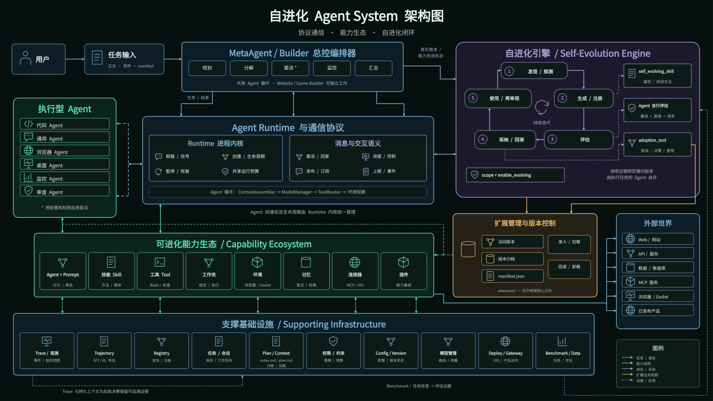
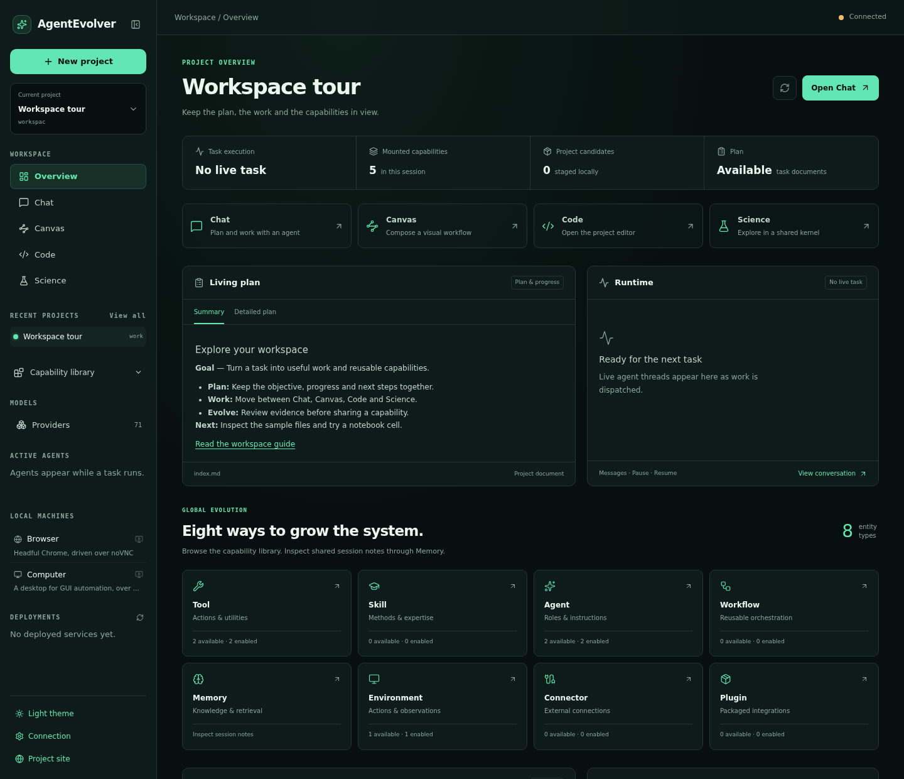

<div align="center">

# AgentEvolver

### 面向复杂任务的多智能体协作与全局演化平台

AgentEvolver 是一个面向工程与研究任务的**自进化多智能体平台**。
共享 Runtime 协调智能体和能力调用，持续更新的 Plan 让目标、进度与下一步贯穿长任务。
智能体可以改进**八类可复用实体**：Tool、Skill、Agent、Connector、Workflow、Memory、
Environment 和 Plugin，并记录候选版本、评估证据与后续使用情况。

Overview、Chat、Canvas、Code 和 Science 将这些工作汇聚到同一个项目工作台。
真实执行轨迹还为后续 SFT/RL 训练提供数据基础。

[](LICENSE)
[](pyproject.toml)
[](.github/workflows/quality.yml)
[](https://dvampire.github.io/AgentEvolver/)

**[在线主页](https://dvampire.github.io/AgentEvolver/)** ·
**[全局演化](#八类实体的全局演化)** ·
**[Runtime 与 Plan](#runtime-与-plan)** ·
**[快速开始](#快速开始)** ·
**[工作原理](#工作原理)** ·
**[Web 工作台](#web-工作台)**

English: **[README.md](README.md)**



</div>

---

## 先用一分钟了解它

AgentEvolver 将**任务执行、可复用能力改进和人的检查与参与**连接起来。
MetaAgent 可以直接使用工具完成工作，也可以把独立任务交给专精智能体。
在规划、反馈和验证过程中，智能体检查哪些方法值得改进，以及改进后能用于哪个具体操作。

| 系统组成 | 提供什么 |
| --- | --- |
| **全局演化** | 改进并组合八类实体，保留版本与证据，支持采纳决策 |
| **共享 Runtime** | 协调智能体生命周期、消息、后台任务、资源访问与共享预算 |
| **持续更新的 Plan** | 在长任务中持续保留目标、进度、阻塞项与下一步 |
| **共享工作台** | 查看工作过程、编辑项目文件，与智能体接续同一份分析 |

一次任务既可以交付代码、报告或实验，也可以形成可复用的方法。
实际可调用和可演化的能力由所选配置与权限决定。

## 八类实体的全局演化

**全局演化覆盖智能体系统中相互协作的各类组件。** 一次任务可能发现更好的推理方法、
缺失的操作、低效的观察接口，或记忆机制的不足。智能体根据证据与预期使用者选择合适的
组件形态，再检查该组件及依赖它的工作。

| 可演化实体 | 可以改进什么 |
| --- | --- |
| **[Tool · 工具](agentevolver/tool/README.md)** | 输入输出明确、职责有边界的可执行操作 |
| **[Skill · 技能](agentevolver/skill/README.md)** | 可复用流程、研究方法、设计方法或验证清单 |
| **[Agent · 智能体](agentevolver/agent/README.md)** | 专业行为、推理、规划、任务拆解及其配套 prompt |
| **[Connector · 连接器](agentevolver/connector/README.md)** | 对外部服务与数据源的访问方式 |
| **[Workflow · 工作流](agentevolver/workflow/README.md)** | 多种能力的可复用顺序、分支与协作方式 |
| **[Memory · 记忆](agentevolver/memory/README.md)** | 知识与经验的保留、检索和复用机制 |
| **[Environment · 环境](agentevolver/environment/README.md)** | 执行环境的观察、交互、状态与生命周期管理 |
| **[Plugin · 插件](agentevolver/plugins/README.md)** | 以一个组件提供相关工具与共享资源的服务集成 |

例如，Connector 为 Agent 提供数据，Skill 指导分析方法，Workflow 协调重复检查。
每项有价值的变更分别与基线比较，再重放依赖它的操作，检查组合后的结果。
后续证据还可以推动已采纳版本的进一步优化。

演化候选写入外部 `extension/` 或会话暂存区。版本、对照案例和真实调用记录支撑保留、
回滚或卸载决策。暂存组件经提升后进入共享扩展，后续运行按各自配置选择使用。
Agent 的 prompt 随所属 Agent 管理，不单独算作第九类实体。

结构准入检查能否加载及 schema 是否合规；功能评估记录对结果的判断；后续使用检验已采纳
版本在真实工作中的表现。候选可能在功能评估前临时激活，注册成功本身不能证明效果提升。
这些边界由[扩展契约](agentevolver/extension/README.md)定义。

## Runtime 与 Plan

### 共享执行 Runtime

Runtime 将 Agent 作为具有独立状态、信箱和生命周期的逻辑进程管理。
同一个内核也管理各类组件的轻量调用，由组件自身负责领域行为，让协作方式随任务需要组合。

| 机制 | 解决什么问题 |
| --- | --- |
| **委派与消息** | 派发有边界的任务，追加后续工作、请求协助并收集结果 |
| **订阅与工作池** | 将事件发布给相关智能体，或把任务分配给一个可用订阅者 |
| **后台任务与持久终端** | 命令或子任务运行期间继续其他工作，跨调用保留 shell 状态 |
| **共享预算与权限继承** | 汇总父子智能体用量，让子任务保持在授权范围内 |
| **资源协调与清理** | 协调声明的共享或独占访问，停止子任务并保留清理失败记录 |
| **中断恢复** | 恢复已保存的状态，在重放前核实不确定的外部副作用 |

生命周期与并发边界见 [Runtime 契约](agentevolver/runtime/README.md)。

### 贯穿任务、持续更新的 Plan

协调者维护精简的 `plan/index.md`，记录目标、进度、阻塞项、下一步和详细记录的链接；
完整计划写入 `plan/plan.md`。Runtime 将当前索引读入实时上下文，在对话压缩后仍然可见。
执行智能体接收有边界的任务；协调者负责共享计划，并根据反馈与证据修订。

自动规划和人工审阅是独立选项：

- **`auto`**：执行过程中持续维护和修订计划，是 MetaAgent 启动器的默认模式。
- **`plan`**：人工批准计划前，将动作限制为允许的读取与推理；运行配置必须提供 `exit_plan_mode` 工具。
- **`off`**：关闭规划上下文和自动维护计划的要求。

启用演化时，计划还记录改进机会、后续复用场景、对照实验，并区分提议、评估、采纳和使用状态。
详见 [Plan 契约](agentevolver/plan/README.md)。

## 配套能力

| 能力 | 提供什么 |
| --- | --- |
| **Code Mode** | 用程序表达批量调用、循环与分支，能力调用经过受控派发 |
| **分层上下文** | 分开保存稳定指令、压缩历史、近期交互与实时状态，详细记录按需读取 |
| **Trace 与 trajectory** | 查看真实请求和动作结果，导出带奖励的 SFT/RL 训练记录 |
| **可版本化扩展** | 归档可复用组件，支持评估、受控提升与回滚 |
| **预算与可观测性** | 展示剩余步数、token 和时间，保留运行记录，并可选导出 OpenTelemetry span |
| **共享项目工具** | 通过同一个 Gateway 使用文件、浏览器 IDE、Python 内核、执行环境与部署预览 |

[工具目录](docs/tool-catalog.md)列出已注册工具、参数与权限模式。

## 适用场景与取舍

### 适合

- 需要多个专精 Agent 协作的长链路工程、数据分析或科研任务；
- 希望把任务中形成的方法沉淀为可复用工具、技能或工作流；
- 研究 Agent 运行时、自改进策略、SFT/RL 数据构建、评估闭环和人机协作；
- 需要可视化工作台、完整运行记录、版本回滚和较强扩展能力的团队。

### 可能不适合

- **简单问答或单步自动化：** 单 Agent 或普通脚本通常更轻、更快；
- **严格追求低延迟、低 token 成本：** 多 Agent 编排和对照评估会增加模型调用与运行时间；
- **希望零运维的托管产品：** 这是可自行部署和扩展的框架，不是开箱即用的 SaaS；
- **不能接受实验性接口变化：** 当前版本为 `0.1.0`，更适合研发和受控工程环境；
- **缺少可靠验收标准的任务：** 版本化和回滚能控制变更，但不能替代测试、基准或人工审查。

### 优势与代价

| 你得到什么 | 相应代价 |
| --- | --- |
| 能力可持续积累，而不是每个任务从零开始 | 需要维护组件契约、评估规则和扩展版本 |
| 任务执行、进化、回滚形成闭环 | 比单 Agent 架构更复杂，调用成本也更高 |
| 丰富的 UI、沙箱、连接器和科研能力 | 安装面较大；完整体验需要 Docker、Node.js 和相应凭证 |
| 过程透明、产物可检查、轨迹可导出 | 日志与产物更多，需要规划存储和保留策略 |
| 核心与进化内容分离 | “可回滚”降低风险，但不代表未经验证的扩展可以直接用于高风险生产环境 |

## 快速开始

### 环境要求

- Python 3.11+（推荐 3.12）；
- conda，或使用安装脚本的 `--uv` 模式；
- 至少一个受支持模型供应商的 API Key；
- Docker：运行完整 Model X 沙箱和容器型环境时需要；
- Node.js：只在使用 Web UI 时需要，安装脚本默认处理。

### 1. 安装

```bash
git clone https://github.com/DVampire/AgentEvolver.git
cd AgentEvolver
bash scripts/install.sh
conda activate agentos
```

没有 conda 时可运行 `bash scripts/install.sh --uv`。浏览器、化学、沙箱和 benchmark 等重依赖通过
extras 按需安装：

```bash
bash scripts/install.sh --extras browser
bash scripts/install.sh --extras sandbox
bash scripts/install.sh --extras science
bash scripts/install.sh --extras all
```

完整选项见 [`scripts/INSTALL_zh.md`](scripts/INSTALL_zh.md)。

### 2. 配置模型

[默认配置](configs/meta_agent.py)选择 `llm_hub` 模型路由。
在仓库根目录的 `.env` 中填写你所用模型网关的地址与密钥：

```bash
LLM_HUB_API_BASE='https://your-model-gateway.example/v1'
LLM_HUB_API_KEY='...'
```

其他 provider 使用各自的变量，例如 `GOOGLE_API_BASE` / `GOOGLE_API_KEY`、
`ANTHROPIC_API_BASE` / `ANTHROPIC_API_KEY` 或 `OPENROUTER_API_BASE` / `OPENROUTER_API_KEY`。
使用 `--cfg-options model_name=...` 选择对应的已注册模型；仅填写另一家 provider 的密钥不会
改变模型路由。Provider 配置机制见[模型指南](agentevolver/model/README.md)。

团队可选用 Vault 集中管理密钥；Vault 不可用时，框架会回退到 `.env`。

### 3. 运行第一个任务

先用主机环境验证最短路径：

```bash
python examples/run_meta_agent.py \
  --task "实现一个反转字符串的 Python 函数，并补充单元测试。"
```

也可以运行 HTML 或 Markdown 任务文档：

```bash
python examples/run_meta_agent.py \
  --task-file examples/tasks/qsar_egfr_experiment.html
```

常用参数：

| 参数 | 用途 |
| --- | --- |
| `--task "<文本>"` | 直接提交任务；优先级高于 `--task-file` |
| `--task-file <路径>` | 从 `.html` 或 `.md` 任务文档运行 |
| `--config <路径>` | 选择配置；默认为 `configs/meta_agent.py` |
| `--cfg-options key=value ...` | 临时覆盖模型名、预算等配置 |
| `--plan-mode auto / plan / off` | 选择自动规划、人工审批门禁或关闭规划上下文 |

默认配置仅常驻 MetaAgent、`code_agent` 和基础执行能力。
请按任务选择需要的技能、环境与演化能力。

每次运行拥有独立 session。工作文件、日志、任务视图和记忆报告写入
`output/<owner>/sessions/<session-id>/`。

### 4. 使用完整容器运行模式

AgentEvolver 将“整个框架运行在一个基础容器中”的方式称为 **Model X**。它让 MetaAgent、子智能体
和工具执行处于同一可复现环境；浏览器、桌面等服务作为 peer 容器按需启动。

```bash
docker build -f docker/base/Dockerfile -t agentevolver/base:latest .

scripts/run-in-sandbox.sh -- python examples/run_meta_agent.py \
  --task "分析这个仓库，并给出有测试支撑的改进。"
```

需要 NVIDIA GPU 时加 `--gpus`。启动器要求 Docker daemon 可达，且不会静默回退到主机执行。

### 5. 启动 Web 工作台

```bash
scripts/run-in-sandbox.sh -- scripts/serve-ui.sh
```

打开 `http://127.0.0.1:5173`。默认 Gateway 地址为 `ws://127.0.0.1:9876/ws`。
若绑定到非本机地址，请设置 `AGENTEVOLVER_GATEWAY_TOKEN` 并配置允许的浏览器来源。

此命令使用第 4 步构建的基础镜像，其中已包含 Jupyter 依赖。
Code 首次启动会构建编辑器镜像并安装默认扩展，可能需要几分钟。
详见 [IDE 镜像指南](docker/vscode/README.md)。

若在宿主机运行 Gateway，请先在它使用的 Python 环境中安装可选后端依赖：

```bash
python -m pip install -e '.[sandbox,science]'
```

然后按[本地前端启动说明](frontend/README.md)启动。Code 仍需要 Docker 与本地基础镜像；
Science 使用宿主 Gateway 的 Python 环境。

### 6. 验证安装

```bash
pytest -q
pytest -m integration   # 需要外部凭证、服务或 peer 容器
```

默认测试排除 integration，因此不需要外部 API Key。安装脚本也会执行一次快速校验。

## 工作原理

### 任务执行与能力改进

```text
用户 / Web UI
      │
      ▼
Gateway / Task Manager
      │
      ▼
协调者 ── MetaAgent / Website Builder / Game Builder
      │
      ├── 持续更新的 Plan：目标、进度、反馈与下一步
      │
      ├── 共享 Runtime：直接工作、委派、消息与后台任务
      │       └── 授权范围内的工具、技能、智能体等能力
      │
      └── 有证据支撑的演化机会
              └── 八类实体共用的自演化流程
                      └── 候选版本 → 评估 → 决策 → 再次使用
```

MetaAgent 与领域 Builder 共用 Agent 生命周期、Runtime 和演化策略。
当所需能力可用时，执行工作的智能体在自身动作循环中遵循 `self_evolving_skill`，
完成可复用组件的生成、优化与评估。

### 自演化闭环

1. **观察与选择。** 从规划、执行、反馈或验证中识别可复用的方法不足或改进机会，
   明确后续复用场景、预期收益，以及与现有方法进行对照的小范围实验。
2. **形成候选。** 选择合适的实体类型，优先改进适用的已有组件，并在注册前保留基线观察。
3. **评估版本。** 通过结构准入注册，再用真实调用比较行为，将判断绑定到候选版本和已有证据。
4. **决策与复用。** 保留通过评估的版本，或显式回滚、卸载；把已采纳的改进用于目标操作，
   检查由此产生的实际工作结果。

首次纠错、一次通过的验证或陌生集成都可能带来有价值的机会，不要求先反复失败。
智能体仍需提供证据、明确使用者，并为评估变更和完成任务留出预算。
单纯修改产品代码或增加组件数量，不能证明能力得到提升。

对于明确要求验证演化效果的任务，系统还会在报告成功前检查对应版本的评估记录与采纳后的
使用凭据。对照失败或缺少可信机会，都意味着目标尚未满足，不能据此编造成功结果。

### 扩展与版本

- 内置能力位于框架包内；演化产物位于外部 `extension/<type>/` 或会话暂存区。
- `ExtensionManager` 负责注册、准入、版本归档与回滚。
- 已有组件设置 `enable_evolving=False` 时，不能通过演化覆盖。
- Gateway 会话单独暂存变更，经显式提升后才进入共享扩展。
- 注册、功能评估、提升与后续使用是不同状态，各自有对应记录。

证据要求与激活边界见[扩展契约](agentevolver/extension/README.md)。

## 从任务轨迹到端到端训练

`trace` 保留执行观察；`TrajectoryHook` 将运行投射为面向训练的逐步记录：

```text
s_t = (z_t, a_t, o_t, r_t)

z_t  实际发送给模型的上下文
a_t  模型推理与原生工具调用
o_t  动作结果或错误
r_t  benchmark 或 evaluator 回填的奖励
```

记录保留任务标识、结果、父子任务关系和 token 用量，写入
`<log_root>/trajectory/<task_id>.jsonl`，并通过 `export_sft()` 或可插拔的 `RLFormat` 接口导出。
内置 VERL 格式提供文本级 episode，由训练方负责分词与 mask。

当前可用链路是**真实任务 → 带奖励的 trajectory → SFT 记录 / RL episode**。
训练执行、模型与 checkpoint 管理、模型评测及 serving 回流仍需进一步集成。
组件演化与训练数据导出不意味着普通任务会更新模型权重。
详见 [trajectory 契约](agentevolver/trajectory/README.md)。

## Web 工作台

<div align="center">

<a href="https://dvampire.github.io/AgentEvolver/ui.html?lang=zh"></a>

**[查看 11 段功能演示](https://dvampire.github.io/AgentEvolver/ui.html?lang=zh)**

</div>

五种视图共用同一项目与 Gateway：

| 视图 | 用来做什么 |
| --- | --- |
| **Overview** | 阅读计划摘要与详情，查看 Runtime 活动、八类实体、暂存候选、共享笔记与文件 |
| **Chat** | 提交任务、附加文件、跟踪活动、检查步骤、回答审批请求并控制运行中的工作 |
| **Canvas** | 可视化组合 JSON 流程，并在共享 Workflow Runtime 上执行 |
| **Code** | 在浏览器内的 VS Code 打开项目 workspace |
| **Science** | 与 Agent 的代码解释器共用项目内核，查看输出与算力状态，或进入 JupyterLab 继续工作 |

可搜索的项目选择器帮助切换会话。侧栏还提供能力与模型目录、Browser/Computer 实时画面、
已配置远程机器和连接设置。候选暂存状态与功能改进证据分别展示。

截图与 11 段短视频于 2026 年 9 月 16 日录制，使用连接真实 Gateway 的预置示例项目。
Science 在合成数据上执行真实 Python cell；示例 Runtime 处于空闲状态。
这些素材演示界面操作，录制方法见[录屏指南](docs/assets/ui/README.md)。

Code 需要 Docker 和本地构建的基础镜像，编辑器镜像在首次使用时构建。
Science 需要 Gateway 所用 Python 环境中的 JupyterLab 与 ipykernel，配置方法见
[前端指南](frontend/README.md)。Canvas JSON 流程有自己的库；Agent 编写的 HTML 工作流
属于另一套接口，详见 [Canvas 指南](docs/canvas.md)。

## 安全、预算与可观测性

### 安全边界

| 层 | 职责 |
| --- | --- |
| Sandbox | 隔离代码、浏览器或桌面环境；不同后端提供不同强度与能力 |
| Network policy | 应用所选后端的出网控制；容器中继策略判定并记录允许的外部请求 |
| Permission | 在 Tool 或 Sandbox 执行前，根据读写、破坏性、网络、进程和包管理等意图授权 |
| Lifecycle | 预写式容器账本清理崩溃遗留资源；端口注册表减少多服务冲突 |

“支持沙箱”不等于“可以直接处理任意高风险工作负载”。部署者仍需根据威胁模型审查镜像、挂载、凭证、
网络白名单、宿主 Docker socket 和权限模式。

### 预算与记录

- `constraint/` 同时跟踪步数、token 和墙钟时间，并把剩余预算写入 Agent 上下文；
- `trace/` 保存结构化事件并实时推送给 Gateway；
- `trajectory/` 将运行投射为带奖励的步级记录，并导出 OpenAI Chat SFT 或 VERL 等 RL 格式；
- [会话记录](agentevolver/session/README.md)让 Agent 能检索以前的运行，并查看命中结果前后的步骤；
- `memory/` 维护近期历史、压缩后的工作记忆、todo、调用路径与最终结果；
- `tool/spill/` 把过大的工具输出整份写进文件，并把位置写在摘要里，装不下的那部分仍然读得到；
- `benchmark/` 提供 AIME、GPQA、GSM8K、HLE、LeetCode、DeepWeb、ProgramBench 等评测入口。

提示词将稳定的指令与目录前缀和变化中的任务状态分开，以利用 provider 的提示词缓存。
命中率与节省幅度取决于模型路由及任务，应以运行记录中的实际用量为准。
上下文构造见 [Agent 指南](agentevolver/agent/README.md)。

## 扩展框架

大多数组件模块遵循同一种结构：

```text
agentevolver/<module>/
├── default/       # 手写内置实现
├── types.py       # 基类、数据结构和契约
├── context.py     # 注册与生命周期（部分模块）
├── server.py      # <module>_manager 门面
└── README.md      # 模块边界与使用说明
```

新增手写组件时，通过对应注册表装饰器注册，并从 `default/__init__.py` 导出。新增进化组件时，不修改
包内 `__init__.py`，而是写入 `extension/`，交由目录扫描和 ExtensionManager 加载。

| 组件 | 入口 |
| --- | --- |
| Agent / Prompt | `agentevolver.agent` / `agentevolver.prompt` |
| Tool / Skill | `agentevolver.tool` / `agentevolver.skill` |
| Environment / Sandbox | `agentevolver.environment` / `agentevolver.sandbox` |
| Memory / Hook / Constraint | `agentevolver.memory` / `agentevolver.hook` / `agentevolver.constraint` |
| Dataset / Benchmark | `agentevolver.data` / `agentevolver.benchmark` |
| Connector | 扫描 `CONNECTOR.md`，由 `connector_manager` 管理 |
| Workflow | HTML 定义经 `WorkflowCompiler` 编译，由共享 runtime 执行 |
| Plugin | `plugin.py` + `PLUGIN.md`，由 `plugin_manager` 管理 |

每个模块自己的 `README.md` 就是该模块的契约：它拥有什么、是什么形状、怎么扩展。

## 目录与产物

```text
AgentEvolver/
├── agentevolver/       # 框架核心与内置能力
├── configs/            # 运行配置
├── extension/          # 共享、可版本化的进化组件
├── frontend/           # React/Vite Web UI 与终端客户端
├── examples/           # Agent 入口和任务样例
├── docs/               # 文档主页、UI 演示和专题文档
├── docker/             # 基础、浏览器、桌面等镜像
├── datasets/           # 本地优先的 benchmark 数据
├── scripts/            # 安装、启动和维护脚本
├── tests/              # 快速测试与 integration 测试
└── output/             # 会话、日志、workspace 与运行时状态（生成内容）
```

框架写入路径集中由 `agentevolver.paths` 管理。主要可写根是 `output/` 和 `extension/`；可通过
`AGENTEVOLVER_HOME` 与 `AGENTEVOLVER_EXTENSION_ROOT` 调整位置。

## 文档导航

| 文档 | 内容 |
| --- | --- |
| [在线主页](https://dvampire.github.io/AgentEvolver/) | 项目定位、架构、特点、取舍和快速开始 |
| [完整教程](https://dvampire.github.io/AgentEvolver/tutorial.html) | 十三章：系统认知、安装、入口选择、首次运行、输出目录、能力扩展、SFT/RL 轨迹导出、Web UI、安全、组件进化与排障 |
| [架构指南](https://dvampire.github.io/AgentEvolver/architecture.html) | Runtime 边界、事件日志投影、扩展生命周期与训练数据飞轮 |
| [模块手册](https://dvampire.github.io/AgentEvolver/modules.html) | 可搜索的模块参考：职责、运行位置、公共 API 与源码入口 |
| [Web UI 演示](https://dvampire.github.io/AgentEvolver/ui.html) | 11 个短视频逐项展示工作台 |
| [贡献者指南](https://dvampire.github.io/AgentEvolver/development.html) | 模块契约、验证门禁、不变式与安全扩展模式 |
| [`scripts/INSTALL_zh.md`](scripts/INSTALL_zh.md) | 安装、可选 extras、Vault 与环境配置 |
| [`frontend/README.md`](frontend/README.md) | Gateway 和 Web UI 的开发与部署 |
| [因子与策略挖掘示例](docs/demos/factor_strategy_mining.md) | 研究智能体开发市场连接器与回测环境，维护连续研究报告与冻结的最终测试协议 |
| [`docs/workflows.md`](docs/workflows.md) | 动态 HTML 工作流 |
| [`docs/canvas.md`](docs/canvas.md) | 可视化 Canvas 流程 |
| [`docs/capability-schemas.md`](docs/capability-schemas.md) | 能力 schema 协议 |
| [`docs/tool-catalog.md`](docs/tool-catalog.md) | 自动生成：每个已注册工具的参数与权限模式 |
| [`agentevolver/trajectory/README.md`](agentevolver/trajectory/README.md) | trajectory 采集、持久化与 SFT/RL 导出契约 |

## 项目状态

AgentEvolver 目前是 `0.1.0` 阶段的研究与工程框架。组件进化和 SFT/RL trajectory 数据接口已经
存在；训练执行、checkpoint/模型版本管理和训练后模型回流属于下一阶段路线图。欢迎使用、实验和扩展；
如果要用于生产或高风险环境，请先建立与你的任务相匹配的评估集、审批流程、安全策略和回滚演练。

## 许可证

[MIT](LICENSE) © 2026 Wentao Zhang
