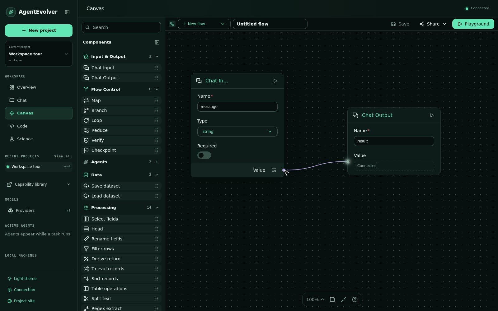
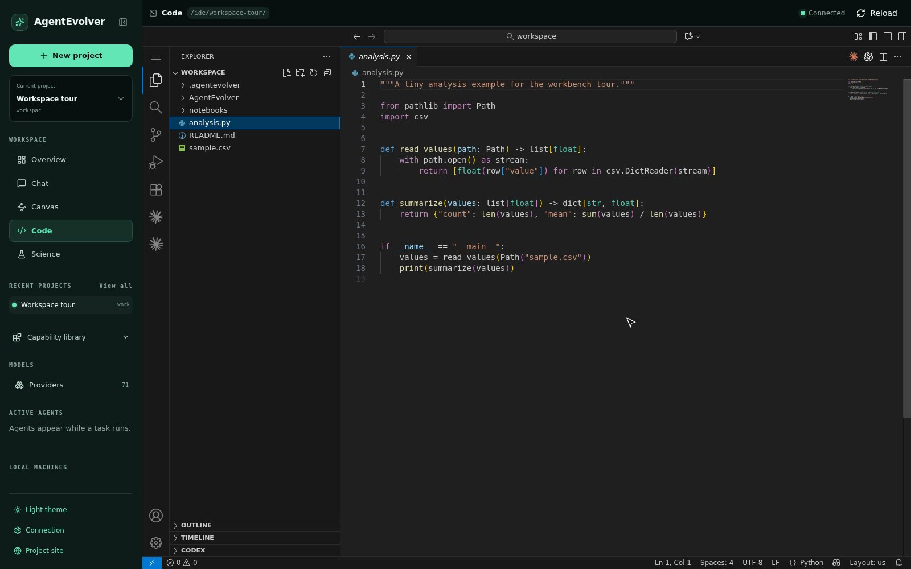
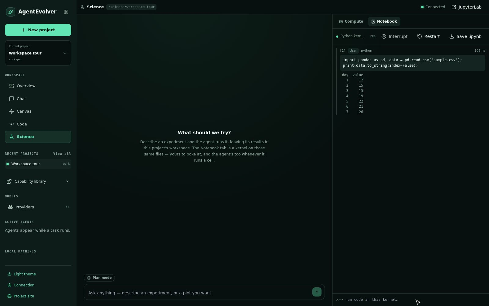
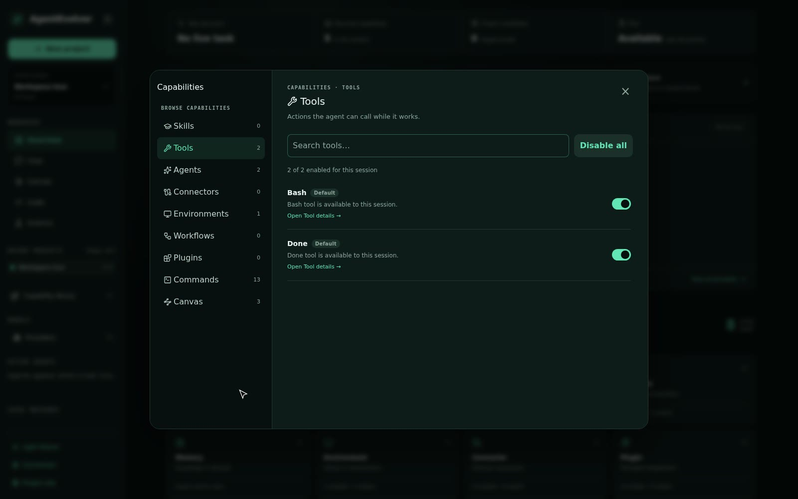
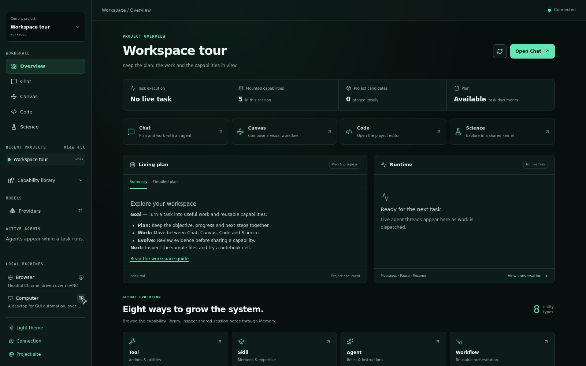
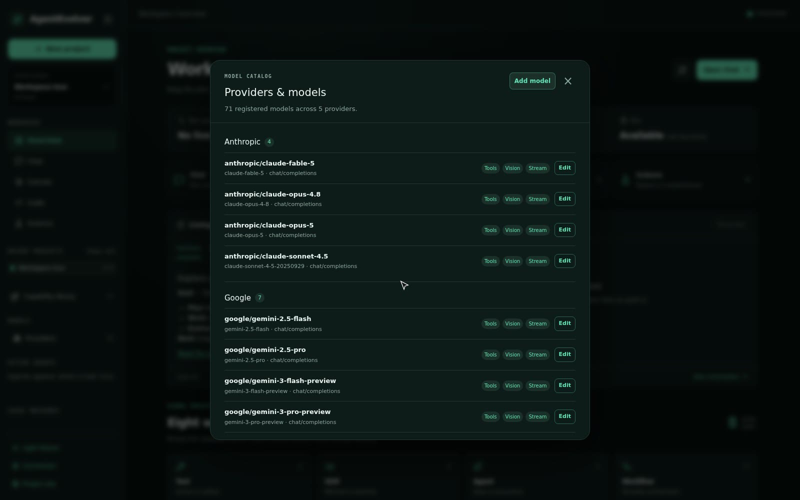

<div align="center">

# AgentEvolver

**一个会自我进化的多智能体框架。**

**MetaAgent** 编排子智能体完成你的任务；与此同时，generator / evaluator / optimizer 智能体
在下层不断编写、评分、重写框架自己的工具、技能、智能体、连接器、环境、工作流与记忆系统。

[](LICENSE)
[](pyproject.toml)
[](.github/workflows/quality.yml)
[](docs/)

[快速开始](#-快速开始) · [亮点](#-亮点) · [架构](#-架构) · [网页 UI](#-网页-ui) · [沙箱与安全](#-沙箱与安全) · [扩展框架](#-扩展框架)

🌐 English version: **[README.md](README.md)**


</div>

---

## 📌 一览

| | |
|---|---|
| **48** 个框架模块，约 **9.1 万**行 Python | 每个模块都有自己的版本化 `README.md` 契约 |
| **29** 个内置智能体 | 8 actor + 7 generator + 7 evaluator + 7 optimizer |
| **27** 工具 · **83** 技能 · **25** MCP 连接器 | 另有 **89** 个服务插件，共 **332** 个插件工具 |
| **4** 类执行环境 | 浏览器 · Linux 桌面 · SSH · artifact 渲染器 |
| **6** 种沙箱后端 | host · docker · playwright · chrome-vnc · desktop · vscode |
| **84** 条 Gateway 命令 | 所有客户端共用一套版本化、可重放的协议 |
| **9** 个基准 · **41** 个测试模块 | AIME · GPQA · GSM8K · HLE · LeetCode · DeepWeb · ProgramBench |

---

## ✨ 亮点

<table>
<tr>
<td width="50%" valign="top">

### 🧬 它会改写自己
一个闭环 —— **发现能力缺口 → 生成 → 评估 → 采纳或回滚** —— 在服务用户任务的**同时**运行，
且与用户工作严格分离。每个版本都会归档，任何一个都能一行调用恢复。
→ [详情](#自进化闭环)

</td>
<td width="50%" valign="top">

### 📄 一切都是可直接打开的 HTML
提示词、工作流、任务文档、记忆报告、每一步的快照，全都是**完整的 HTML 文档** ——
既能被运行时执行，也能被人打开、阅读、diff、评审。
→ [详情](#html-原生的一切)

</td>
</tr>
<tr>
<td width="50%" valign="top">

### 🔒 沙箱根本没有出口
任务容器**不分配任何网络接口**，只有 loopback。唯一的出口是宿主侧、经 Unix socket 的中继，
所以出网策略待在沙箱内进程够不着的地方，而且**每一次尝试都被记录**。
→ [详情](#-沙箱与安全)

</td>
<td width="50%" valign="top">

### ⏱ 模型看得见的预算
步数 / token / 墙钟约束不只是断路器：剩余预算每一步都以
**NORMAL / TIGHT / CRITICAL** 的形式渲染进提示词，让智能体主动围绕它规划，而不是被一刀切断。
→ [详情](#约束智能体读得懂的预算)

</td>
</tr>
<tr>
<td width="50%" valign="top">

### 🖥 四个视图，同一个工程
对话、可视化**流程画布**、浏览器里的**真 VS Code**、带实时 Jupyter 内核的
**Science 工作台** —— 全都编辑同一个 workspace，走同一条协议。
→ [详情](#-网页-ui)

</td>
<td width="50%" valign="top">

### 🗂 一张表管住整块磁盘
框架写入的每一条路径都声明在同一张 enum 索引的表里。可写根只有两个 ——
而且这条规则由测试强制，不靠约定。
→ [详情](#-产物与目录布局)

</td>
</tr>
</table>

---

## 🚀 快速开始

### 1. 安装

```bash
bash scripts/install.sh
```

它会创建 conda 环境（`agentos`，Python 3.12）、安装本包及其依赖、安装 Node.js，并生成 `.env`
模板。重复执行是安全的。可加 `--extras browser` 安装浏览器自动化、`--uv` 改用 uv、`--help`
查看全部选项。

然后在项目根目录的 `.env` 里填入 API Key：

```bash
ANTHROPIC_API_BASE='...'
ANTHROPIC_API_KEY='...'
OPENROUTER_API_BASE='...'
OPENROUTER_API_KEY='...'
```

密钥也可以交由 **Vault** 集中管理；只要 Vault 已配置且可连通，框架会优先从中读取，否则自动
回退到 `.env`。

> 手动安装、Vault、可选 extras 等完整说明：**➡️ [scripts/INSTALL_zh.md](scripts/INSTALL_zh.md)**

### 2. 构建沙箱镜像（一次即可）

AgentEvolver 把**整个框架都跑在容器里**（即 "Model X"）：MetaAgent、所有子智能体，以及全部工具
执行（bash / 文件编辑 / git / 实验代码）。主机只负责启动；项目仓库以 bind-mount 挂进容器，所以
源码改动实时生效、产物落回主机的 `output/` 下。服务型 peer（浏览器、任务镜像）则通过挂载的
Docker socket、共享主机网络，作为兄弟容器被拉起。

```bash
docker build -f docker/base/Dockerfile -t agentevolver/base:latest .
```

之后**所有东西都用同一种方式跑** —— 把命令写在 `--` 之后交给启动器：

```bash
scripts/run-in-sandbox.sh -- <命令>          # 在 sandbox 里运行 <命令>
scripts/run-in-sandbox.sh --gpus -- <命令>   # ……并暴露 NVIDIA GPU
```

启动器要求 Docker 守护进程可达，且拒绝回退到主机执行；用 `--image IMG` 指定别的 base 镜像。
去掉包裹、`conda activate agentos` 后，裸命令也能在主机上直接跑（不进容器），便于本地快速调试。

### 3. 你会用到的三件事

<details open>
<summary><b>① 运行任务（MetaAgent）</b></summary>

[`examples/run_meta_agent.py`](examples/run_meta_agent.py) 会启动 MetaAgent 及其子智能体，并把
单个任务跑到完成。

```bash
# 默认任务
scripts/run-in-sandbox.sh -- python examples/run_meta_agent.py

# 直接传入任务文本
scripts/run-in-sandbox.sh -- python examples/run_meta_agent.py \
  --task "写一个反转字符串的 Python 函数并补充单元测试。"

# 从任务文档运行（examples/tasks/ 下的 .html / .md）
scripts/run-in-sandbox.sh -- python examples/run_meta_agent.py \
  --task-file examples/tasks/qsar_egfr_experiment.html
```

| 参数 | 说明 |
| --- | --- |
| `--task "<文本>"` | 内联任务文本，优先级高于 `--task-file`。 |
| `--task-file <路径>` | 任务文档路径（`.html` / `.md`），位于 `examples/tasks/` 下。 |
| `--config <路径>` | 配置文件（默认：`configs/meta_agent.py`）。 |
| `--cfg-options key=value ...` | 覆盖任意配置项，例如 `--cfg-options model_name=openai/o3`。 |

每次运行都是独立 session：运行产物、日志和任务视图都写到
`output/<owner>/sessions/<session-id>/` 下（`workspace/` 存智能体的工作文件，`log/` 存日志和
渲染后的任务视图）。任务结束时日志会打印最终结果；若生成了记忆报告，还会打印其 HTML 路径。
现成的任务文档在 [`examples/tasks/`](examples/tasks/) 下，[`examples/`](examples/) 还为每个
智能体都准备了单独的 `run_*.py`。

</details>

<details open>
<summary><b>② 交互式网页 UI</b></summary>

[`frontend/`](frontend/) 是基于 React/Vite 的浏览器界面，通过版本化 Gateway 协议连接 Python
运行时。在 Model X 下，**后端 Gateway 和前端 dev server 都跑在 sandbox 里** —— 一个容器、两个
进程，由 [`scripts/serve-ui.sh`](scripts/serve-ui.sh) 一起拉起：

```bash
scripts/run-in-sandbox.sh -- scripts/serve-ui.sh
```

然后在主机浏览器打开 `http://127.0.0.1:5173`（Vite dev server），它默认连接
`ws://127.0.0.1:9876/ws`。由于 sandbox 用了 `--network host`，两个端口在主机上都直接可达，
无需额外配置。首次启动会在 sandbox 内执行 `npm install`（依赖落到 `frontend/node_modules`，
之后启动跳过）。可用 `GATEWAY_PORT` / `UI_PORT` 覆盖端口；脚本后面追加的参数会透传给
`agentevolver serve`（如 `--token`、`--allow-origin`）。

服务不在受信任的本地网络时，请先设置 `AGENTEVOLVER_GATEWAY_TOKEN`（绑定非本机地址时强制要求），
浏览器来源还可用重复的 `--allow-origin` 限制。完整说明见
[`frontend/README.md`](frontend/README.md)。

</details>

<details open>
<summary><b>③ 运行测试</b></summary>

```bash
scripts/run-in-sandbox.sh -- pytest -q                        # 快速套件
scripts/run-in-sandbox.sh -- pytest -q tests/test_gateway.py  # 单个文件
scripts/run-in-sandbox.sh -- pytest -m integration            # 需要凭证 / 服务 / peer 容器
```

测试都在 [`tests/`](tests/) 下。默认运行会带上 `-m 'not integration'`（见 `pyproject.toml`），
所以不需要 API Key 或 Docker peer，跑得很快。`scripts/install.sh` 在装完后已自动跑过一遍。
CI 还会额外校验每个模块的 `README.md` 契约保持同步（`tests/test_module_readmes.py`），以及磁盘
布局始终只有两个可写根（`tests/test_paths.py`）。

</details>

---

## 🏗 架构

```
                       ┌──────────────────────────────────────────────┐
   用户 / 浏览器  ───▶ │  Gateway（84 条命令，版本化、可重放）          │
                       └───────────────────────┬──────────────────────┘
                                               ▼
                       ┌──────────────────────────────────────────────┐
                       │  MetaAgent —— 规划 · 拆解 · 派发               │
                       └───────────────────────┬──────────────────────┘
                    Runtime（信箱 / 事件泵）    │  Protocol（类型化会话通道）
                                               ▼
   ┌──────────────────────── 可进化的能力生态 ─────────────────────────────────────┐
   │  智能体+提示词 · 工具 · 技能 · 连接器 · 环境 · 工作流                          │
   │  记忆系统 · 插件 · 知识库（RAG）· 数据变换                                     │
   └───────────────────────────────────┬────────────────────────────────────────────┘
                                       ▼
   ┌──────────────── 基础设施 ───────────────┐   ┌────────── 自进化 ──────────────┐
   │ 沙箱 · 权限 · 约束                      │   │ 生成 → 评估 → 优化              │
   │ trace · trajectory · paths · 端口注册   │◀─▶│ ExtensionManager + 版本管理     │
   │ 模型 · 配置 · 版本 · 基准               │   │ journal · 冒烟闸门 · 回滚       │
   └─────────────────────────────────────────┘   └─────────────────────────────────┘
```

绝大多数组件模块共享同一种形状：`default/`（内置实现）+ `types.py`（基类与契约）+
`context.py`（注册与生命周期）+ `server.py`（`*_manager` 单例门面）。学会一个模块，其余的就都会了。

### 自进化闭环

框架在服务用户任务的同时进化**自己的**能力 —— 并与*用户工作*（由 `code_agent` /
`general_agent` 这类 actor 智能体完成）严格分离。

```
  判定              生成 / 优化                    评估                 采纳或回滚
  ────              ───────────                    ────                 ──────────
  某项能力     →    *_generate_agent 写出新组件 →  *_evaluate_agent →   提升为正式版，
  缺失或太弱        或 *_optimize_agent 直接改     打分：到底有没有     或恢复任意历史版本
                    现有组件的源码                 变好
```

| 部件 | 作用 |
|---|---|
| **7 个 generator** | 每种类型一个 `*_generate_agent`：工具、智能体（含提示词）、技能、连接器、环境、记忆、工作流 |
| **7 个 evaluator** | 给组件打分；evaluator 运行在**只读工具守卫**下，保证"评分"不会顺手改东西 |
| **7 个 optimizer** | 重写现有组件源码并当场重新注册 |
| **`enable_evolving` 闸门** | 冻结组件（比如进化智能体自身）永远不能被优化 —— 每次都最先检查 |
| **ExtensionManager** | 写出扁平的 active 文件，把每个版本归档到 `extension/.versions/`，在 `manifest.json` 里记录当前生效版本 |
| **Journal + 冒烟闸门** | 提升过程被记入日志，并由基于重放的冒烟检查把关后才真正生效 |
| **回滚** | `rollback(module, name, version)` 可恢复任意归档版本 |

生成的组件都住在 Python 包**外面**的 [`extension/`](extension/) 树里 —— `agentevolver/` 保持
不可变。**没有 `__init__.py` 要改**：加载靠目录扫描 + 动态导入，注册走的还是内置组件那套注册表。
方法论本身也是一个技能：`skill/creator/self_evolving_skill`。

### HTML 原生的一切

这是本框架的标志性设计：**智能体读、写、执行的产物，就是人用浏览器打开的那个文件。** 不存在
一个会随时间跑偏的"导出成 HTML"的额外步骤。

| 产物 | 文件 | 由谁执行 | 由谁渲染 |
|---|---|---|---|
| **智能体提示词** | `prompt/default/<agent>.html` | `prompt_manager` | `visual/css/prompt.css` + `js/prompt.js` |
| **动态工作流** | `workflow/default/<name>.html` | `WorkflowCompiler` → `WorkflowRuntime` | `visual/css/workflow.css` + `js/workflow.js` |
| **任务文档** | `examples/tasks/*.html` | `task/loader.py` | `visual/css/task.css` + `js/task.js` |
| **记忆报告** | `FileSystemMemory` 输出 | —（运行时用同结构的 JSON 版） | `visual/css/memory.css` |
| **单步快照** | `<log_root>/messages/<agent>/NNNN.html` | — | 与提示词**同一套** `prompt.css` / `prompt.js` |

<details>
<summary><b>提示词：一份文档，而不是一个 f-string</b></summary>

每个智能体的提示词就是一个完整的 HTML 文件。SAX 解析器先取 `<meta>` 拿到身份与版本，再原样抽出
`div.system` 和 `div.user` —— 内部标签一字不改地保留下来，所以那些语义标签会直接进入模型上下文：

```html
<!DOCTYPE html>
<html lang="en">
<head>
  <meta name="name" content="meta_agent">
  <meta name="version" content="2.9.0">
  <meta name="enable_evolving" content="false">
  <link rel="stylesheet" href="../../visual/css/prompt.css">
  <script src="../../visual/js/prompt.js"></script>
</head>
<body>
<div class="system">
  <profile>You are a Meta Agent — an orchestrator that …</profile>

  <module src="../module/language_settings.html"></module>

  <project>
    - `{{ workspace_root }}` —— 本 Session 的用户工作区……
  </project>

  <module src="../module/runtime.html"></module>
  <constraint-rules>…</constraint-rules>
  <task-rules>…</task-rules>
</div>
</body>
</html>
```

- **`<module src="...">`** 引入 [`prompt/module/`](agentevolver/prompt/module/) 下的可复用片段 ——
  `action_batching`、`agent_context`、`constraint_rules`、`context_rules`、`language_settings`、
  `progress_rules`、`response_protocol`、`runtime`。改一处，所有引用它的智能体同步生效。
- **`{{ jinja2 }}` 变量**在调用时用本次运行的真实根目录与实时上下文渲染。
- **版本写在文件里**（`<meta name="version">`），所以 optimizer 改写提示词产出的是一份可 diff、
  带显式版本号的产物，而不是一次不透明的字符串变更。
- 因为文件本身链接了样式表，**双击就能打开一份排好版、可读的文档**。运行时从不执行这些
  CSS/JS：它们存在的唯一目的，就是让人看到模型看到的东西。

</details>

<details>
<summary><b>快照：看到每一步的确切提示词</b></summary>

`snapshot_hook` 把每个 think-and-act 步骤*渲染后*的消息 —— 也就是所有字段都已填好的提示词 ——
写到 `<log_root>/messages/<agent_name>/0001.html`、`0002.html`……，同样包在
`div.system` / `div.user` 里，链接同一套样式表。

结果是：任意一次运行的任意一步，你都能用浏览器打开，看到模型**当时确切看到了什么**，而且排版和
它来源的提示词模板完全一致。调试智能体不再是 grep 日志。

</details>

<details>
<summary><b>工作流：可评审的 HTML，同时也是多智能体程序</b></summary>

工作流是系统编排基础设施 —— 既不是 Agent 的子类，也不是固定 DAG。普通 HTML 文档里的
`<workflow>` 元素**就是**源码；`WorkflowCompiler` 直接读它，而 `visual/js/workflow.js` 在旁边
渲染出预览，完全不改动源码树。

```html
<workflow name="parallel_review" schema-version="1.1.0" version="1.0.2"
          max-agents="40" max-concurrency="8" enable-evolving="false">
  <inputs>
    <input name="task" type="string" required="true" />
    <input name="perspectives" type="array" required="true" />
    <schema for="perspectives">{"type":"array","items":{"type":"string"},"minItems":1}</schema>
  </inputs>
  <flow>
    <map id="reviews" items="${inputs.perspectives}" as="perspective" concurrency="8">
      <agent id="review" name="general_agent" task="从 ${perspective} 视角评审：${inputs.task}" />
    </map>
    <verify id="verified" items="${reviews}" as="finding" agent="general_agent"
            task="独立核验这条评审意见，驳回缺乏证据的论断：${finding}" />
    <reduce id="report" items="${verified}" agent="general_agent"
            task="对已核验的发现去重、按影响排序，产出一份简洁报告。" />
  </flow>
  <outputs><output name="report" value="${report}" /></outputs>
</workflow>
```

**语言**：`<agent>` `<tool>` `<skill>` `<connector>` `<environment>` `<workflow>` 用于调用已注册
能力；`<parallel>` `<map>` `<reduce>` `<branch>` `<loop>` `<verify>` `<checkpoint>` 是控制流。
表达式是受限的 `${path.to.value}` 语法。

**安全不变式** —— 工作流 HTML 里不会执行任何 JavaScript、Python、事件处理器、文件系统操作或
shell 命令；只有编译器白名单内的标签才会变成指令；循环必须写 `max-rounds`；扇出、嵌套、智能体
总数、并发度、墙钟时间全部有界；副作用一律走正常的能力管理器，保留各自的权限边界。

**执行模型** —— `WorkflowDefinition` → `ExecutionFrame` → `InvocationRun` → `InvocationAttempt`，
每层都有显式状态机和状态转移表。运行可暂停、恢复、取消；检查点原子写入并带上可执行程序的哈希，
所以恢复时会复用已完成的调用、重启未完成的调用，并**拒绝**同版本号但内容已变的程序。

激活的工作流会以 `workflow__<name>` 的原生函数形式投射给 MetaAgent。
→ [`docs/workflows.md`](docs/workflows.md)

</details>

### 能力生态

九类能力，一套统一契约。每个可调用的管理器都实现
`get_schema(name, action=None, format="json"|"md")` —— `json` 返回发给模型的原生 function-calling
对象，`md` 返回人类可读的契约。提示词里只放**精简名录**，完整 schema 随模型请求单独下发，
`inspect_*` 工具按需取详情。

| 类型 | 是什么 | 内置数量 |
|---|---|---|
| **Agent** | 推理 + 执行循环；actor、generator、evaluator、optimizer | 29 |
| **Tool** | 一个原子操作 —— bash、文件读写编辑、git、grep/glob、网页抓取与搜索、代码解释器、todo、部署、escalate/reply、`inspect_*` | 27 |
| **Skill** | 文件系统承载的 SOP（`SKILL.md` + 脚本/参考资料），分 11 个类别 | 83 |
| **Connector** | 一个外部 **MCP server**，每个 action 独立投射为函数（`<connector>__<action>`） | 25 |
| **Environment** | 带 `@action` 方法的有状态世界 —— 浏览器、Linux 桌面、SSH、artifact 渲染器 | 4 |
| **Workflow** | 可执行的 HTML 多智能体程序 | — |
| **Memory system** | 可插拔的会话级分层记忆，自身也可进化 | 2 |
| **Plugin** | 一个外部服务（OpenAI、Tavily、Chroma、Composio……），提供若干画布 datasource 工具 | 89 / 332 个工具 |
| **Knowledge · Process** | 命名知识库上的 RAG（`bm25`、`tfidf`……）；纯记录/文本变换 | — |

<details>
<summary><b>技能分类</b></summary>

`creator/` 自进化方法论 · `methodology/` TDD、增量开发、调试、API 设计、git ·
`orchestrate/` 任务拆解、spec/doubt 驱动开发、上下文工程 · `review/` 代码与安全评审、验证、
简化、性能 · `authoring/` docx/pdf/pptx/xlsx、报告与产物设计 · `web/` 前端、Web 应用测试、部署、
CI/CD、迁移 · `research/` 深度研究、可观测性 · `science/` AlphaFold2、Boltz、Chai-1、DiffDock、
ESM2/ESMFold、Evo2、LigandMPNN/ProteinMPNN、scGPT、scvi-tools、文献综述 · `writing/` 一整套
科研论文流水线 · `interactive/` · `misc/`

</details>

<details>
<summary><b>内置 MCP 连接器（生物/化学科研）</b></summary>

`pubmed` · `biorxiv` · `chembl` · `chemistry` · `ketcher_chemistry` · `molecule_toolkit` · `zinc` ·
`biomart` · `cbioportal` · `cellguide` · `clinical_genomics` · `clinical_trials` · `drug_regulatory` ·
`expression` · `genes_ontologies` · `genomes` · `human_genetics` · `literature_graph` ·
`omics_archives` · `protein_annotation` · `regulation` · `research_resources` · `rna` ·
`structures_interactions` · `variants`

</details>

### 智能体运行时与协议

`runtime/` 管的是*消息怎么流动*；`protocol/` 管的是*每种会话长什么样*。

- **所有智能体共用一套生命周期** —— 会调工具的智能体走
  `on_start → _advance → _think → _dispatch_round → _run_one → _conclude`；确定性的
  `ProceduralAgent` 复用同一入口与钩子，只是实现 `run_procedure`。
- **Runtime 动词**（`runtime_manager`）：`spawn`、`send`（发完不管）、`ask` / `invoke`
  （执行并等待 `Response`）、`suspend` + `resume`（挂在某个 key 上）、`publish` + `subscribe`（扇出）。
- **Protocol 通道**（`protocol_manager`）是建在这些动词之上的类型化会话：**escalation**
  （被卡住的子智能体向父级提问并挂起，直到收到回复）、**delegation** / **query**、
  **progress** / **control**（取消、暂停、恢复）、**pubsub**。

### 钩子：横切行为，一条流水线

| 钩子 | 作用 |
|---|---|
| `trace_hook` | 为每个生命周期事件产出结构化 `TraceEvent` |
| `trajectory_hook` | 边跑边构建步级训练轨迹 |
| `memory_hook` | 把生命周期事件喂给记忆系统 |
| `constraint_hook` | 逐步执行资源预算检查 |
| `no_progress_hook` | 在执行**之前**拦下与上一次完全相同、且已经成功过的动作批次 |
| `snapshot_hook` | 把每一步渲染后的消息存成 HTML |
| `compact` | 把溢出的记录列表摘要进工作记忆 |
| 6 个 `*_registration_hook` | 把生成的工具 / 技能 / 智能体 / 环境 / 连接器 / 工作流当场注册生效 |

**无进展守卫**值得单独说一句：它是无状态的（证据挂在每次 agent run 上，所以并发会话互不影响），
而且是**全局的** —— 它被接在基类 `Agent._prepare_round` 上，那是所有智能体循环都必经的单一轮次
路径，因此没有任何智能体能绕开。`MetaAgent` 重写这个方法只是为了加编排逻辑，仍然会
`super()` 链下去。工具可以声明 `progress_policy`（`workspace` / `external` / `polling` /
`always`）来告诉守卫：什么时候重复调用是合理的。

### 记忆：一台状态机，不是一份日志

会话级、可插拔（`MEMORY_SYSTEM` 注册表），且它自己也可进化。默认的 `TieredMemory`
（JSON 走 `GeneralMemorySystem`，HTML 走 `FileSystemMemory`）由 `TraceEvent` 驱动：

- **`emit(event)`** 同步进四个视图：**todos**、**flow_chart**（调用路径）、
  **recent_history**（原始日志）、**final_result**。
- **两级** —— `recent_history` 是有界的原始记录；溢出时最旧的那批由 `compact` 钩子摘要进
  `working_memory`。`get()` 把最近 N 条摘要 + 最近 N 条原始记录注入提示词。

### 约束：智能体读得懂的预算

只做拦截是不够的 —— 一个在第 50 步被杀掉的智能体，会丢掉所有还没落盘的东西。所以
`constraint/` 做两件事：

1. **拦截。** `step_constraint`、`token_constraint`、`wall_time_constraint`（都注册在
   `CONSTRAINT` 上，都可进化）在违反时返回 `Response(success=False, …)`，`constraint_hook`
   每一步都检查。
2. **告知。** 每次检查同时返回一个 `ConstraintStatus`（`used` / `limit` / `unit`，并派生
   `remaining` 与 `ratio`）。`render_status_text()` 把它们变成一段提示词块，**每一步**都注入
   `agent_context`：

```
You operate under hard resource limits. When any limit is hit the task is force-stopped
immediately — an unfinished answer is lost. Budget accordingly.

Current budget (used / limit, remaining):
- step_constraint: 34 / 50 (16 steps remaining)
- token_constraint: 412,880 / 600,000 (187,120 tokens remaining)
- wall_time_constraint: 1180s / 3600s (2420s remaining)

Status: TIGHT. Stop broadening scope; prioritize the critical path and prepare to conclude.
```

档位取自**消耗最多**的那项预算：**NORMAL** → 60% 起 **TIGHT** → 85% 起 **CRITICAL**，每档都带一条
行动建议，由提示词里的 `<constraint-rules>` 模块教会智能体如何响应（到 CRITICAL 就收拢已验证的
成果，用最好的部分结果调用 `done_tool`）。限额可以逐次调用覆盖，且生效值会按 task 记住，所以
智能体可以在运行中调高或调低自己的预算，而状态显示始终一致。

### 可观测性与训练数据

| 模块 | 产出 |
|---|---|
| `trace/` | 结构化 `TraceEvent`，持久化到 `<log_root>/trace/<session_id>.jsonl` 并向订阅者扇出 —— Gateway 会实时转发到浏览器 |
| `trajectory/` | 同一次运行投射成**带奖励标注的步级训练记录**，导出为 SFT/RL 格式（如 VERL） |
| `memory/` | 人类可读的 HTML 报告与分级工作记忆 |
| `benchmark/` | AIME24/25、GPQA、GSM8K、HLE、LeetCode、DeepWeb、ProgramBench、exact-match —— 先读 `datasets/`，缺失时从 HuggingFace 快照下载（`ensure_dataset`，支持 `HF_ENDPOINT` 镜像） |

Trace 严格只做观察：它绝不能改变 Agent、Runtime 或 Workflow 的执行语义。

---

## 🖥 网页 UI

一个 React/Vite SPA，一条 WebSocket。Gateway 暴露 **84 条命令**和一条版本化、**可重放**的事件流
（`GatewayCommand` / `GatewayResponse` / `GatewayEvent`，各自带 `protocol_version`、单调递增的
`seq_no`，以及归属的 `session_id` / `conversation_id` / `task_id`）。

<div align="center">

<a href="https://dvampire.github.io/AgentEvolver/ui.html"></a>

### ▶ [看功能演示](https://dvampire.github.io/AgentEvolver/ui.html) —— 十一段短视频，一个功能一段

<sub>GitHub 会剥掉 README 里的 <code>&lt;video&gt;</code>，所以视频放在文档站上。点下面的图直接跳到对应那段。</sub>

</div>

<table>
<tr>
<td width="33%" align="center"><a href="https://dvampire.github.io/AgentEvolver/ui.html#canvas"></a><br><b>🕸 Canvas</b><br><sub>从组件面板连出一条流程</sub></td>
<td width="33%" align="center"><a href="https://dvampire.github.io/AgentEvolver/ui.html#code"></a><br><b>📝 Code</b><br><sub>开在会话文件上的真 VS Code</sub></td>
<td width="33%" align="center"><a href="https://dvampire.github.io/AgentEvolver/ui.html#science"></a><br><b>🔬 Science</b><br><sub>你和智能体共用一个内核</sub></td>
</tr>
<tr>
<td width="33%" align="center"><a href="https://dvampire.github.io/AgentEvolver/ui.html#capabilities"></a><br><b>🗂 能力目录</b><br><sub>勾选这次会话能用什么</sub></td>
<td width="33%" align="center"><a href="https://dvampire.github.io/AgentEvolver/ui.html#machines"></a><br><b>📺 机器环境</b><br><sub>给智能体一块能操作的桌面</sub></td>
<td width="33%" align="center"><a href="https://dvampire.github.io/AgentEvolver/ui.html#models"></a><br><b>🧠 模型</b><br><sub>所有 provider 一张目录</sub></td>
</tr>
</table>

| 视图 | 是什么 |
|---|---|
| 💬 **Chat** | 任务编辑器（支持文件上传）、实时活动时间线、审批弹窗、取消、事件检查器、自动重连与重放 |
| 🕸 **Canvas** | 可视化流程编辑器（React Flow）。流程是 **JSON** —— 可编辑的唯一真源 —— 编译成 `WorkflowDefinition` 后在共享的 `workflow_runtime` 上以*临时运行*执行。它与智能体的 HTML 工作流刻意隔离：两者只共享执行引擎，就像两种语言共用一台 VM，但身份、存储、编写方式都不共享。→ [`docs/canvas.md`](docs/canvas.md) |
| 📝 **Code** | 浏览器里的**真 VS Code**（openvscode-server），每个 session 一个容器，编辑的就是智能体编辑的那份 workspace 字节 |
| 🔬 **Science** | 一个工作台：对话 + 实时 Jupyter 内核 + 算力面板 + 执行历史 + 一键 JupyterLab |
| 📺 **VNC** | 通过 noVNC 实时围观智能体操作浏览器或 Linux 桌面环境 |

此外还有：能力浏览器（列出全部 agent/tool/skill/connector/environment/workflow/command/canvas 条目，
标注来自 `default` 还是 `extension`、是否自进化）、按会话勾选能力、模型管理器、workspace 文件
编辑器（Monaco）、部署站点状态、SSH 主机管理，以及扩展的暂存与提升。另有一个
**Ink 终端客户端**（`npm run dev:terminal`）走同一套协议。

<details>
<summary><b>为什么 IDE 与 JupyterLab 挂在 UI 自己的 origin 的子路径下</b></summary>

VS Code 发出的是**绝对**资源路径，所以只有服务端也知道这个子路径才行 ——
`--server-base-path /ide/<session>` 让两边达成一致，而链路上每一跳都恰好剥掉自己加的前缀，
于是 VS Code 完全意识不到自己被代理了。JupyterLab 用
`--ServerApp.base_url=/science/<session>/` 同理。

```
<ui origin>/                   → AgentEvolver SPA
<ui origin>/ide/<session>/     → 该 session 的 VS Code
<ui origin>/science/<session>/ → 该 session 的 JupyterLab
```

这里以前用的是每会话一个*主机名*（`<session>.ide.localhost`），而主机名是由**浏览器**解析的 ——
所以只有当浏览器就跑在提供 UI 的那台机器上才管用。走隧道访问时，iframe 指向的是用户自己的
笔记本，页面一片空白。

**IDE 状态**：`/workspace` 按 **session** 隔离（智能体的文件，同一份字节，不复制）；扩展、
用户数据和 `$HOME` 按 **owner** 持久，所以新会话彼此隔离，却不会让你重装一遍插件 —— 智能体 CLI
的登录态（`~/.claude`、`~/.codex`）也能跨容器存活。IDE 容器**从不挂载 Docker socket**。
首次打开时惰性启动，空闲回收，达到 `max_instances` 时按 LRU 淘汰。

</details>

<details>
<summary><b>只有一个内核，所以根本不需要"同步"</b></summary>

智能体的 `code_interpreter_tool`、Science 视图的 REPL、JupyterLab，全都通过**同一个** Jupyter
Server 执行，每个工程一个。所以智能体定义的变量，就是你在提示符下能打印的变量；而 "Notebook"
面板也不是谁在编辑的文档 —— 它就是**内核自己的执行历史**渲染出来的。没有东西会跑偏，因为只有
一份记录、一套变量。

单元格返回完整的 MIME bundle，所以 matplotlib 图是真正的 `image/png`，而不是那句
`<Figure size 640x480 with 1 Axes>`。想要文件时，`science.save` 会把历史导出成真正的 `.ipynb`。
回收器同时检查空闲**和**服务端自己的 `execution_state`，所以一个没人盯着的六小时训练任务，永远
不会被误判为已废弃的会话。

**刻意分成三层**：*project*（`session_id`）拥有 workspace 文件、内核和容器；
*conversation*（`conversation_id`）拥有对话记录、智能体记忆、预算和 todo；
*task*（`task_id`）拥有一次提交的轨迹。资源按 project 索引，状态按 conversation 索引 ——
于是新问题不会带着上一个问题的上下文进来，而问一个问题也不必再开一个容器。

</details>

---

## 🔒 沙箱与安全

四层彼此独立，各司其职。

### 1. 隔离 —— 整个框架跑在容器里

`SANDBOX` 后端：`host`、`docker`、`playwright`、`chrome_vnc`、`computer`（桌面）、`vscode`
（E2B 与 Docker 原生后端是同一契约下的适配器骨架）。`SandboxConfig` 声明镜像、entrypoint、
环境变量、挂载、发布端口、用户、工作目录、存活时长，以及下面这套网络策略。

### 2. 出网 —— 不是"必须拦住一切的过滤器"，而是压根没有路

```
   ┌─ 容器内 ─────────────────────────────────┐          ┌─ 宿主机 ────────────────────┐
   │  agent 进程                              │          │                             │
   │     │ HTTPS_PROXY=127.0.0.1:<port>       │          │   relay.py                  │
   │     ▼                                    │          │     ├─ NetworkPolicy 判定   │
   │  forwarder.py ──── unix socket ──────────┼──────────┼──▶  ├─ 记录这次尝试         │
   │                                          │          │     └─ 放行，或拒绝         │
   │  （没有任何网络接口，只有 loopback）      │          │                             │
   └──────────────────────────────────────────┘          └─────────────────────────────┘
```

任务沙箱通常需要*一点*网络 —— 智能体的"大脑"得连上模型端点 —— 但被执行的工作本身绝不能碰到
公网。一个布尔开关表达不了这件事，所以：

- 容器**完全不分配网络接口**，只有 loopback。"拒绝"是世界的默认状态，而不是一条要靠人记得去加的规则。
- 它唯一的出口是宿主机 bind-mount 进来的一个 Unix socket。**用 Unix socket 而不是 loopback
  端口**：文件权限是一道边界，而一个监听端口机器上任何进程都能连。
- 策略在沙箱**外面**、在沙箱内代码够不着的进程里判定 —— 在沙箱里检查的策略，就是沙箱里的进程
  可以改掉的策略。
- **匹配规则**：`deny` 永远压过 `allow`。条目可以是裸主机名、通配符（`*.example.com`，匹配子域
  但不匹配裸域）或 `host:port`；大小写不敏感。在 `default_allow=False`（任务沙箱的常态）下，
  任何未命中的目标一律**拒绝**，所以漏配一个 host 是"失败关闭"。
- 模型调用的白名单是从本部署自己的 `*_API_BASE` 变量推导出来的，而不是写死的 —— 写死某家厂商的
  公网域名，会得到一个看起来完全正确、却把每一次中转调用都挡死的白名单。
- **每一次尝试都被记录**，于是"这次运行确实没有联网"变成一个可以拿出证据的结论，而不是对某个
  配置文件的一厢情愿。

### 3. 授权 —— 权限模式与命令意图

`permission_manager` 在 Tool 或 Sandbox 执行之前，先对提议的操作做判定。

| | |
|---|---|
| **模式** | `read_only` · `workspace_write` · `danger_full_access` |
| **操作** | `bash` · `read` · `write` |
| **命令意图** | shell 命令被分类为 `read_only`、`write`、`destructive`、`network`、`process_management`、`package_management`、`system_admin` 或 `unknown` |
| **附加保护** | 读写时的文件大小与二进制文件防护 |

### 4. 收尾 —— 抗崩溃、无冲突

- **沙箱账本** —— 一个 write-ahead 日志在容器创建后立刻记下它的 id，正常销毁时抹掉。下次启动时
  还留在账本里的，就属于某次已经死掉的运行，会在新运行创建第一个沙箱之前被强制清除。
  （泄漏的 peer 容器曾导致之后每次启动浏览器都报 "network connectivity error"，并悄无声息地把
  能力列表清空。）
- **端口注册表** —— 具名默认值（`GATEWAY` 9876、`OPENSANDBOX` 8080）加上统一的
  `register(name, port=None, preferred=…, kind=…)` 接口，持久化到 `output/.runtime/ports.json`，
  于是所有进程、所有运行看到的是同一张表。端口的*取值*归各环境自己所有（浏览器沙箱知道自己的
  CDP/VNC 端口），但仍要在中心注册表登记。
- **部署** —— `DEPLOYER` 配置档（`static`、`node`、`python`、`llm`、`custom`）在沙箱里跑起一个
  Web 产物并绑定 URL，记录健康状况、资源与生命周期状态。

---

## 📁 产物与目录布局

`agentevolver` 只有一个 CLI，提供三种模式：直接执行控制命令（`agentevolver /registry`）、进入
终端交互循环（`agentevolver tui`），或启动 Gateway（`agentevolver serve ...`）。

可写位置只有两个。框架写入的每一条路径都声明在同一张表里（`agentevolver/paths`），统一经
`path_manager` 解析 —— 没有别的地方在拼路径片段，所以**这个模块就是磁盘契约**。`P` 是一个
`str` 枚举，打错字会变成带编辑器补全的静态错误；`get()` 还会校验占位符（只给 `owner` 就请求
`SESSION_WORKSPACE` 会直接报错，而不是造出一个真的叫 `{session_id}` 的目录）。

```
output/                          生成态，可随时删除
  .runtime/                      机器级，属于宿主而非某个用户
    ports.json                     端口注册表
    sandbox_ledger.json            抗崩溃的容器回收账本
    deploy/  checkpoints/  staging/
  <owner>/
    state/                       跨会话持久：files、flows、IDE 扩展与登录态
      files/  flows/  ide/{extensions,user-data,home}
    sessions/<session-id>/       一个任务一个目录
      workspace/                   智能体、画布、IDE 共享的那份文件
      session.json                 身份信息，重启后会话仍在
    runs/<run-id>/               非 Gateway 的直接运行
extension/                       共享且持久的组件，随项目一起版本化
  tool/ agent/ prompt/ skill/ connector/ environment/ memory/ canvas/
  .versions/                     所有归档版本
  manifest.json                  当前生效的是哪个版本
```

从 config 启动的任务和从浏览器启动的同一个任务落在**同一个目录**：两者都从这张表构建沙箱，
而不是各自拼路径。会话先在自己的输出目录内暂存扩展改动，只有显式 promote 才写入 `extension/`。

`AGENTEVOLVER_HOME` 把整棵树搬到别处（共享卷、临时盘），`AGENTEVOLVER_EXTENSION_ROOT` 只搬共享
组件库。`writable_roots()` 返回的就是这两个根，所以这条规则是可测试的，而不是靠大家记得 ——
见 [`tests/test_paths.py`](tests/test_paths.py)。

<details>
<summary><b>仓库结构</b></summary>

```
AgentEvolver/
├── agentevolver/            # 框架本体 —— 48 个模块，每个都有自己的 README.md
│   ├── agent/               #   actor/ generator/ evaluator/ optimizer/
│   ├── tool/ skill/ connector/ environment/ workflow/ memory/ plugins/
│   ├── prompt/              #   HTML 提示词 + 可复用的 module/ 片段
│   ├── visual/              #   为这些 HTML 产物准备的零依赖浏览器渲染器
│   ├── runtime/ protocol/ hook/ trace/ trajectory/
│   ├── sandbox/ permission/ constraint/ port/ deploy/ docker/ e2b/
│   ├── gateway/ 面向前端： canvas/ ide/ science/ kernel/ conversation/
│   ├── knowledge/ process/ data/ benchmark/
│   ├── paths/ session/ task/ config/ version/ dynamic/ extension/ capability/
│   └── registry.py          #   mmengine Registry 实例
├── configs/                 # mmengine 配置（base.py、meta_agent.py、agents/、tools/、memory/）
├── docker/                  # base · vscode · computer（XFCE 桌面）· chrome-vnc 镜像
├── frontend/                # React/Vite 网页 UI + Ink 终端客户端
├── extension/               # 可热插拔的进化组件（在包外面）
├── examples/                # 每个智能体一个 run_*.py，任务文档在 tasks/ 下
├── datasets/ · docs/ · scripts/ · tests/
```

</details>

---

## 🧩 扩展框架

组件通过类装饰器自注册到 [mmengine](https://github.com/open-mmlab/mmengine) 的 `Registry` 上。
内置组件在导入时注册；扩展组件由 ExtensionManager 在运行时通过同样的注册表注册。

| 注册表 | 位置 | 装饰器 |
| --- | --- | --- |
| `TOOL` | `agentevolver.tool` | `@TOOL.register_module()` |
| `AGENT` | `agentevolver.agent` | `@AGENT.register_module()` |
| `PROMPT` | `agentevolver.prompt` | `@PROMPT.register_module()` |
| `SKILL` | `agentevolver.skill` | `@SKILL.register_module()` |
| `HOOK` | `agentevolver.hook` | `@HOOK.register_module()` |
| `CONSTRAINT` | `agentevolver.constraint` | `@CONSTRAINT.register_module()` |
| `ENVIRONMENT` | `agentevolver.environment` | `@ENVIRONMENT.register_module()` |
| `MEMORY_SYSTEM` | `agentevolver.memory` | `@MEMORY_SYSTEM.register_module()` |
| `SANDBOX` | `agentevolver.sandbox` | `@SANDBOX.register_module()` |
| `DEPLOYER` | `agentevolver.deploy` | `@DEPLOYER.register_module()` |
| `PLUGIN` | `agentevolver.plugins` | `@PLUGIN.register_module()` |
| `DATASET` · `BENCHMARK` | `agentevolver.data` · `.benchmark` | `@DATASET…` · `@BENCHMARK…` |
| `E2B` · `DOCKER` | `agentevolver.e2b` · `.docker` | `@E2B…` · `@DOCKER…` |

> **不走注册表的：** `connector`（MCP server）、`protocol` 和 `trajectory` 由各自的 `*_manager`
> 单例直接管理 —— 连接器靠扫描 `CONNECTOR.md` 目录发现，和技能扫描 `SKILL.md` 一样。

**约定**

1. **手写的内置组件**放在模块的 `agentevolver/<module>/default/` 目录下，并且必须在该目录的
   `__init__.py` 里导入（import + `__all__`），装饰器才会执行。技能、连接器、插件改用
   分类/包子目录组织。
2. **生成或进化出来的组件**放在外部 `extension/` 树里 —— 绝不放进 `agentevolver/`。写出扁平的
   active 文件（`extension/tool/<name>.py`、`extension/agent/<name>.py` +
   `extension/prompt/<name>.html`、`extension/skill/<name>/SKILL.md`、
   `extension/connector/<name>/CONNECTOR.md`、`extension/environment/<name>.py`），
   ExtensionManager 会自动注册并归档。扩展**不要改任何 `__init__.py`** —— 发现靠目录扫描。
3. **遵守模块契约**：继承 `types.py` 里的基类、实现其抽象方法，并通过 `server.py` 里的
   `*_manager` 单例调用，不要绕过。
4. **基准先读 `datasets/`**，缺失时用 `ensure_dataset(<name>, hf_repo_id)` 从 HuggingFace 快照下载。

每个模块自己的 `README.md` 就是其边界的权威契约，由
[`tests/test_module_readmes.py`](tests/test_module_readmes.py) 保证它们不会说谎。

---

## 📚 文档

| 文档 | 内容 |
|---|---|
| [`PROJECT.md`](PROJECT.md) | 完整目录结构、核心概念与约定 |
| [`docs/workflows.md`](docs/workflows.md) | 编写动态 HTML 工作流 |
| [`docs/canvas.md`](docs/canvas.md) | 可视化流程编辑器 |
| [`docs/capability-schemas.md`](docs/capability-schemas.md) | 共享的能力 schema 协议 |
| [`scripts/INSTALL_zh.md`](scripts/INSTALL_zh.md) | 手动安装、Vault、可选 extras |
| [`frontend/README.md`](frontend/README.md) | 网页 UI 详解 |
| [功能演示](https://dvampire.github.io/AgentEvolver/ui.html) | 一个功能一段视频 —— 用 [`scripts/record-ui-clips.py`](scripts/record-ui-clips.py) 和 [`scripts/encode-ui-clips.sh`](scripts/encode-ui-clips.sh) 重新生成 |
| `agentevolver/<module>/README.md` | 48 份模块契约 |

## 📄 许可证

[MIT](LICENSE) © 2026 Wentao Zhang
