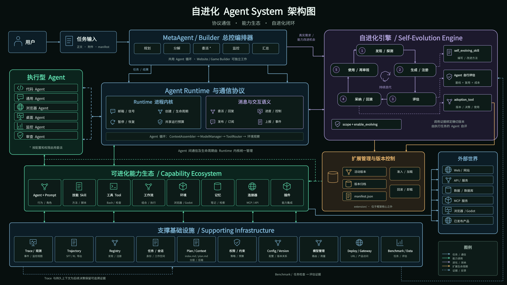
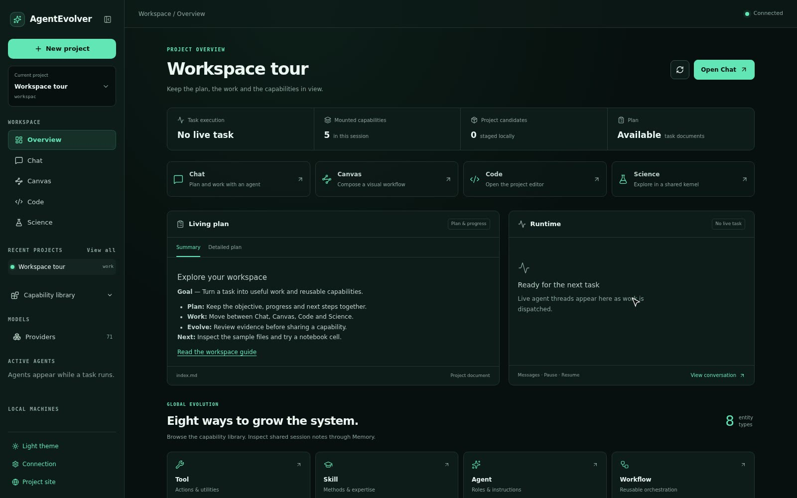

<div align="center">

# AgentEvolver

### 让多智能体完成任务、沉淀可复用能力，并把真实运行转化为下一轮训练数据

AgentEvolver 是一个面向复杂工程与研究任务的**自进化多智能体框架**。
MetaAgent 负责规划、分派和验收；当实际执行暴露出明确的能力缺口时，专门的生成、评估与优化智能体
会创建或改进工具、技能、智能体、连接器、环境、工作流和记忆组件。与此同时，`trajectory` 将真实
执行过程转化为带奖励的 SFT/RL 训练记录，为后续模型训练与回流保留数据基础。

[](LICENSE)
[](pyproject.toml)
[](.github/workflows/quality.yml)
[](https://dvampire.github.io/AgentEvolver/)

**[在线主页](https://dvampire.github.io/AgentEvolver/)** ·
**[快速开始](#快速开始)** ·
**[工作原理](#工作原理)** ·
**[训练数据闭环](#从任务轨迹到端到端训练)** ·
**[适用场景与取舍](#适用场景与取舍)** ·
**[Web 工作台](#web-工作台)**

English: **[README.md](README.md)**



</div>

---

## 先用一分钟了解它

普通多智能体框架主要回答：**如何让多个 Agent 协作完成当前任务？**

AgentEvolver 还多问一步：**这次任务暴露出的能力缺口，如何变成以后可以直接复用的组件？**

一次典型运行包含两条相互隔离的链路：

| 当前任务 | 能力进化 |
| --- | --- |
| MetaAgent 拆解目标并派发给代码、通用、浏览器、审查等执行智能体 | 只有在检查确认存在缺口后，才触发 generator / evaluator / optimizer |
| 产出代码、报告、实验结果或网页等用户需要的交付物 | 产出工具、技能、智能体、连接器、环境、工作流或记忆组件 |
| 优先保证当前任务完成 | 新组件先评估，再采纳或回滚 |
| 工作文件写入独立 session workspace | 可复用组件写入外部 `extension/`，核心包保持不变 |

当前版本的在线“自进化”首先发生在**运行时组件层**，不会在一次普通任务中直接修改模型权重，也不
允许 Agent 无限制地重写框架源码。但模型进化并未被排除：系统已经采集可训练 trajectory，目标是
进一步接入训练、评测、模型注册与应用回流，完成端到端闭环。

> **一句话心智模型：** AgentEvolver = 多智能体任务运行时 + 可版本化的能力扩展系统 + SFT/RL 数据飞轮；当前闭环到“可训练数据”，未来闭环到“训练后的模型重新服务 Agent”。

## 它解决什么问题

复杂任务经常不是“模型不会回答”，而是系统缺少稳定的方法：没有合适的工具、没有可复用流程、
没有领域连接器，或没有可靠的验收方式。仅靠加长提示词，下一次通常还会遇到同样的问题。

AgentEvolver 把这些方法做成一等组件：

- **先编排任务。** MetaAgent 将目标拆成子任务，通过统一运行时把工作交给专精智能体，并收集、审查结果。
- **再用证据判断是否需要进化。** 第一次可修复的错误只会重试；只有缺失能力、重复的结构性失败，或经测量确认的质量上限，才进入进化流程。
- **把改进保存成组件。** 新能力落在 `extension/`，可热加载、版本化、比较和回滚，不污染手写核心。
- **让过程既可检查又可训练。** `trace` 保留原始观察事件；`trajectory` 将运行投射为逐步、带奖励、可导出到 SFT/RL 流水线的训练记录。

## 核心特点

| 特点 | 实际意味着什么 |
| --- | --- |
| **证据驱动的自进化** | 发现缺口 → 生成或优化 → 只读评估 → 与基线比较 → 采纳或回滚；“看起来可能更好”不算验证。 |
| **不可变核心，可变扩展** | 手写内置能力位于 `agentevolver/`；进化结果位于外部 `extension/`。每个版本都有归档，已有版本可以恢复。 |
| **统一的多智能体运行时** | `spawn`、`send`、`ask`、`suspend/resume`、`publish/subscribe` 支撑委派、进度、控制和升级处理。 |
| **面向训练的数据接口** | `TrajectoryHook` 记录每步实际上下文、推理与工具调用、观察、token 和奖励；支持 OpenAI Chat SFT 记录与可插拔 RL 格式，内置 VERL 文本级 episode 导出。 |
| **HTML 原生的可审查产物** | 提示词、动态工作流、任务文档、记忆报告和逐步快照既供运行时使用，也供人阅读与 diff。 |
| **预算进入 Agent 上下文** | 步数、token 与墙钟预算以 `NORMAL / TIGHT / CRITICAL` 呈现，让 Agent 主动收敛，而不只是超限后被终止。 |
| **同一工程的四种视图** | Chat、Canvas、浏览器内 VS Code、Science/Jupyter 共用 session workspace 和 Gateway 协议。 |
| **分层安全边界** | 沙箱隔离、宿主侧出网策略、命令意图授权、容器回收账本分别处理不同风险；安全不是一个布尔开关。 |
| **注册表驱动的扩展面** | Agent、Tool、Skill、Environment、Memory 等组件遵循一致的注册、schema 与生命周期约定。 |

## 适用场景与取舍

### 适合

- 需要多个专精 Agent 协作的长链路工程、数据分析或科研任务；
- 希望把任务中形成的方法沉淀为可复用工具、技能或工作流；
- 研究 Agent 运行时、自改进策略、SFT/RL 数据构建、评估闭环和人机协作；
- 需要可视化工作台、完整运行记录、版本回滚和较强扩展能力的团队。

### 可能不适合

- **简单问答或单步自动化：** 单 Agent 或普通脚本通常更轻、更快；
- **严格追求低延迟、低 token 成本：** 多 Agent 编排和对照评估会增加模型调用与运行时间；
- **希望零运维的托管产品：** 这是可自行部署和扩展的框架，不是开箱即用的 SaaS；
- **不能接受实验性接口变化：** 当前版本为 `0.1.0`，更适合研发和受控工程环境；
- **缺少可靠验收标准的任务：** 版本化和回滚能控制变更，但不能替代测试、基准或人工审查。

### 优势与代价

| 你得到什么 | 相应代价 |
| --- | --- |
| 能力可持续积累，而不是每个任务从零开始 | 需要维护组件契约、评估规则和扩展版本 |
| 任务执行、进化、回滚形成闭环 | 比单 Agent 架构更复杂，调用成本也更高 |
| 丰富的 UI、沙箱、连接器和科研能力 | 安装面较大；完整体验需要 Docker、Node.js 和相应凭证 |
| 过程透明、产物可检查、轨迹可导出 | 日志与产物更多，需要规划存储和保留策略 |
| 核心与进化内容分离 | “可回滚”降低风险，但不代表未经验证的扩展可以直接用于高风险生产环境 |

## 快速开始

### 环境要求

- Python 3.11+（推荐 3.12）；
- conda，或使用安装脚本的 `--uv` 模式；
- 至少一个受支持模型供应商的 API Key；
- Docker：运行完整 Model X 沙箱和容器型环境时需要；
- Node.js：只在使用 Web UI 时需要，安装脚本默认处理。

### 1. 安装

```bash
git clone https://github.com/DVampire/AgentEvolver.git
cd AgentEvolver
bash scripts/install.sh
conda activate agentos
```

没有 conda 时可运行 `bash scripts/install.sh --uv`。浏览器、化学、沙箱和 benchmark 等重依赖通过
extras 按需安装：

```bash
bash scripts/install.sh --extras browser
bash scripts/install.sh --extras sandbox
bash scripts/install.sh --extras all
```

完整选项见 [`scripts/INSTALL_zh.md`](scripts/INSTALL_zh.md)。

### 2. 配置模型

在仓库根目录 `.env` 中配置你实际使用的 provider。默认配置使用 Google 模型；也可以通过配置或
`--cfg-options model_name=...` 切换。

```bash
GOOGLE_API_BASE='https://generativelanguage.googleapis.com'
GOOGLE_API_KEY='...'

# 或配置其他 provider
ANTHROPIC_API_BASE='...'
ANTHROPIC_API_KEY='...'
OPENROUTER_API_BASE='...'
OPENROUTER_API_KEY='...'
```

团队可选用 Vault 集中管理密钥；Vault 不可用时，框架会回退到 `.env`。

### 3. 运行第一个任务

先用主机环境验证最短路径：

```bash
python examples/run_meta_agent.py \
  --task "实现一个反转字符串的 Python 函数，并补充单元测试。"
```

也可以运行 HTML 或 Markdown 任务文档：

```bash
python examples/run_meta_agent.py \
  --task-file examples/tasks/qsar_egfr_experiment.html
```

常用参数：

| 参数 | 用途 |
| --- | --- |
| `--task "<文本>"` | 直接提交任务；优先级高于 `--task-file` |
| `--task-file <路径>` | 从 `.html` 或 `.md` 任务文档运行 |
| `--config <路径>` | 选择配置；默认为 `configs/meta_agent.py` |
| `--cfg-options key=value ...` | 临时覆盖模型名、预算等配置 |

每次运行拥有独立 session。工作文件、日志、任务视图和记忆报告写入
`output/<owner>/sessions/<session-id>/`。

### 4. 使用完整容器运行模式

AgentEvolver 将“整个框架运行在一个基础容器中”的方式称为 **Model X**。它让 MetaAgent、子智能体
和工具执行处于同一可复现环境；浏览器、桌面等服务作为 peer 容器按需启动。

```bash
docker build -f docker/base/Dockerfile -t agentevolver/base:latest .

scripts/run-in-sandbox.sh -- python examples/run_meta_agent.py \
  --task "分析这个仓库，并给出有测试支撑的改进。"
```

需要 NVIDIA GPU 时加 `--gpus`。启动器要求 Docker daemon 可达，且不会静默回退到主机执行。

### 5. 启动 Web 工作台

```bash
scripts/run-in-sandbox.sh -- scripts/serve-ui.sh
```

打开 `http://127.0.0.1:5173`。默认 Gateway 地址为 `ws://127.0.0.1:9876/ws`。
若绑定到非本机地址，请设置 `AGENTEVOLVER_GATEWAY_TOKEN` 并配置允许的浏览器来源。

### 6. 验证安装

```bash
pytest -q
pytest -m integration   # 需要外部凭证、服务或 peer 容器
```

默认测试排除 integration，因此不需要外部 API Key。安装脚本也会执行一次快速校验。

## 工作原理

### 任务执行链路

```text
用户 / Web UI
      │
      ▼
Gateway / Task Manager
      │
      ▼
MetaAgent ── 规划、拆解、分派、验收
      │
      ├── Code / General / Browser / Computer / Reviewer 等执行智能体
      │       └── Tools · Skills · Connectors · Environments · Workflows
      │
      └── 只有在获得缺口证据时
              └── Generate / Evaluate / Optimize
                        └── versioned extension/ → 采纳或回滚
```

Runtime 负责消息如何移动；Protocol 定义对话的语义。每个活跃 Agent 都由独立信箱、事件泵、状态和
待回复对象包装，因此可以被调用、暂停、恢复、取消或订阅。

### 自进化闭环

```text
1. 判断        2. 生成或优化        3. 评估             4. 取舍
缺少什么？  → 写入 extension/   → 与基线/标准比较   → 采纳或回滚
为什么重试不够？  保留核心不变       留下可审查证据      归档每个版本
```

以下信号才应触发进化：

1. **能力缺失：** 任务需要的操作不存在，现有能力无论如何重试都无法完成；
2. **重复的结构性失败：** 明确纠正后，同一种失败仍至少再次出现；
3. **经测量的质量上限：** 已有方法在明确指标上系统性不达标。

第一次可修复的错误、偶发故障、没有启用已有能力、或预算已经紧张，都应该优先重试、修复配置或完成
当前任务，而不是扩大系统。

### 扩展与版本

- 手写内置组件位于 `agentevolver/<module>/default/`；
- 生成或优化的组件位于外部 `extension/<module>/`；
- `ExtensionManager` 负责动态加载、注册、归档和回滚；
- `enable_evolving=False` 的已注册组件不能被进化覆盖；
- Gateway 会话先在自己的输出目录暂存扩展，显式 promote 后才进入共享 `extension/`。

这种设计限制了修改范围，但**不会自动证明新组件正确**。测试、基准、只读评估器和人工审批仍然是
高风险场景所必需的。

## 从任务轨迹到端到端训练

AgentEvolver 不只记录“发生过什么”，还维护一份面向训练的运行投影。`TrajectoryHook` 监听 Agent
生命周期，把一次执行聚合成步骤序列：

```text
s_t = (z_t, a_t, o_t, r_t)

z_t  实际发送给模型的上下文
a_t  模型产生的推理与原生工具调用
o_t  每个动作的结果或错误
r_t  benchmark / evaluator 在任务结束后回填的奖励
```

当前已经实现：

- 按 `task_id` 采集 Agent 每一步的有效 prompt、推理、工具调用、观察结果和 token 使用量；
- 保存 session/task 标识、任务结果、成功状态以及 parent/subtask metadata；
- 允许 benchmark 或 evaluator 在任务结束后回填 task-level reward，并传播到每一步；
- 持久化为 `<log_root>/trajectory/<task_id>.jsonl`；
- `export_sft()` 导出逐步 OpenAI Chat 格式，assistant target 保留推理和原生 `tool_calls`；
- `export_rl()` 通过可插拔 `RLFormat` 导出 RL episode；内置 `VerlFormat` 提供
  `prompt / response / reward` 等文本级字段，token ids 与 mask 预留给持有 tokenizer 的训练 provider。

因此，系统的数据闭环已经到达“**真实任务 → 奖励标注 trajectory → SFT 记录 / RL 格式 episode**”。下一阶段的
目标是在同一系统中接入训练执行、checkpoint 与模型版本管理、离线/在线评测、审批提升和 serving，
形成完整飞轮：

```text
任务执行
   ↓
Trajectory 采集与奖励回填             ← 当前已实现
   ↓
SFT / RL 数据集与 VERL 等格式导出     ← 当前已实现
   ↓
训练与 checkpoint 管理                ← 规划接入
   ↓
基准评测、对照验证与模型提升           ← 规划接入
   ↓
新模型重新服务 Agent                  ← 规划接入
   └──────────────────────────────→ 产生新一轮 trajectory
```

这也是 AgentEvolver 更完整的“进化”定义：**组件层进化让系统获得新方法，模型层训练让系统把高质量
行为内化；两者最终由同一套任务、评价和数据接口连接起来。** 当前仓库提供数据采集与导出基础，不能把
尚未接入的训练执行器描述成已经完成。

## Web 工作台

<div align="center">

<a href="https://dvampire.github.io/AgentEvolver/ui.html"></a>

**[查看 11 段功能演示](https://dvampire.github.io/AgentEvolver/ui.html)**

</div>

| 视图 | 用来做什么 |
| --- | --- |
| **Chat** | 提交任务、上传文件、查看实时事件、审批敏感操作、取消与重连 |
| **Canvas** | 使用 React Flow 编辑 JSON 流程，并在共享 Workflow Runtime 中运行 |
| **Code** | 在浏览器内的 VS Code 直接编辑同一 session workspace |
| **Science** | 与 Agent 共用 Jupyter 内核，查看执行历史、MIME 输出和算力状态 |
| **Machines** | 通过 noVNC 查看浏览器/桌面环境，或管理已明确配置的 SSH 主机 |

能力目录、模型管理、文件编辑、扩展暂存/提升和部署状态也都通过同一套版本化 Gateway 协议工作。
详见 [`frontend/README.md`](frontend/README.md) 和
[`docs/canvas.md`](docs/canvas.md)。

## 安全、预算与可观测性

### 安全边界

| 层 | 职责 |
| --- | --- |
| Sandbox | 隔离代码、浏览器或桌面环境；不同后端提供不同强度与能力 |
| Network policy | 任务容器默认无公网路由；允许的请求经 Unix socket 到宿主侧中继判定并记录 |
| Permission | 在 Tool 或 Sandbox 执行前，根据读写、破坏性、网络、进程和包管理等意图授权 |
| Lifecycle | 预写式容器账本清理崩溃遗留资源；端口注册表减少多服务冲突 |

“支持沙箱”不等于“可以直接处理任意高风险工作负载”。部署者仍需根据威胁模型审查镜像、挂载、凭证、
网络白名单、宿主 Docker socket 和权限模式。

### 预算与记录

- `constraint/` 同时跟踪步数、token 和墙钟时间，并把剩余预算写入 Agent 上下文；
- `trace/` 保存结构化事件并实时推送给 Gateway；
- `trajectory/` 将运行投射为带奖励的步级记录，并导出 OpenAI Chat SFT 或 VERL 等 RL 格式；
- `memory/` 维护近期历史、压缩后的工作记忆、todo、调用路径与最终结果；
- `benchmark/` 提供 AIME、GPQA、GSM8K、HLE、LeetCode、DeepWeb、ProgramBench 等评测入口。

## 扩展框架

大多数组件模块遵循同一种结构：

```text
agentevolver/<module>/
├── default/       # 手写内置实现
├── types.py       # 基类、数据结构和契约
├── context.py     # 注册与生命周期（部分模块）
├── server.py      # <module>_manager 门面
└── README.md      # 模块边界与使用说明
```

新增手写组件时，通过对应注册表装饰器注册，并从 `default/__init__.py` 导出。新增进化组件时，不修改
包内 `__init__.py`，而是写入 `extension/`，交由目录扫描和 ExtensionManager 加载。

| 组件 | 入口 |
| --- | --- |
| Agent / Prompt | `agentevolver.agent` / `agentevolver.prompt` |
| Tool / Skill | `agentevolver.tool` / `agentevolver.skill` |
| Environment / Sandbox | `agentevolver.environment` / `agentevolver.sandbox` |
| Memory / Hook / Constraint | `agentevolver.memory` / `agentevolver.hook` / `agentevolver.constraint` |
| Dataset / Benchmark | `agentevolver.data` / `agentevolver.benchmark` |
| Connector | 扫描 `CONNECTOR.md`，由 `connector_manager` 管理 |
| Workflow | HTML 定义经 `WorkflowCompiler` 编译，由共享 runtime 执行 |

完整约定见 [`PROJECT.md`](PROJECT.md)；每个模块自己的 `README.md` 是该模块的详细契约。

## 目录与产物

```text
AgentEvolver/
├── agentevolver/       # 框架核心与内置能力
├── configs/            # 运行配置
├── extension/          # 共享、可版本化的进化组件
├── frontend/           # React/Vite Web UI 与终端客户端
├── examples/           # Agent 入口和任务样例
├── docs/               # 文档主页、UI 演示和专题文档
├── docker/             # 基础、浏览器、桌面等镜像
├── datasets/           # 本地优先的 benchmark 数据
├── scripts/            # 安装、启动和维护脚本
├── tests/              # 快速测试与 integration 测试
└── output/             # 会话、日志、workspace 与运行时状态（生成内容）
```

框架写入路径集中由 `agentevolver.paths` 管理。主要可写根是 `output/` 和 `extension/`；可通过
`AGENTEVOLVER_HOME` 与 `AGENTEVOLVER_EXTENSION_ROOT` 调整位置。

## 文档导航

| 文档 | 内容 |
| --- | --- |
| [在线主页](https://dvampire.github.io/AgentEvolver/) | 项目定位、架构、特点、取舍和快速开始 |
| [Web UI 演示](https://dvampire.github.io/AgentEvolver/ui.html) | 11 个短视频逐项展示工作台 |
| [`PROJECT.md`](PROJECT.md) | 完整目录、核心概念和开发约定 |
| [`scripts/INSTALL_zh.md`](scripts/INSTALL_zh.md) | 安装、可选 extras、Vault 与环境配置 |
| [`frontend/README.md`](frontend/README.md) | Gateway 和 Web UI 的开发与部署 |
| [`docs/workflows.md`](docs/workflows.md) | 动态 HTML 工作流 |
| [`docs/canvas.md`](docs/canvas.md) | 可视化 Canvas 流程 |
| [`docs/capability-schemas.md`](docs/capability-schemas.md) | 能力 schema 协议 |
| [`agentevolver/trajectory/README.md`](agentevolver/trajectory/README.md) | trajectory 采集、持久化与 SFT/RL 导出契约 |

## 项目状态

AgentEvolver 目前是 `0.1.0` 阶段的研究与工程框架。组件进化和 SFT/RL trajectory 数据接口已经
存在；训练执行、checkpoint/模型版本管理和训练后模型回流属于下一阶段路线图。欢迎使用、实验和扩展；
如果要用于生产或高风险环境，请先建立与你的任务相匹配的评估集、审批流程、安全策略和回滚演练。

## 许可证

[MIT](LICENSE) © 2026 Wentao Zhang
