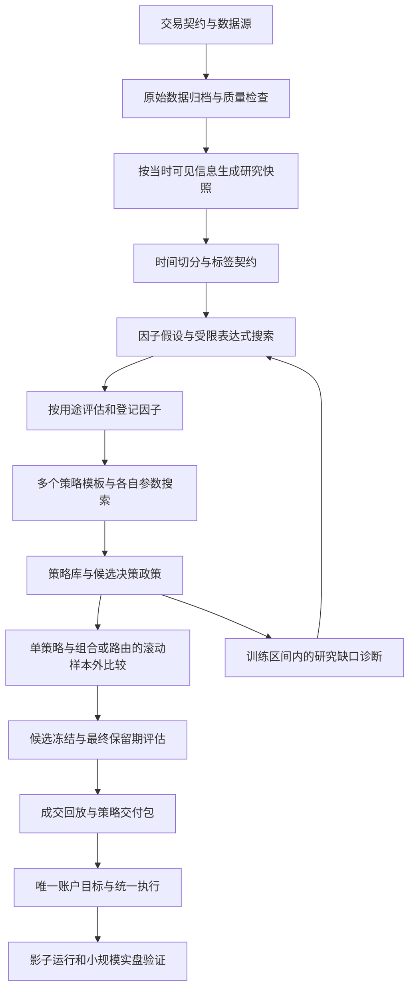

# 单资产因子策略：机构方法比较、研究流程与实盘设计

更新：2026-09-11。状态：**设计讨论稿；本次只更新文档，尚未完成策略实证或交易框架接入。**

2026-09-12 补充：新增 [Signal Foundry 单 Agent 双阶段 demo](../demos/factor_strategy_mining.md)，
入口为 `examples/run_factor_strategy_mining_demo.py`。它在运行中开发数据 Connector、因子 Environment
和策略 Environment，并交付两个关联的网页报告。默认采用协议约束的单次最终测试，不宣称独立隔离或已获得盈利结果。
本文后续的实盘目标和原双 Agent Benchmark 是不同范围；新 demo 的当前任务要求以其 task.html 和 study.json 为准。

当前阶段：先定义因子与因子策略挖掘的历史输入，实盘讨论后置。**用户已明确当前研究市场为美股**；沿用单资产研究范围，首批建议准备原始量价、公司行动、证券与交易状态、历史股本、当时可见的财报、业绩披露、大盘/行业参照及回测成本，逐笔与全量新闻按假设扩展。字段、用途、优先级与来源见 [美股历史数据需求文档](us-stock-factor-data-requirements.md)。

以 NVIDIA 为例的官方来源核查已整理为 [NVDA API、历史覆盖与数据粒度表](nvda-historical-data-api-matrix.md)：区分日/分钟/秒/逐笔与披露事件，列出多个来源、访问条件及实测/文档证据。

下文保留此前围绕 BTC 的策略与实盘设计，作为既有讨论记录；其中币种、频率、合约和交易规则尚未迁移到美股，不作为当前美股方案的既定配置。[此前的 BTC 历史数据方案](factor-strategy-data-sources.md) 也单独保留。通用的研究验证原则可以复用，股票数据需求以新文档为准。

此前用于核验数字资产链路的候选基线是 **BTC 4 小时趋势突破策略（BTC-TREND-01）**，数据空间同时支持其他因子与策略假设：用过去区间突破判断入场，以波动确定仓位，用趋势失效与保护止损退出，赚取持续方向行情中的价差。先验证这一条完整策略，再比较同族信号组合与辅助因子的增益。详细规则、盈利判据及交易所接入见第 0.5 节。它是待实证候选，当前没有可以声称已证明赚钱的生产策略。

长期架构保留多种候选和一个账户控制器。同族简单组合是优先比较的扩展，市场状态服务于适用性和风险，跨家族自动切换后置。首版交付优先围绕明确的交易产品和实际损益展开；最终可以只上线一条策略。

现有实现见 [factor_mining README](../../agentevolver/benchmark/default/factor_mining/README.md)。本文的状态门控、决策控制器、事件回放及实盘交付均为目标设计。本轮检索和代码阅读没有证明任何候选能在 BTC 上盈利，也没有验证交易框架的目标场所适配。

## 0. 调研结论与方案比较

### 0.1 量化机构公开资料实际支持什么

检索截至 2026-09-11。下表以机构官网的一手资料为依据，区分业务流程披露、教学材料与研究观点。公开样本不能提供行业采用率，也不能还原各公司的保密生产系统。这里比较的重点是系统化方向预测与趋势研究；跨资产基金的结论不能直接等同于单 BTC 策略的结果，做市等不同业务也不纳入同一排名。

| 机构与资料 | 可核实的公开内容 | 对本项目的启示及证据边界 |
| --- | --- | --- |
| **Two Sigma，Investment Management**，当前业务页面，未标发布日期 | 多个独立预测形成每个潜在交易标的的综合判断，再结合成本与风险形成目标配置 | 对“多预测 → 单标的目标 → 执行”有直接业务流程依据；未披露具体权重或证明某种 BTC 政策。[官方流程](https://www.twosigma.com/businesses/investment-management/) |
| **Man AHL，Momentum**，2015-06-02；**Need for Speed**，2023-01-04 | 公开讲解不同时间尺度趋势信号的组合，并讨论快慢趋势的表现和交易取舍 | 支持从同一家族内组合不同尺度起步；不是要求任意策略都混合，也不是分钟 BTC 参数建议。[Momentum](https://www.man.com/insights/ahl-explains-momentum)、[Need for Speed](https://www.man.com/insights/need-for-speed-trend-following) |
| **Two Sigma，Regime Modeling**，2021-10-06 | 用混合模型描述历史市场状态，讨论压力测试与配置用途；文中明确其模型本身不具预测性 | 状态描述不能直接证明下一阶段应由谁交易。这是研究文章，不能据此声称其生产采用唯一赢家切换。[原文](https://www.twosigma.com/articles/a-machine-learning-approach-to-regime-modeling/) |
| **AQR，The Siren Song of Factor Timing**，2016-06-30 | 对基于估值的因子择时证据及过度推销提出质疑 | 给新增择时层设置较高证明要求；研究对象不是所有状态模型，更不是直接否定 BTC 状态策略。[原文](https://www.aqr.com/Insights/Research/Journal-Article/The-Siren-Song-of-Factor-Timing) |
| **Winton，What is trend following?**，2022-03-01 | 介绍趋势强弱、风险与仓位的联系，以及跨市场分散的重要性 | 可借鉴信号和风险分层；单 BTC 缺少其跨市场分散来源，不能照搬基金业绩或危机保护结论。[原文](https://www.winton.com/news/what-is-trend-following) |
| **Man AHL，AlphaTrend**，2026-02-11 | 专门的 Agent 流程生成、实现和评估趋势信号，展示正面、负面和效果不稳定的研究结果 | 与本项目的自动研究最贴近；借鉴结构化试验与淘汰无效假设。文章展示模拟研究，未证明 BTC 实盘，也未证明让 LLM 在线选策略有效。[原文](https://www.man.com/insights/alphatrend-agentic-research-workflows) |

**可以作出的判断：上述机构公开方法更充分支持“多信号研究与组合、统一风险和成本处理”，而非一个通用的“先判断牛熊震荡，再全仓切换唯一赢家”模板。** 这是对已查资料的归纳，不是行业份额统计。交易框架支持某功能也不能用作量化公司实际采用该方法的证据。

### 0.2 五种方案放在同一张表里比较

以下优劣是结合单资产、有限独立行情样本、先回测后实盘的工程与统计判断，收益优劣仍需样本外检验。

| 方案 | 真实运行方式 | 主要价值 | 主要问题 | 本项目定位 |
| --- | --- | --- | --- | --- |
| **A：固定单策略** | 一个完整政策长期运行，满足条件才交易 | 易解释、易对账，估计与维护负担小 | 有失效环境；依赖单一逻辑 | 必须保留的基线；若其他方案没有增量价值就采用它 |
| **B：市场状态硬切换** | 根据状态，在趋势/反转/突破中只选一个；也可空仓 | 主策略身份明确，政策间方向冲突少 | 状态误判、识别滞后、交接成本；额外估计“哪个更有效” | 后续挑战者，不作首版默认 |
| **C：一个主策略 + 辅助信号** | 主策略管方向和持仓，辅助管准入、减仓或执行 | 权限清楚，适合逐项验证辅助因子 | 辅助条件过多会形成隐蔽择时；动态选主策略仍有 B 的问题 | 首版辅助层采用此权限边界；主策略自动轮换需另验 |
| **D：简单信号组合 + 统一仓位** | 少量可比较信号固定或受约束组合，一个政策管理真实持仓 | 不依赖逐时挑赢家，能利用部分互补，适合逐步研究 | 标度/期限不一致会误混，冗余信号可能放大同一风险 | **首版默认骨架：先同族，跨族需证明增益** |
| **E：学习型状态加权 / MoE** | 状态概率或预测的条件表现决定动态权重 | 可表达不同环境的条件差异，能平滑过渡 | 训练样本要求、模型漂移和搜索偏差更大；平滑不保证低换手 | 简单基线稳定后再研究 |

推荐 **D 的组合骨架 + C 的辅助权限**：先找一个可用的策略家族，在其内部组合少量不同尺度的信号；状态信息首先服务于风险、适用性和不交易决策。反转等其他家族保留为独立研究候选。可以有多个候选持续计算和影子评估，实盘只有一个获批决策政策管理目标与订单。

这是一项首版复杂度选择。若单策略 A 在风险匹配、扣费后的滚动样本外比较中与 D 相当或更好，就部署 A；若 B/E 有稳定增量证据，再升级。不能用一个历史区间的最高 Sharpe 宣布复杂架构更优。

### 0.3 BTC 的具体起点与升级条件

本轮将具体首发候选收敛为单 BTC、1 分钟基础行情、4 小时决策；以 USDT 线性永续作为设计示例，场所、可交易产品和实际资金条件待确认：

1. 建立慢趋势、震荡反转、压缩后突破三个完整基线，分别检验；前三者只是优先研究假设，不预设一定有三条可用策略。
2. 先验证第 0.5 节的单一趋势突破政策，再比较少数快慢趋势分数的固定组合。选择趋势是研究优先级，不能据此断言它在 BTC 上必然优于反转。
3. 逐项检验波动、流动性、拥挤等辅助因子；它们控制风险或执行许可，不能未经验证变成新的方向来源。状态过滤没有独立贡献就删除。
4. 其他家族只有在完整样本外实验中证明价值，才加入受约束的信号组合或作为路由候选。突破可能与趋势高度同源，不能只因名称不同就增加权重。
5. 硬切换和学习型加权必须超过固定单策略、简单组合、以及简单减仓这些对照，收益扣除真实切换成本；证据不足时保持已获批政策或按风险政策减仓。

例如，趋势组合给出偏多方向，波动上升降低目标敞口，点差异常暂缓新增风险。反转候选出现偏空信号时先记录影子结果；经消融验证获准后可作减仓提示，正式成为获批方向组件后才参与生成反向目标。**辅助信号、研究候选和生产方向信号的身份必须显式登记。**

### 0.4 交易内核选型是下一层问题

| 工具 | 本项目判断 | 需验证的边界 |
| --- | --- | --- |
| **NautilusTrader** | 优先评估为确定性事件回放与实盘内核；一个执行 Strategy 接收控制器目标 | 策略接口、场所适配器、数据精度、成交/资金费用、重启对账；文档上的回测/实盘复用不等于接入完成。[Strategies](https://nautilustrader.io/docs/latest/concepts/strategies/) |
| **LEAN / QuantConnect** | Alpha → 目标配置 → 执行的分层很合适，作为主要备选 | 基础 Portfolio Construction 对同 Symbol 默认选择最新有效 Insight，目标组合需要明确实现。[官方说明](https://www.quantconnect.com/docs/v2/writing-algorithms/algorithm-framework/portfolio-construction/key-concepts) |
| **Freqtrade** | 对单交易对、单实际仓位的首版，比独立策略分账架构更匹配；可作轻量备选 | 在一个策略内实现组合和状态政策；仍需检验目标场所、成交模型和研究数据一致性。[FAQ](https://www.freqtrade.io/en/stable/faq/) |
| **vectorbt** | 可用于批量研究与粗筛，现有引擎足够时无需增加依赖 | 最终结论仍需事件回放验证订单和账户状态。[Portfolio API](https://vectorbt.dev/api/portfolio/base/) |
| **Qlib / RD-Agent** | 可参考因子与模型研究方法 | 研究框架的存在不解决交易所账户与实盘恢复。[Qlib](https://github.com/microsoft/qlib) |

后续选定产品后，用同一简单政策检查历史导入、目标转订单、部分成交、退出、重启恢复和资金现金流，再冻结一个运行内核。现在不同时建设多套正式执行系统。

本地 [均值回归原型](../../others/FactorStrategyLLM/src/strategy/futures/mean_reversion.py) 和 [突破原型](../../others/FactorStrategyLLM/src/strategy/futures/momentum_breakout.py) 可用于核对业务对象；多指标评分、阈值和实时循环仍需独立检验，不整体移植。

### 0.5 首发产品：BTC-TREND-01 怎样交易、怎样赚钱、怎样接实盘

#### 0.5.1 产品与收益来源

**首发候选：BTC 的中低频趋势突破。** 研究版以同一场所的 `BTCUSDT` USDT 线性永续为示例，允许多头、空头或空仓，只保持一个净方向。4 小时闭合后做策略决策，盘口与账户风险持续监控。现货账户则另建 long/flat 版本及报告，不能把永续收益曲线直接改接口后作为现货成绩。

经济假设是：部分由资金流和仓位调整形成的方向运动会持续，突破后跟随，失败时退出；若较大盈利段足以覆盖失败交易、费用和资金费率，就有正净期望。该机制是待检验假设。上涨时的利润来自多头价差，下跌时来自空头价差；风险控制本身不创造方向 alpha。

Man AHL 在 2024-12-19 的《In Crypto We Trend》中讨论了加密资产的趋势研究，比较均线与突破，并纳入流动性和交易成本。这给出研究该家族的依据，但其示例涉及币种组合和不同周期，不能当成本项目单 BTC、4 小时规则的实证结果。[机构研究](https://www.man.com/insights/in-crypto-we-trend)

选择 4 小时决策，是为了先研究持有数日至数周的机会，降低对亚秒级延迟和极短期价格预测的依赖；实际换手与持有分布必须由回测报告。初期不追求每天交易或每天赚钱。

| 收益路径 | 具体赚什么 | 本项目顺序 |
| --- | --- | --- |
| **趋势突破** | 持续方向运动中的净价差，允许多次小额失败 | 首发候选；先证明完整政策的净期望 |
| **震荡反转** | 偏离后回归的净价差 | 独立挑战者；需要证明极端单边风险和费用没有吞掉优势 |
| **BTC 期现基差** | 现货与期货对冲后基差收敛的收益，扣除融资和交易成本 | 若接受同一 BTC 的两条交易腿，另立产品；不是首版单 instrument 控制器的直接开关 |

BIS 的 Crypto Carry 研究讨论了买现货、卖期货的收益来源，也分析保证金和套利资本约束。期现基差是另一条值得评估的经济机制；永续资金费率会变化，不能把当前费率直接外推为保证年收益。是否做该产品取决于资金、融资、场所和双腿执行条件，不能为了“更像稳定赚钱”就称其无风险。[BIS 研究](https://www.bis.org/publications/working-paper-1087-crypto-carry)

#### 0.5.2 可以直接实现和复现的基线规则

以下参数是**首轮固定研究基线**，用于产生一份可证伪报告；尚未优化，也不是实盘仓位建议。允许 Agent 修改的参数与规则必须另记版本，保留原版对照。

| 项目 | BTC-TREND-01 的定义 |
| --- | --- |
| 决策与数据 | UTC 固定 4 小时 bar，使用已闭合且已到达的数据；1 分钟/成交数据用于执行回放，标记价用于账户风险与清算建模 |
| 入场通道 | 当前 bar 之前的 120 根 4 小时 bar，约 20 天；上轨为这些 bar 最高价的最大值，下轨为最低价的最小值 |
| 开多 | 空仓且非冷却，当前闭合价高于上述上轨；决策后才提交订单 |
| 开空 | 空仓且非冷却，当前闭合价低于上述下轨；仅允许做空的产品适用 |
| 不交易 | 没有突破、数据未预热/无效、实际账户未对账、执行条件不满足，均不新增风险 |
| 趋势退出 | 多头闭合价跌破之前 60 根 bar 的低点，或空头闭合价升破之前 60 根 bar 的高点，提交减仓退出 |
| 保护退出 | 初始距离为信号时刻 `3 × ATR(20)`；实际成交后按成交均价确定保护价。ATR 使用已闭合 4 小时 bar 的 true range，以 Wilder 方法平滑 |
| 跟踪保护 | 多头保护价只上移，空头只下移；参考入场后完整 4 小时 bar 的最高/最低收盘价和当时 ATR。更新只在信息到达后生效 |
| 持有与冷却 | 不设固定盈利目标；最长持有 60 个自然日，届时尝试退出。退出确认后至少等待一个完整 4 小时 bar；不在同一决策中直接翻仓 |
| 加仓与数量 | 首版不盈利加仓、不亏损摊平；开仓数量确定后只允许风险减仓或退出，禁止因波动下降自动补满仓位 |
| 辅助条件 | 首版只要求数据/账户有效、价差及可成交深度符合冻结执行契约；成交量确认、均线过滤和拥挤因子后续逐项做消融 |

定义入场时的参考价格 `P_ref`、账户权益 `E`、止损距离 `D = 3 × ATR`，用以下规则确定线性 BTC 合约的数量：

```text
q_risk = E × r / D
q_cap  = E × e_max / P_ref
q      = 按数量步长向下取整(min(q_risk, q_cap, 资金/深度允许数量))
```

`r` 是单次计划价格风险占权益的比例，`e_max` 是总名义敞口上限；二者按用户风险条件冻结。研究核验示例可取 `r=0.25%`、`e_max=0.5`，这些数值只用于检查账本和敏感性。名义敞口限制与交易所杠杆/保证金设置分别管理，不能把其中一个当成另一个。

例如，纯算术场景中 `E=10,000 USDT`、`P_ref=100,000`、`D=3,000`，按上述示例风险比例得到约 `0.00833 BTC`，再按场所步长下调。计划价格损失约 25 USDT，费用、跳空与止损滑点可能使真实损失超过它；这不是当前 BTC 报价，也不是收益预测。实际成交价使风险超出契约时，停止追加并按政策减仓。

多头初始保护价为 `P_fill-D`，空头为 `P_fill+D`。持仓后的跟踪更新可写为：多头 `max(旧保护价, 入场后最高完整bar收盘价 - 3×ATR_t)`，空头对称；初始极值以成交均价初始化。当前 bar 更新后的保护价不能倒回用于该 bar 已经发生的高低点成交。保护单在 bar 内触发时以实际可成交价格记账；禁止无条件按保护价成交。

首轮同时报告 long/short、long/flat、short/flat 的结果，三者计入研究尝试。若空头侧持续消耗净收益，就允许最终只保留 long/flat；选择只能发生在训练/内层验证中。

#### 0.5.3 Agent 实际挖什么

先得到上述基线的真实缺点，再让 Agent 提出少量可检验修改。例如：

- 突破后什么成交活跃度/趋势效率条件能减少假突破，并保留足够有效交易？
- 资金费率和拥挤能否改善成本或退出，而不是仅在历史顶部出现好看的解释？
- 一个较快的趋势信号能否在扣费后降低回吐，是否优于单纯缩小敞口？
- 通道长度、退出长度与保护距离的邻域是否平稳，是否只能在某一个精确参数赚钱？

每个候选写明改动的决策、经济理由、允许字段、预期失效场景与独立对照。首轮先跑未改的基线和少量预登记邻域，后续每轮只改变一个主要机制。目标是找到**净交易收益的增量**；IC、分类准确率、Agent 生成数量都不是交付目标。

#### 0.5.4 用什么证据判断值得真钱试运行

真实目标定义为：在用户允许的资金与风险下，冻结政策在后续数据上有正的净经济收益，并且执行成本和运维费用不会吃掉它。现阶段没有测算结果，不能给出年化收益或胜率承诺。

```text
净交易损益 = 已实现与未实现价格损益
           + 实际资金/融资现金流 - 手续费 - 未计入成交价的执行成本
经营净收益 = 净交易损益 - 数据、服务器与研究等成本的明确分摊
```

评价至少覆盖下列条件；具体阈值在看结果前依据风险/资金需求冻结：

1. **经济收益**：拼接的外层样本外净收益为正；报告相对现金、买入持有、波动控制持有和原始通道基线的表现。牛市绝对收益低于满仓 BTC 不自动失败，但应在预登记风险目标下体现价值。
2. **不确定性**：给出考虑时间相关的净期望与风险区间、独立交易/行情段数量；证据不足时留在研究或影子阶段。单纯点估计大于零不构成生产验证。
3. **稳定性**：参数邻域、不同年份和成本/延迟压力下不存在仅一个点漂亮的现象；成本敏感性逐项列出。趋势收益本来可能集中在少数行情，去掉最大盈利段作为依赖诊断，不能机械要求去掉全部主要趋势后仍盈利。
4. **风险与资金效率**：真实净敞口、回撤、尾部亏损、水下时间、资金占用与最差退出情景满足事先约束。降低仓位后的漂亮回撤需与相同风险的朴素对照比较。
5. **可执行性**：小额实际成交与回测假设的偏差可解释，保护单和对账恢复经过验证；模拟环境成绩不能证明真实成交质量。

历史按目标合约可取得的真实数据起点建清单，不能用其上市前现货行情伪造成永续成交。滚动划分可先设计为“过去 24 个月研究、内部留 6 个月验证、后续 3 个月外层评估”，每次前进 3 个月；再保留最近一段未用于选策略的历史作最终评估。窗口长度只是待冻结方案，要核验可用历史和独立事件是否足够；按第 4 节控制所有搜索和跨窗口持仓。

由于已经公开的历史可能为研究者或 LLM 所知，最终仍需要冻结之后新增数据的前向证据。固定策略连续 30–90 天影子运行可作为首轮观察计划，但低频策略必须结合足够交易与关键分支；日历到期或短期盈利均不自动通过。

#### 0.5.5 实盘接入的具体形态

接入示例采用 **AgentEvolver 离线研究 + 冻结 BTC-TREND-01 + NautilusTrader 运行内核 + Binance USDT 永续适配器**。实际场所和账户产品待用户确认；当前只设计，不加载交易密钥、不开户、不发单。


运行组成保持小而明确：一个行情/策略执行进程、持久化事件账本、进程守护与告警。研究进程独立部署，输出含数据版本、规则、参数、代码哈希及验收证据的包；正式策略加载后不调用 LLM，不边交易边改参数。

接入顺序：

1. **确认产品和账户**：实际交易对、线性合约乘数、方向模式、保证金模式、费用档位、数量/价格步长与最小下单额；示例选择 one-way 单向净持仓。交易凭据通过部署密钥配置注入，限定交易权限，研究进程不持有凭据。
2. **准备实时输入**：行情流维护报价/成交和闭合 bar，历史补齐预热；账户私有流接收订单、成交、资金及持仓更新。断线后先补数与对账，再允许新开仓。
3. **目标变成订单**：结合真实持仓和在途订单计算差额。普通开仓用带价格保护的可成交 IOC 限价单；未成交部分按冻结有效期取消，信号过期不追单。普通退出采用减仓语义，优先降低风险。
4. **保护实际持仓**：部分成交后即保护已成交数量。验证场所托管的条件止损及其触发价口径，首版以合约成交价触发为例；真实标记价仍用于保证金风险。保护下单失败时暂停新增风险并按预设方案尝试退出。
5. **恢复和对账**：保存 client order ID、信号序号、参数版本和最后事件；超时后先查询确认，不能直接重发。重启读取交易所余额、实际仓位、普通和条件订单，再重建状态。
6. **同一政策逐级验证**：历史事件回放 → Demo/Testnet 验证接口与异常分支 → 真实行情影子运行 → 获批后的限定规模实盘。正式数据与测试环境分别配置，不以测试网盈亏评价 alpha。

NautilusTrader 的 Binance 文档公开了现货/期货行情与执行支持、环境选择、订单回报及对账接口；这些可以作为实现基础，仍需锁定依赖版本并验证目标账户。[适配器](https://nautilustrader.io/docs/latest/integrations/binance/)、[运行节点](https://nautilustrader.io/docs/latest/how_to/configure_live_trading/)

需要专门核验普通订单和条件单的不同生命周期，以及请求超时后的未知状态处理。保护止损若使用全仓关闭语义，不能同时盲目附加不兼容的数量/减仓字段；若使用指定数量，则必须随实际成交数量维护。所有这些规则进入回放与接入用例，不能靠接口调用返回成功就宣称交易完成。

实盘看板至少展示实际持仓、入场依据、有效保护单、最后行情/账户事件、订单状态、毛损益、费用/资金费率、净损益和回撤。账户风控触发后允许暂停新增风险、撤销开仓订单和尝试减仓；保留保护与对账通道。

#### 0.5.6 本轮决策与仍待确认的事实

本轮确定**研究优先级与策略规范**，没有产生盈利证据或实盘授权。第一项后续交付应是 BTC-TREND-01 的可复现交易清单、样本外净值和成本/风险报告；通过后才值得把资源投入真实场所验证。若该家族不通过，记录失败并比较下一条机制，不能通过无限加指标或提高杠杆制造达标结果。

仍需用户条件来确定：可用交易所、现货/永续、资金规模、可承受回撤，以及需要的净收益相对于维护成本是否值得。用户只使用现货时，先验证 long/flat；接受同一 BTC 的双腿对冲且更偏好较低方向暴露时，可另评估基差产品。未收到这些条件时，本文参数均保持研究示例。

## 1. 范围和首版决策

### 1.1 已确定与待确定

| 项目 | 设计决定 |
| --- | --- |
| 交易范围 | 一个部署只交易一个 `instrument_id`；策略库可有多种逻辑，获批控制器形成唯一账户目标，不做截面选股或多资产轮动 |
| 数据范围 | 首版以该标的自身行情为主；同一标的的现货、衍生品信息可作为可选输入，但不自动增加交易腿 |
| 框架 | 保留 AgentEvolver 的 Data、Environment、Agent、Benchmark 分层；不移植 `others/FactorStrategyLLM` 的代码 |
| 研究方法 | 假设驱动的受限表达式搜索、小规模可解释组合、完整试验账本、按时间向前验证 |
| 生产方式 | Agent 离线研究，冻结策略包由确定性程序运行；实盘决策路径不调用 LLM |
| 尚待选择 | 市场、交易所/券商、唯一标的、现货/永续/期货、是否允许做空、资金规模、可接受回撤、信号与执行周期 |

具体首发候选采用**BTC、1 分钟底层行情、4 小时决策**；第 6 节其他周期属于候选家族的说明例子。不同候选分别登记主周期与持有期，组合前明确期限和状态语义。USDT 永续和 Binance 在本轮用作产品/接入示例，不代表已确认用户账户可用、已选择生产交易所或已授权交易。

单资产泛化主要指跨时间、跨市场状态、跨成本情景的稳健性。不再要求“每个资产都通过”。不同市场制度必须另建研究契约，不能把股票、现货和永续的交易假设混成一个实验。

### 1.2 先冻结 ResearchContract

每次研究开始前冻结以下信息并生成指纹：

- 标的、场所、合约类型、计价/结算币、交易日历、方向限制、资金与风险边界。
- 数据源及版本、各字段可见时间规则、基础周期、决策时钟、允许的外部信息。
- 标签主周期、最长持有期、最大回看长度、训练/评估日历及最后保留期。
- 手续费口径、成交模型、滑点/延迟情景、可参与成交量、资金费率或融资规则。
- 因子族与参数搜索预算、比较基线、统计评价方式、组合/路由选择与停止规则。

缺少资金规模，就不能给出容量结论；缺少做空和融资条件，就不能默认多空对称；缺少风险容忍度，就先交付收益—风险前沿，不编造“实盘已达标”的统一分数。

## 2. 主链路与模块边界



Environment 提供训练数据与确定性评估工具；Agent 决定提出什么假设、测试什么候选；Benchmark 持有评估数据并执行冻结的评价协议。实盘发布、账户风控和交易执行属于独立业务组件，不塞进 Agent 基类，也不把 `done_tool` 当作实盘验收通过。

## 3. 数据：先证明“当时能知道”，再计算因子

具体字段优先级、Binance/OKX/Bybit 入口、可选商业数据以及下载顺序见 [单资产因子与因子策略挖掘：数据需求和来源](factor-strategy-data-sources.md)。

### 3.1 数据分层与首版采购/采集清单

| 数据 | 用途 | 首版要求 |
| --- | --- | --- |
| OHLCV、成交额、成交笔数 | 趋势、反转、波动、活跃度、基础回测 | 必须；覆盖多个行情阶段，明确币/张/手等单位 |
| 逐笔或聚合成交、买卖方向定义 | 主动买卖压力、细粒度成交回放 | 有可靠历史时纳入；不能用未来 K 线猜主动买卖量 |
| 最优买卖价与对应数量 | 点差、可成交价格、滑点校准 | 实盘执行验证需要报价证据；历史不足不阻断先做 OHLCV 策略回测，先用保守成本情景并补实时采集 |
| L2 快照与增量序列 | 盘口因子、深度与容量 | 按策略需求增加；没有连续可重建历史，不挖盘口依赖策略 |
| 手续费、价格/数量步长、最小下单额等场所元数据 | 成本、合法订单、历史约束 | 必须有来源与生效版本；历史无法恢复时记录假设和敏感性 |
| 实时订单/成交/余额事件 | 回放校准、对账、实际实现成本 | 从影子/模拟执行阶段开始，贯穿小规模实盘 |

市场专属数据单独列出：

- **现货**：现金余额、交易费用；允许融券或杠杆时才加入借贷费率、可借数量和强制平仓规则。
- **永续**：合约成交价、标记价、指数价、已结算资金费率及时间；若研究预测资金费率，另存其每次发布快照。持仓量、基差按可获得历史选择。
- **交割期货**：合约乘数、到期/换月、保证金、涨跌停与结算。连续合约可用于部分研究，但成交和换月费用必须落到实际合约。
- **股票**：交易日历、公司行动及公告时间、停牌/价格限制、结算和可卖数量、融资条件。具体规则由所选市场适配器确认。

先做 `DataInventory`：逐字段列出历史起止、真实采样频率、缺口、修订方式、可见时间可信度、实时来源、授权使用条件和成本。不要因为历史 API 能返回一个字段，就假设它有完整多年记录；也不要把下载日收到的历史数据当成过去真实接收时间。

以数字资产为例，交易所公开归档可作为历史源、官方 REST 作补洞、WebSocket 作增量，但格式、时间戳单位及修订都要显式校验。Binance 的公开数据项目提供归档、校验信息和数据更新说明，可作为适配器设计参考，并非指定使用该交易所。[Binance public data](https://github.com/binance/binance-public-data)

### 3.2 四层存储

| 层 | 内容 | 不变量 |
| --- | --- | --- |
| Raw | 原始响应/事件、采集元信息、供应商修订版本 | 追加归档；不覆盖旧版本 |
| Canonical | 统一 UTC、单位、标的身份、交易日历和质量标记 | 每条记录可追溯到原始来源 |
| As-of snapshot | 在给定决策时点实际可使用的数据视图 | 不接入未来发布或未来修订值 |
| Feature/label cache | 因子数组与单独保存的未来标签 | 特征和标签权限分离；缓存绑定数据、算子、时间切分和参数版本 |

存储用按场所、标的、数据类型、日期分区的 Parquet；研究侧组织为同一资产的 `T × F` 特征表。现有引擎内部可保留各字段的 `T × 1` 数组以便迁移，但任务注册表禁用跨资产 `rank/zscore/neutralize`。多周期特征仍属于同一资产。

不为“将来可能扩展”先建设复杂平台。首版可用文件快照、manifest 和一个轻量元数据库；保留清晰契约，容量不足时再替换存储。

### 3.3 每条数据必须带时间语义

至少区分：

| 字段 | 含义 |
| --- | --- |
| `event_time` / `bar_start` / `bar_end` | 市场事件发生时间或 K 线覆盖区间 |
| `published_at` | 来源发布该版本的时间；未知时留空 |
| `received_at` | 本系统接收事件时间；历史回填不能伪造该字段 |
| `available_at` | 该研究允许使用该记录的最早时点，以及实测/推定的依据 |
| `revision_id` / `source_hash` | 本次值对应哪个原始版本 |
| `quality_flags` / `is_final` | 缺失、迟到、修订、未闭合等状态 |

约束是：`available_at <= decision_time`。派生特征的可见时间不能早于全部输入的可见时间；延迟模型还要包含聚合与计算耗时。

历史只有最终 OHLCV、缺少接收日志时，使用明确标注的保守延迟模型并做敏感性测试，不能声称已还原逐笔信息到达顺序。修订历史若没有旧版本，受影响字段不能作为已经证明无未来信息的证据。

交易所 K 线消息会更新尚未结束的当前 K 线，部分接口明确提供闭合标记；收到一条消息不等于可以使用完整收盘信息。[Binance WebSocket Kline 文档](https://github.com/binance/binance-spot-api-docs/blob/master/web-socket-streams.md#klinecandlestick-streams-for-utc)

### 3.4 对齐与质量门禁

1. **K 线闭合**：例如 10:00–10:15 的 bar，必须收到其完整数据后才允许形成决策。不能在 10:00 就使用它的最高、最低和收盘价。
2. **多周期对齐**：15 分钟策略只能引用最近已经闭合且已到达的 1 小时 bar；使用带容忍时长的向后 as-of join，禁止 nearest join。
3. **按字段处理缺失**：成交缺口不补成零收益；无成交、交易暂停和采集失败分开标记。已发布的低频状态可在有效期内延续，但必须携带数据年龄，不能无限前填。
4. **数据中断时的持仓**：禁止默认“缺失信号=目标零仓=已成交退出”。暂停新开仓、保留已知真实持仓，由独立风控决定是否尝试减仓；没有可成交报价时不得记作已平仓。
5. **行情检查**：重复、乱序、OHLC 关系、单位和时区变化、极端跳变、缺口、序列号断裂；异常先隔离，不能直接删除所有大涨跌。
6. **跨源核验**：核验时间、价格和成交量定义；同标的的不同场所存在真实价差，不能取均值掩盖异常。
7. **日历与公司行动**：区分休市和丢数据；成交使用真实可交易价格，公司行动进入现金/持仓账本；调整后的研究序列要有明确时点口径。

交付 `DataQualityReport`：按日期/字段的缺口、可用比例、异常原因、修订记录和适用的研究范围。质量不合格的时段必须可追溯，不能只保留对回测有利的月份。

## 4. 标签、可交易时间与研究切分

### 4.1 收益标签与成交约定一致

把“收盘形成信号”“订单发出”“订单到达”“成交”“退出”分成不同时间。

方向研究可先定义主标签：`y(t,h) = P_ref(exit(t,h)) / P_ref(entry(t)) - 1`。这里的入场参考价必须在决策与延迟之后可获得，不能用决策前价格。参考收益用于检验预测能力，真正策略收益必须交给逐订单现金账本，不能把参考收益直接当作可成交净收益。

- 粗筛可用下一 bar 的开盘作统一近似，但要单列其局限；闭合消息到达晚于开盘时，这个价格可能无法成交。
- 成本敏感性另计算多头、空头的净收益标签；两侧点差、融资与资金费用不假设完全对称。
- 主收益周期事先登记，少数其他周期用于稳定性诊断；不能从大量周期中事后挑一个最高 IC。
- 辅助标签可以预测未来波动、尾部损失或执行成本，其用途和评价指标分别登记。
- 标签只能用于训练拟合和评测，不进入因子可用字段。任何标签区间跨越数据边界的样本都排除或按协议处理。

### 4.2 使用向前滚动的完整研究评估

不采用随机打乱。时间上划为开发区间和最后保留区间；开发区间内再做嵌套的向前滚动研究：

```text
外层时点 k：
  仅使用 k 之前的数据
    → 内层训练/验证：重新挖因子、选因子、拟合归一化、生成策略、选参数与组合或路由政策
    → 冻结当时能形成的策略包
    → 在下一个外层窗口运行并记账
  然后时间前进，按事先固定的更新频率重复

所有外层窗口完成 → 冻结最终研究流程与候选选择规则
                → 最后保留期评估一次 → 后续新增数据做前向验证
```

**需要回放的是整个研究过程，而不只是最后一个策略。** 不能先在全历史挖出因子库，再把这个已经看过未来的库拿回早期做 walk-forward；因子库版本、方向、阈值、标准化参数、状态划分、策略选择和组合配置都必须属于当时的训练边界。

普通时间切分工具能保证索引顺序，但不能自动处理标签区间、模型选择和本项目的完整搜索过程；例如 `TimeSeriesSplit` 的 `gap` 只是排除一定数量样本，需要结合实际事件区间制定清洗规则。[scikit-learn TimeSeriesSplit](https://scikit-learn.org/stable/modules/generated/sklearn.model_selection.TimeSeriesSplit.html)

### 4.3 Purge、上下文与重复查看

- 根据每个样本的入场—标签结束时间移除跨入评估窗口的训练标签；涉及路径状态时还考虑最长持有和退出影响。不能固定留 5 根 bar 就声称隔离充分。
- 单向滚动只使用过去训练数据；若未来采用包含评估窗口之后样本的交叉验证，另定义 embargo，避免近邻信息传播。
- 评估窗口可以读取之前已经存在的历史作指标预热，这不是泄漏；但不能利用评估值反向拟合缩放器或补值器。最大 lookback 不能简单等同于必须删掉的全部 gap。
- 持仓跨窗口采用明确政策：评估固定重训练计划时延续真实持仓并计迁移成本；独立候选比较若统一从空仓启动，则所有候选和基线采用同一规则。禁止拼接最有利的片段。
- 验证返回的摘要也会影响搜索，因此记录所有访问、版本和候选数，并限制适应性尝试。新建 study 目录不能让同一历史保留期重新变成“未见数据”。
- 最后保留期结果不得驱动改参数再测同一区间；失败可以继续研究，但下一次独立证明需要新时间段。

LLM 可能从预训练中知道公开的历史行情事件，文件隔离无法删除这种知识。研究提示不提供保留期轨迹，所有经济假设都记录形成时间，并把冻结后的新增市场数据验证作为实盘前不可替代的证据。

## 5. 因子定义：按用途分成四类

原设计把每个因子都要求在每个收益周期具有正 RankIC，这会误杀有用的波动率/流动性因子，也会鼓励迎合固定指标。新设计给每个因子声明用途，再按用途检验。

| 因子角色 | 回答的问题 | 典型候选 | 主要评价 |
| --- | --- | --- | --- |
| Alpha / 方向 | 未来更可能上涨还是下跌，幅度是否覆盖成本？ | 动量、均值偏离、突破、量价压力 | 时序 IC、分位条件收益、净收益、方向稳定性 |
| Regime / 状态 | 何时适用某种策略？ | 趋势强度、震荡程度、拥挤状态 | 条件表现、状态持续性、切换成本、过滤后的样本外增益 |
| Risk / 风险 | 应承担多大仓位，是否退出？ | 实现波动、尾部风险、跳变、流动性收缩 | 风险预测校准、尾部损失、风险匹配后的策略表现 |
| Execution / 执行 | 现在交易是否太贵、是否应等待？ | 点差、深度、短时成交冲击 | 成本预测误差、实现滑点、交易完成率与等待机会成本 |

“无方向 IC”不等于“无价值”。但风险/状态因子也不能免检：统一在预先定义的基线策略上做消融，在相近风险或敞口下比较，否则仅靠长期空仓就可能得到虚假的回撤改善。

### 5.1 首版搜索空间

先实现可由已批准数据支撑的五个假设族：趋势/动量、均值回归、波动与状态、成交量与压力、流动性与成本。永续的资金费率/基差作为有完整数据后的扩展。

每个假设必须包含：机制解释、输入字段、预期方向或条件作用、适用持有期、失效情景和成本敏感性。例如“高活跃度下的区间突破可能持续”是一条可检验假设；“把 20 个算子嵌套到 IC 最高”不是研究目标。

先使用少量有含义的窗口及浅表达式，再根据开发区间的诊断扩大搜索。窗口、方向翻转、阈值和状态筛选都算搜索尝试；没有独立增益就保留简单版本。新闻/社交信号、任意 Python 和复杂端到端模型留到数据与基线已经稳定之后。

### 5.2 表达式与 FactorSpec

继续采用受限 AST，不执行任意 Python；示例是目标语法，算子是否已实现需要逐项核对：

```text
# 以过去波动归一化的动量
safe_div(log_return(close, 12), ts_std(log_return(close, 1), 48))

# 当前价格相对历史分布的位置，统计量只取过去
safe_div(close - lag(ts_mean(close, 48), 1), lag(ts_std(close, 48), 1))

# 当期成交额相对过去活跃度
safe_div(quote_volume, lag(ts_mean(quote_volume, 48), 1))
```

`FactorSpec` 至少保存 `id/version/role/expression/inputs/units/max_lookback/available_at_rule/warmup/missing_policy/primary_horizon/direction_or_use/hypothesis/family_id/code_hash`。

编译器必须约束算子、因果依赖、输入类型、量纲、有限常数、最大窗口和复杂度；拒绝未来 shift、全样本归一化和标签列。窗口要同时记录 bar 数与实际时间。除零、方差为零和未预热定义为明确的无效状态，不悄悄生成无限值或有效零信号。

增加两类因果验证：截断到时点 t 的结果必须等于完整序列在 t 的结果；离线批计算与在线逐事件更新在同一输入事件下必须一致。现有开源工具的 lookahead 检测也强调只有实际触发并被检查的信号才被覆盖，因此静态检查或一次检测通过不能替代完整分支覆盖。[Freqtrade lookahead analysis](https://www.freqtrade.io/en/stable/lookahead-analysis/)

### 5.3 因子挖掘与准入过程

1. Agent 提交带机制解释的候选批次，系统先做语法、输入可用性和复杂度检查。
2. 对 AST 做规范化，识别符号翻转、参数近邻和结构同族；同族变体统一记入试验账本，不伪装成独立发现。
3. 在当前训练折计算并缓存值；检查缺失、极端值、稳定性和时点一致性。
4. 按角色计算指标，在训练内部的向前窗口选择方向、尺度和候选；不使用外层结果选这些参数。
5. 对候选做分块置信区间、参数邻域、成本/延迟情景和去掉少数极端事件后的敏感性检查。
6. 去重既看全局相关，也看状态内相关、共同激活和实际持仓/收益贡献。相关阈值作预先配置的候选提示，不能仅凭统一 `0.7` 就断定两者完全等价。
7. 登记到当前折的研究因子库；进入某一冻结策略的因子，再随完整策略接受独立检验。

因子库至少区分 `research_candidate → role_validated → strategy_bound → retired`。研究候选不能自行变成生产依赖；获准用于某个状态/持有期不代表对所有状态/周期通用。只有组合才有作用的交互项需显式登记假设并按固定协议评估，不能在策略层偷偷拼入未登记的计算。

### 5.4 报告和多重搜索

方向因子报告包含分窗口时序 IC/RankIC、各分位净条件收益、效应方向与幅度、有效样本与独立事件数；其他角色输出对应的风险/状态/执行评价。每个报告保留所有预登记周期，不能只展示最佳周期。

重叠收益标签、长期持仓和收益自相关会使 bar 数远大于有效样本数。报告采用保留时间相关的 block bootstrap 或适当的相关性稳健估计，说明分块选择；不把分钟样本当独立样本直接年化显著性。

研究账本记录所有候选、失败、方向变换、参数尝试和评价次数，跨重启不重置。最终策略报告加入选择偏差诊断，例如 Deflated Sharpe Ratio；相关候选的有效试验数需说明估计方法并做敏感性分析，不把一个修正统计量当成盈利保证。DSR 原论文针对多重搜索和非正态收益造成的表现膨胀提出修正，这正是保留完整试验账本的依据。[Bailey & López de Prado, The Deflated Sharpe Ratio](https://www.davidhbailey.com/dhbpapers/deflated-sharpe.pdf)

## 6. 从因子到策略：生成交易政策，不只生成一个公式

### 6.1 StrategySpec 的组成

一份完整候选策略必须同时说明：

| 组成 | 内容 |
| --- | --- |
| 适用范围 | 唯一标的、场所、方向、决策周期、所需数据与有效性条件 |
| 因子依赖 | 精确因子版本、标准化/拟合参数、各自角色、训练边界 |
| 交易触发 | 入场阈值、退出阈值、状态过滤、信号消失的处理 |
| 仓位函数 | 目标敞口、波动调整、变化速率、现金保留和资金约束 |
| 状态机 | 空仓/持仓/退出中/冷却；禁止下单、拒单和部分成交后的行为 |
| 退出规则 | 信号退出、最长持有、风险退出、退出优先级和价格语义 |
| 执行政策 | 允许订单类型、有效期、价格保护、延迟、最小下单单位与参与率 |
| 更新政策 | 因子和参数何时重估、训练区间、版本切换和已有持仓交接 |
| 验收证据 | 研究契约、滚动结果、保留期结果、成交回放、适用资金规模 |

所有归一化、阈值、权重和过滤器均属于策略参数，必须计入搜索和版本管理；不能当成“预处理细节”绕开验证。

### 6.2 首版策略模板

优先比较少量有明确行为含义的模板：

- **趋势模板**：方向信号决定方向，趋势状态决定是否激活，风险因子控制敞口，趋势失效或达到最长持有期退出。
- **均值回归模板**：在事先定义的非强趋势/流动性允许状态下，对极端偏离入场，回归至较弱阈值退出；避免信号在边缘频繁翻转。
- **小规模组合模板**：少量低冗余方向信号形成固定或正则化分数，搭配独立的状态门控、波动仓位和执行条件。

趋势、反转和突破分别保留完整策略及独立研究报告。生产组合从显式兼容的信号接口接入，不能把每条独立策略的止损和虚拟持仓直接套到同一个真实仓位；组合及辅助权限见第 6.6–6.9 节。

先建立等权/固定权重的简单基线，再比较有正则化的线性权重。只有简单模型已证明存在可交易增益，才扩展非线性模型。首版不让 Agent 生成任意 Python 交易逻辑，也不让它同时自由搜索几十种入场、止损、加仓与退出组合。

这里的“趋势状态”必须由当前已知数据判断，不能用后面一段走势给当前贴上“牛市/熊市”标签。事后行情分类可用于解释报告，但不能回流为可交易特征。

### 6.2.1 首批可完整回测的策略样例

以下是搜索模板与待检验假设，数值用于说明策略行为，不能当作已验证参数。首版优先前三类；短周期量价策略只有在成交与成本数据足够时增加。

| 策略家族 | 因子如何发挥作用 | 入场与退出例子 | 单独回测重点 |
| --- | --- | --- | --- |
| **慢趋势** | 过去收益/均线差给方向，趋势效率给状态，ATR/实现波动给仓位尺度 | 1 小时闭合信号确认持续上行后做多；趋势失效、保护性退出或持有期结束离场；做空需市场允许 | 震荡磨损、跳空、趋势结束后回吐，是否仅复制买入持有 |
| **震荡反转** | 相对过去均值的 z-score 给偏离，趋势强度过滤单边行情，波动控制仓位 | 15 分钟 z-score 低于负阈值且出现止跌确认时买入，回到较弱偏离阈值退出；趋势增强或超时退出 | 接飞刀、长时间不回归、均值距离能否覆盖费用；不能把距离当成必赚收益 |
| **压缩后突破** | 前序波动压缩作准备条件，突破过去区间与成交活跃度作触发 | 收盘突破之前 20 根 bar 的高点且成交活跃；使用跟踪/失败突破/超时退出；区间不能包含当前 bar | 假突破、追价成本、与慢趋势是否高度重复 |
| **短周期量价压力** | 主动成交不平衡给方向，点差/流动性给交易许可 | 短时买压持续且费用允许时入场，买压消退或短持有期结束退出 | 延迟与滑点能否完全吞掉预测收益，历史方向字段是否可靠 |

同一个“动量因子”可以参与不同策略，但交易周期、触发、退出和仓位政策不同，收益特征才可能不同。不能仅改窗口名称，就宣称多了一条独立策略；三个同涨同跌的策略不会因为名字不同就形成分散化。

研究流程从 `基础因子 + 最简单交易规则` 起步，再逐项增加过滤器、退出或仓位变化，保存消融结果。例如先证明“区间突破”本身可交易，再验证量能确认是否有净增益，而不是一开始堆十几个指标和大量评分权重。

对于单腿永续，资金费率可作成本/拥挤因子；仅凭负资金费率持多不叫无风险套利。真正现货—期货对冲会增加交易腿，不属于首版一个可交易 instrument 的范围。

### 6.3 单资产仓位保留幅度与现金

策略输出是唯一资产的目标净敞口，例如权益的 `0、0.2、0.5`，允许空头时也可以为负。不能再除以“各资产绝对仓位之和”；在单资产情况下，那会把所有非零值放大为满仓。

示意政策：

```text
score_t        = combine(approved_alpha_factors, frozen_weights)
direction_t    = hysteresis(score_t, enter_threshold, exit_threshold)
risk_scale_t   = target_vol / max(causal_vol_forecast_t, vol_floor)
raw_exposure_t = direction_t × signal_strength_t × risk_scale_t
wanted_t       = clip(raw_exposure_t, allowed_short_exposure, allowed_long_exposure)
target_t       = apply_capital_margin_and_position_limits(wanted_t, account_state)
```

- 目标波动与预测波动必须使用同一时间单位，风险参数由交易契约冻结。
- 风险约束始终优先于策略信号；资金、保证金、现有订单和实际持仓共同决定可下数量。
- 在目标变化很小时使用预先定义的不交易区间；入场与退出采用不同阈值，降低来回交易。
- 执行条件不合格时可以拒绝新开仓，不能把“想退出”当成“已经退出”。退出仍需要订单和成交事实。
- 现金收益是否计息、保证金和未实现盈亏如何影响可用权益，由市场账本显式定义。

上述公式是政策结构，不是给定的盈利策略；实际阈值、权重、最大敞口和目标波动需要在选定市场与风险约束下确定。

### 6.4 策略搜索与选择

```text
登记经济假设和候选模板
  → 固定基础因子族及允许的组合复杂度
  → 内层训练拟合尺度/权重/阈值
  → 内层向前验证做参数选择和消融
  → 返回净收益—回撤—成本—复杂度的候选前沿
  → 根据预登记规则选少数候选
  → 送外层样本外评估
```

选择过程先排除不可执行、泄漏、破产、风险越界和数据不足的候选，再比较样本外净收益的稳定性和不确定性、尾部损失、换手与复杂度。不要只最大化 Sharpe，也不要用固定“年化收益达标”迫使 Agent 不停搜索直到偶然通过。

因子 Agent 与策略 Agent 的交互保留，但诊断只能来自可研究的训练/内层验证：例如“高波动段交易成本吞噬信号”“状态过滤对基线没有增量贡献”。新增因子按其角色重新检验；独立评估区间不返回精确时间上的失败案例供定向拟合。

搜索预算应控制独立假设、参数变体、验证访问和算力，不限制“必须挖到多少因子”。预算用完、复杂度上升却没有稳定增益、或候选持续不优于基线时停止，允许输出“目前没有可用策略”。

### 6.5 必须同时保留的基线

- 现金/不交易基线，现金收益口径一致。
- 同标的买入持有；永续或融资头寸必须计入对应持有费用。
- 简单动量、简单均值回归和波动控制基线。
- 与候选策略相近风险、平均敞口或市场 beta 的对照。
- 去掉每个因子、状态过滤器或执行过滤器后的消融版本。

比较不仅看绝对收益。减少敞口通常会降低回撤，增加杠杆通常会增加收益；这些不能直接当成预测能力。报告同时展示净收益、暴露、波动、beta、回撤与各类成本。

### 6.6 信号、候选策略和实际执行的权限

| 对象 | 输出和状态 | 生产权限 |
| --- | --- | --- |
| **因子/状态估计器** | 因果数值、有效性、来源和计算版本 | 提供证据 |
| **方向信号组件** | 标准化预测分数、方向、适用期限、有效期；必要时有自身信号状态 | 仅获批组件可参与账户方向决策 |
| **辅助组件** | 风险缩放、开仓许可、执行成本或退出建议 | 只在已登记权限内影响控制器；不能独立开仓或逆转方向 |
| **独立候选策略** | 一套完整入场/退出/仓位政策及其回测或影子持仓 | 研究结果用于比较，不自动成为真实成交或实际持仓 |
| **DecisionController** | 选择冻结的组合/路由模式，维护生产状态，形成一个账户目标 | 唯一策略决策权威；不能绕过账户风控 |
| **风控与执行器** | 真实订单、成交、资金、持仓、限额、对账 | 根据实际账户状态执行、限制或拒绝目标 |

信号建议保存 `signal_id/version/family_id/role/instrument/decision_time/data_snapshot_id/score/scale/horizon/valid_until/validity/reason`。预测分数不是自动校准的获胜概率；不同期限和标度不能直接相加。

`ControllerSpec` 记录 `mode/component_versions/base_weights/gating_policy/aux_permissions/position_policy/exit_policy/update_schedule/fallback_policy`；路由模式另记录主策略选择、置信要求、滞回和交接规则。全部字段都属于冻结版本与研究预算。

多个组件可以持续计算以保持指标预热，获批控制器只使用当前有效输入。初版共用一个决策时钟，读取各周期最近闭合且已到达的特征；信号有效期短于更新间隔时按契约处理。多个模型在计算，与多个模型各自对账户发单，是两个需要分别定义的运行层次。

### 6.7 推荐模式：简单信号组合与受限辅助

首版在一个已验证家族内选择少量非冗余信号，统一标度后使用非负固定权重。权重在一个冻结运行周期内保持不变，更新只发生在预定研究/发布时点。暂不估计高维动态相关矩阵或按近期收益追逐赢家。

```text
s_i(t)       = 第 i 个获批方向分数，因果缩放到约定范围
w_i          = 冻结基础权重，w_i >= 0，sum(w_i) <= 1
g_i(t)       = 已验证的适用性系数，范围 [0, 1]，默认 1
alpha(t)     = sum(w_i × g_i(t) × s_i(t))
risk_mult(t) = 受限的风险辅助系数，范围 [0, 1]
raw_target   = exposure_policy(alpha, causal_vol, risk_mult, controller_state)
account_goal = apply_account_limits_and_exit_priority(raw_target, actual_account)
```

这里的 `w_i` 是信号贡献权重，不是每个机器人可以独立动用的资金份额。仓位尺度在控制器统一计算一次，不能在各信号与总账户重复加杠杆。`sum(w_i × g_i)` 下降时保留其减弱效果，不重新归一化成满额风险。

改变各分量的 `g_i` 可能改变组合方向，这属于方向政策的择时变更，必须单独验证；纯辅助版本只使用不改变方向的整体风险缩放或新增风险许可。不能把会翻转方向的门控登记成普通风控。

组合的入场滞回、信号退出、保护退出、最长持有和冷却属于一个完整状态机。各信号独立回测时使用的退出规则只用于独立实验；生产采用新组合的统一退出政策，并对这个完整政策重新回测。若某个组件必须依赖独立成交和持仓管理才能保持语义，首版不接入简单信号组合，转为独立候选或以后单独设计。

辅助权限需要逐条明确：

- **波动/尾部风险**：可减少仓位规模、收紧获批风险边界；首版辅助系数不增加原方向的最大敞口。
- **执行条件**：可拒绝新增风险、改变获批执行节奏；已有风险的退出仍走独立通道，不能被普通开仓过滤器永久拦住。
- **反向确认/拥挤**：只有通过消融验证后，才能作为减仓或退出条件；不能因名字叫“辅助”就绕开策略评价。
- **数据故障**：按失效政策冻结新开仓、保持实际持仓记录并触发风控；不可把无效输入补成有效的零分，再伪造成已平仓。

例如 `s_fast=0.8`、`s_slow=0.4`、各占一半，方向分数为 `0.6`；风险系数 `0.5` 表示收缩最终风险需求，不能把结果再次标准化回满仓。数值只解释语义，不是推荐 BTC 仓位。

跨族扩展时先解决共同目标期限、尺度与统一退出语义，再检验增量收益和成本。趋势与反转相互抵消有时是合理不确定性表达，有时是错误混合；必须用完整交易路径与消融区分，不能规定“冲突时永远选得分最大的”来掩盖问题。

### 6.8 市场状态先做风险和适用性信息

状态拆成可以检验的维度，例如趋势强弱、波动水平、流动性、拥挤程度。高波动趋势与高波动震荡可以同时落在“高波动”类别，不能用单一牛/熊/震荡标签承载所有决策。

每个状态用途明确声明：预测风险、估计执行成本、筛选方向信号适用性，或选择主策略。前两者可直接评价相应预测；后两者必须证明对交易政策的增量贡献。先比较连续风险缩放与简单阈值；只有数据支持才增加状态聚类或 HMM。

若引入状态模型，执行以下约束：

1. 在每个训练折内拟合状态定义、特征尺度与模型；状态名称依据训练期特征语义对齐，不能看未来盈亏给它重命名。
2. 实时只用当时的过滤概率。平滑概率使用未来观测，不能回放成当时已知；即使用过滤概率，参数若在全历史拟合仍然泄漏。[statsmodels 对 filtered / smoothed 的说明](https://www.statsmodels.org/stable/examples/notebooks/generated/markov_autoregression.html)
3. 概率不等于策略将盈利的概率。若要预测各策略条件收益，需要额外的因果样本、成本口径与嵌套验证。
4. 市场状态变化、风险目标变化和方向政策变化分别记录。采用预登记滞回/平滑以控制抖动，同时检验引入的滞后损失。
5. 状态未知时采用预定后备政策，例如保持基础信号组合并降低风险，或停止新增风险；不能默认切到最近赚钱最多的策略。

首版的 `g_i(t)` 默认是 1。只有独立验证有价值的状态条件才改变它；不为了架构完整而强制每条策略都挂一个分类器。

### 6.9 备选模式：唯一主策略与切换交接

硬切换模式拥有 `active_strategy_id`，其他候选可以计算和影子评估，辅助组件遵守第 6.7 节权限。若采用主策略加辅助，但主策略身份固定，它接近方案 C；若身份随市场自动改变，就必须按方案 B 评价整个选择器。

首个可验证切换版本采用“确认空仓后交接”：

```text
ACTIVE(A)
  → 满足预登记切换条件，记下 pending_strategy=B
  → EXIT_ONLY(A)：禁止新增风险，由旧政策退出或按交接政策减仓
  → 确认真实仓位为零、旧订单撤销/完成、迟到成交已处理
  → 更新控制器归属和状态 → ACTIVE(B) 或 FLAT
```

旧策略退出期间，B 不能提前开仓。等待超时的动作必须明确：取消本次交接，或按预定政策尝试退出；不能无限等待后在报告中假定已切换。持仓直接转交另一策略涉及入场成本基准、止损、持有时间和责任变化，作为后续单独模式检验。

路由需要比较切换收益与真实费用、滑点和交接空窗损失，设置滞回和最短驻留等约束；这些参数本身也计入搜索。账户紧急风控可随时减少风险，不受策略最短驻留限制。停掉主策略后由控制器处理真实仓位和在途订单，不能仅停止计算进程。

学习型软加权同样属于新政策：可限制权重偏离简单基线、更新速度和总风险；不能把概率权重光滑等同于目标仓位一定平滑。首版不采用无约束 RL 在线探索或自动追涨杀跌式权重更新。

### 6.10 实际账户账本与研究归因

推荐模式保留一个权威真实账户账本。目标变化时，执行器结合实际持仓、部分成交、在途订单和预留资金生成差额计划；撤单确认前仍可能成交，所有事件携带可重放 ID。

报告区分三类结果：各候选独立回测/影子曲线、控制器的完整实际运行曲线、因子/辅助的消融与贡献分析。信号贡献是解释归因，不能被冒充为交易所独立持仓或每个信号各赚一份真实利润。控制器切换日志记录选择依据、数据版本、前后目标和真实交接成本。

当前默认没有多个独立策略各自持有虚拟资金的需求，因此不把资金分仓、内部对敲和虚拟成交分配设为首版前置条件。以后若确实要独立策略账户，再另行定义资金、订单和费用归属，并重新验证对应运行模式的收益曲线。

## 7. 回测与真实可执行性

### 7.1 两层引擎，生产候选必须经过成交回放

| 层 | 职责 | 允许的结论 |
| --- | --- | --- |
| 向量化研究引擎 | 大批因子/简单策略粗筛，统一时间移位与费用假设 | 候选值得进一步检查 |
| 确定性事件回放引擎 | 行情到达、策略状态、订单、成交、余额、风控逐事件回放 | 在明确成交模型与资金规模下可执行 |

两者共享因子定义、控制器与策略状态、目标仓位和记账约定；对于双方都支持的简单场景必须能对账。止损、部分成交、资金费用和订单生命周期不再是可以不做的“高级逃生路径”，而是生产候选必须通过的执行检查。

只有 OHLCV 时，不能确定同一根 K 线内止盈、止损谁先触发，也无法证明限价单排队成交。要么使用更细粒度数据验证，要么使用事先登记的保守成交假设并明确限制；不能依赖乐观 bar 内路径获得策略收益。

### 7.2 事件顺序

```text
收到市场事件 → 数据质检与时点对齐 → 更新已闭合特征
  → 获批信号/辅助更新 → 控制器组合或路由 → 唯一账户目标
  → 风控核对实际账户
  → 生成订单意图 → 发单/拒单/确认/部分成交/撤单
  → 更新真实账户现金与持仓、生产策略状态 → 计费用及结算 → 对账快照
```

行情、标记价格、订单回报和资金结算的先后规则必须可重放。策略只生成意图，实际持仓来自成交与对账。实盘重启恢复最后已处理的事件和订单身份，不能把订单重发一次当作新信号。

### 7.3 成本、账本与容量

线性合约的概念账本可写成：`权益变化 = 既有实际数量 × 价格变化 + 现金流 − 费用`；实际产品按合约乘数、结算币和保证金规则实现。手续费、融资/资金费用、实现盈亏和未实现盈亏分别保存。

- 基础研究至少使用可实现的 taker 成本情景，除非数据和模型已支持 maker 成交率；不能先假设总能挂单成交，再享受低费率。
- 成交价已经包含的点差/滑点不能在费用项重复扣除；手续费和资金费用按真实事件独立记账。
- 永续按实际结算事件的持仓和费率入账。历史最终结算费率可用于损益核算，但未结算时的信号只能读取当时发布的估计值。官方接口区分资金费率历史与资金间隔等信息，采集器不能硬编码所有合约永远相同的结算频率。[Binance USDⓈ-M 资金费率相关接口](https://developers.binance.com/en/docs/catalog/core-trading-derivatives-trading-usd-s-m-futures/api/rest-api/market-data)
- 库存、可借数量、价格跳空、价格限制或流动性不足会导致目标无法实现，不能在回测中无条件成交。
- 容量按一组资金规模做敏感性：单次订单额、同时间段成交量参与率、可用深度、预计冲击和退出耗时。不能只用全日成交量推断分钟级容量。
- 至少比较基准成本、提高交易摩擦、增加决策/成交延迟、漏掉部分信号、极端缺口等情景。幅度需由数据和目标规模校准；示例成本倍数不是统一上线门槛。

实盘前以模拟/小规模真实执行校准成交假设，同时保留校准前后版本；只修正执行模型不能偷偷重选历史策略后继续沿用旧保留期成绩。

## 8. 独立评估、冻结与策略交付

### 8.0 用完整样本外实验决定采用哪种架构

评估顺序是 **因子用途 → 完整基线策略 → 候选之间的关系 → 冻结控制器的整个交易过程**。方向策略需要可交易的独立证据或可重复的条件增量证据；风险/执行辅助不要求自己独立赚钱，但必须在相近风险下胜过简单减仓或等待的对照。

先预登记以下比较，首轮运行 M0–M2；M3–M5 作为证据充分后的升级实验。避免同时开放所有模型和大量参数，把架构比较变成另一轮无边界挖掘。

| 实验 | 控制方式 | 主要回答的问题 |
| --- | --- | --- |
| **M0 固定单策略** | 每折只在内层选择一个完整简单策略，外层不临时追逐赢家 | 复杂系统是否比一个正常策略有价值？ |
| **M1 简单同族组合** | 因果标度，少量固定权重方向信号，统一风险和退出 | 组合是否比单信号更稳定，代价是多少？ |
| **M2 组合 + 辅助/适用性** | 在 M1 上逐个增加已登记风险、成本、状态组件 | 改善来自辅助信息，还是只减少敞口？ |
| **M3 主策略硬切换** | 少数策略家族，预登记规则，空仓确认后交接 | 选择器在扣掉误判与切换成本后是否仍有增益？ |
| **M4 跨族简单组合** | 统一期限、标度及退出语义后，少量固定贡献权重 | 多家族是否提供同族组合之外的互补？ |
| **M5 学习型条件权重** | 用训练期状态/条件收益估计受约束动态权重 | 学习层是否超过简单规则与固定权重？ |

各实验使用相同产品、数据可见性、费用/资金费率、执行限制、风险预算和外层窗口；使用共同的每折候选库，库本身只能来自当时的训练信息。预登记各方案可用的搜索预算，完整报告额外参数与尝试次数，不让复杂模型无限试到赢。候选选择遵循风险约束下的预定收益—成本—复杂度规则，表现相当时优先简单版本。

必须同时检查：

- **滚动增益与不确定性**：逐窗口比较，采用考虑时间相关性的区间估计；区间过宽时记作证据不足。
- **暴露与风险匹配**：同时报告净收益、平均/峰值仓位、波动、beta、回撤、换手、现金占比和各项成本。
- **策略互补**：收益、持仓、共同激活与尾部亏损重合；从同一时间轴比较，参数近邻不能伪装成独立来源。
- **路由代价**：切换频率、识别延迟、退出等待、反复切换、空窗损失、失败切换和执行费用；保留账户持仓连续性。
- **状态可靠性**：状态占比、持续性、转换次数和样本外漂移。十万根 bar 不代表十万个独立市场状态；状态分类准确率也不等于策略效益。
- **消融与朴素对照**：去掉每个辅助、取消路由、固定权重、简单风险缩放、提高费用、推迟信号与交接。

可以画事后“每段选择最佳策略”的理想曲线，用于解释潜在空间，但必须标为不可交易的事后参考，不能用它训练未隔离的状态标签、挑时间段或作为上线成绩。正式曲线必须由当时可见信息驱动，逐事件执行完整控制器；禁止把独立策略最赚钱的片段拼起来。

最终交付各候选独立曲线、各预登记控制器曲线及辅助消融结果。上线只选择一个冻结控制器版本；候选在某段历史获胜，不自动获得下一阶段的实盘权限。

### 8.1 评估什么

| 方面 | 必须回答的问题 |
| --- | --- |
| 收益来源 | 超过风险匹配基线的贡献来自哪些决策？是否只是持有资产上涨？ |
| 稳定性 | 收益是否集中在少数交易、月份或极端事件？跨预登记窗口表现如何？ |
| 统计可信度 | 有多少独立事件？尝试了多少候选？区间估计和选择偏差诊断如何？ |
| 成本敏感性 | 扣除合理费用后是否仍有增益？延迟、滑点、部分成交会怎样改变结果？ |
| 风险 | 最大回撤、尾部损失、最长水下期、杠杆/保证金和极端场景表现如何？ |
| 可维护性 | 参数邻域是否平稳？数据缺失、初始化、重启和版本交接能否处理？ |
| 容量 | 当前证据支持多大资金与订单？超出范围后哪些假设失效？ |

报告逐外层窗口和整体拼接结果，不只报均值。自相关显著时同时报告相关性稳健的不确定性，不把简单平方根年化 Sharpe 当唯一结论。某个窗口未盈利不自动判死，所有窗口和汇总的接受规则应在实验前确定。

策略候选的完整身份包括代码、数据快照、因子、参数、交易政策和研究过程版本。最终保留期的访问账本按数据日历/指纹统一管理，不依赖 Agent 的自然语言自觉，也不因重启、复制目录而重置。

### 8.2 交付物

| 产物 | 内容 |
| --- | --- |
| `ResearchContract` | 标的、数据、时间、成本、风险、预算和验收协议 |
| `DatasetManifest` / `DataQualityReport` | 来源版本、可见时间规则、缺口与适用范围 |
| `ExperimentLedger` | 全部假设、失败、变体、验证访问、随机种子及研究边界 |
| `FactorLibrary` / `FactorReport` | 分角色因子、精确版本、适用范围、消融与试验家族 |
| `StrategySpec` / `StrategyReport` | 每条策略的目标政策、订单/退出意图、独立回测与成本敏感性 |
| `ControllerSpec` / `ControllerReport` | 组合或路由模式、组件版本、权重、辅助权限、退出/后备政策、完整样本外对照 |
| `DecisionLedger` / `AccountLedger` | 输入信号、状态、组合/选择依据、风险裁定、目标、真实订单/成交、费用与账户对账 |
| `FrozenStrategyBundle` / `FrozenControllerBundle` | 独立候选和生产控制器的依赖、参数、状态格式、复现入口与哈希 |
| `ReplayReport` | 特征一致性、意图/订单/成交/账本一致性和异常恢复结果 |
| `PromotionRecord` | 研究候选、冻结、影子运行、小规模实盘、扩大/退出的证据与决定 |

最小研究交付是可复现的策略实例及架构比较报告；准备实盘时再要求带执行与恢复证据的冻结控制器包。策略通过独立回测，并不自动授权把它加入正在运行的决策政策。

### 8.3 实盘前最小闭环

按以下状态逐步推进，生产风控参数不由研究 Agent 自行放宽：

```text
research → frozen → replay_passed → shadow → limited_live → active / paused / retired
```

影子运行连接实时数据，计算获批控制器特征与订单意图，并与回放结果对照；候选的模拟决策可并行记录。它能证明数据和决策一致性，但不能证明真实限价单的成交概率。小规模实盘用于校准实际执行、对账和故障处理，是否扩大规模另作业务决定。

前向观察不能只写“跑满几天就通过”，应同时要求足够交易事件、关键策略分支、必要行情状态和稳定运行；频率低就需要更长日历时间。事先冻结最低证据要求，避免看到短期赚钱就提前宣布完成。

独立风控至少覆盖数据过期、持仓/余额不一致、重复订单、风险超限、连续执行失败和异常滑点。区分暂停开仓、撤单与尝试减仓；保留已有保护性订单与对账通道。回滚采用已知版本或受控退出，不允许在线 Agent 临时重写策略。

## 9. AgentEvolver 中的职责划分

| 组件 | 保留/新增职责 | 不应承担的职责 |
| --- | --- | --- |
| Data | 原始导入、身份/单位/时点、版本、研究快照与切分 | 选择使策略最好看的清洗口径 |
| Environment | 受限算子、因果检查、训练评估、缓存、研究库、候选提交 | 读取或泄露独立评估的原始数据 |
| FactorMiningAgent | 提出假设，选择角色和候选，解释训练区间的效果与失败 | 自己决定样本外通过；绕过数据可见时间 |
| StrategyMiningAgent | 在受限模板内组合因子、拟合多个策略，提出研究缺口 | 修改风控底线、创建隐藏特征、访问生产账户 |
| Benchmark | 冻结协议、向前研究调度的评价边界、访问账本、独立验收 | 向 Agent 返回可用于拟合保留期的详细时序 |
| 研究编排器 | 折间运行、资源/搜索预算、缓存恢复、完整过程版本 | 根据外层结果追溯性修改早期策略 |
| DecisionController | 加载获批信号、组合/路由政策、辅助权限、唯一仓位状态与切换交接 | 因最新几笔盈亏临时改写权重或主策略 |
| 执行/风控组件 | 执行冻结目标、订单状态、交易约束、账户对账和恢复 | 在生产决策环节调用 LLM 自由探索 |

现有训练文件隔离与独立 Benchmark 可以继续使用，但每个研究时点只能挂载当时允许的快照。验证摘要仍是信息，物理隔离不能替代试验次数管理。研究进程不需要生产凭据；读行情、研究评估和下单权限在部署层分离。

### 9.1 推荐的运行集成方式

AgentEvolver 输出 `FactorSpec/StrategySpec/ControllerSpec` 与冻结参数，交由受控的确定性组件加载。首版不把每条挖出的策略都映射成一个可随意发单的机器人。

若采用 NautilusTrader，由一个账户级执行 Strategy 承接获批控制器的唯一目标；内部/上游组件生成信号，框架处理场所事件与订单，项目的 DecisionController 处理组合、辅助和策略状态。这是本项目的设计选择，不是框架默认配置。

框架的行情/执行 adapter 提供数据与订单、成交和对账边界，但不同场所配置和能力需要具体检查。选定交易场所后锁定版本和适配能力，回测端与实盘端使用同一份控制器逻辑，只替换经纪商和时钟输入。[NautilusTrader Adapters](https://nautilustrader.io/docs/latest/concepts/adapters/)

## 10. 与当前实现的差距：后续改代码时的清单

以下是旧版研究实现的差距分析。数值代码现保留在 [research.py](../../agentevolver/benchmark/default/factor_mining/research.py)；原固定环境与双 Agent 入口已移除，当前实验使用 [单 Agent demo 配置](../../configs/factor_strategy_mining_demo.py)。

| 当前能力/行为 | 对单资产实盘目标的影响 | 后续设计调整 |
| --- | --- | --- |
| CSV/Parquet/DataManager、面板对齐、数据指纹 | 可以复用基本导入，但未覆盖真实接收时间和修订可见性 | 增加分层数据与 as-of 契约，不能把格式合法当成时点正确 |
| 受限 AST、时序与截面算子 | AST 边界可复用；单资产截面排名退化 | 单资产任务禁用截面算子，补时序标准化与流式一致性 |
| 默认 `position_rule=rank` | 单资产多空去均值后为零；long-only 排名恒定，不能表达择时强弱 | 默认切换为时序信号、滞回与目标敞口政策 |
| 按横截面绝对仓位和归一化 | 单资产非零信号变成 ±1，丢失现金和部分仓位 | 直接保留目标敞口，按权益/保证金/风险限制裁定 |
| 缺失目标填零 | 可能把数据故障隐含解释成已可执行退出 | 区分无效信号、持仓状态与真正成交 |
| 因子逐资产、逐 horizon 的统一正 RankIC 门槛 | 不符合单资产各类因子的用途，也容易产生标签周期筛选偏差 | 按角色准入，登记主周期及增量贡献 |
| 固定时间三分割、默认 gap、有限验证配额 | 有隔离基础，但不等于完整研究流程的嵌套向前评估 | 基于标签区间 purge、时点因子库、跨 study 的历史访问账本 |
| 固定 bps 成本与 next-open 向量回测 | 可用于粗筛，未证明延迟、资金费用、容量和成交可行性 | 共享策略语义的事件回放和产品现金账本 |
| 有限收盘止损/冷却 | 不是盘中止损或生产订单状态机 | 先定义执行契约，再增加可验证的状态转换 |
| 研究中的独立 StrategySpec/单次策略回测 | 尚未形成信号角色、组合/路由和统一订单状态闭环 | 增加 ControllerSpec、辅助权限、唯一目标与完整政策对照 |
| 训练隔离、Benchmark、结构化报告和断点恢复 | 基础方向正确，继续保留 | 补搜索家族、按角色指标、完整冻结包和验收阶段 |

原配置中的 `min_rank_ic=0.02`、固定成本、年化周期和最大回撤等是既有研究默认值，不是本方案确认的实盘门槛。现有确定性/合成数据测试只能证明相关工程链路，不能证明市场 alpha 或本方案的新增能力已完成。

## 11. 实施顺序：先证明简单政策，再增加选择层

### 11.1 第一个可交付版本

**先交付 BTC-TREND-01 的完整样本外报告，再做 M0–M2 对照，最后冻结一个生产候选控制器。** 三个家族界定后续研究范围，不要求第一批同时挖掘或凑齐三条上线策略。简单同族组合需证明超过该基线后才进入候选。

首个版本包含：

- 一份可复现行情快照，统一数据可见时间、闭合 bar、成交与费用语义。
- 趋势/反转/突破的独立基线、完整交易记录与权益曲线；慢趋势先作为工程核验样例。
- 按方向、状态、风险、执行登记因子，Agent 在受限模板内生成候选并保存失败。
- 一套共享的信号—辅助—目标—订单—实际持仓接口，生产使用一个账户账本。
- 固定单策略、简单同族组合、逐项辅助消融的滚动样本外比较；无增益时回退简单版本。
- 冻结控制器、事件回放与研究报告；没有有效候选也如实输出。

首版不要求完整盘口研究和复杂市场分类器。数据只支持 OHLCV 时，执行证据的局限必须写入报告，不能以未来会补实盘为由使用错误时间或假成交。

### 11.2 后续增量

| 阶段 | 交付 | 验收重点 |
| --- | --- | --- |
| A：可信单策略回测 | 数据快照、基础因子、完整基线与账户报告 | 时间因果、开平仓、费用、部分仓位、现金与方向约束 |
| B：受控挖掘 | 分角色评价、模板搜索、版本化研究库 | 样本外增量、失败记录、因子/规则消融与多重尝试 |
| C：首版控制器 | 同族组合、受限辅助、M0–M2 对照与冻结包 | 标度/期限、统一退出、风险缩放、无效输入、在途订单 |
| D：前向影子验证 | 实时行情与模拟执行、持久化恢复 | 历史回放与实时决策一致性、足够事件与故障恢复证据 |
| E：限定规模实盘 | 目标场所接入、小规模实际执行、账户监控 | 实际费用/滑点/拒单、真实对账与独立风控 |
| F：受控扩展 | M3–M5 中有证据的挑战者、冻结更新和替换协议 | 超过简单基线，切换与迁移成本、持仓交接和新增参数的证据 |

A 的时间与账本边界先稳定，B/C 围绕这些边界迭代。研究新候选可以与生产影子评估并行；生产只加载获批版本。研究流程、选主策略的路由、组合权重重估和真实订单执行各有自己的更新时钟，不能混成每根 bar 都重新挖策略。

Man AHL 的 AlphaTrend 调研给本项目的具体启发是把研究拆成可复现的假设、实现、检验与淘汰步骤。因此后续评估 Agent 时应包含已知合理基线、刻意有缺陷的候选和结果不确定的假设，检查它能否识别无效工作；不能只统计产出了多少“有效因子”。这里是对第 0.1 节研究案例的设计借鉴，不是复现其系统或业绩。

## 12. 下一轮需要敲定的研究参数

这些参数目前保持未定，不阻碍本轮设计，但会决定数据清单和后续实现细节：

1. **交易什么**：市场、标的、交易场所、产品类型、允许方向。
2. **多久决策和持有**：首个基线的周期、其他策略允许的周期范围、预计持有时长和执行延迟。
3. **承担多少风险**：起始资金、最大允许敞口/杠杆、回撤/日损约束、可接受容量。
4. **现有数据**：历史覆盖、是否有逐笔/报价/盘口、资金费率或公司行动、是否已采集实时接收时间。
5. **部署与运维**：首版一个账户/控制器，运行地点、网络延迟、接入、保护订单与对账恢复方式；独立子账户留作另行扩展。
