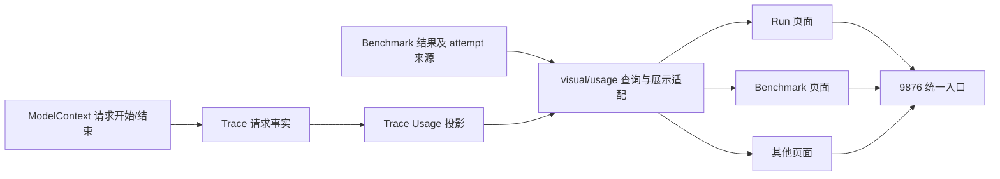
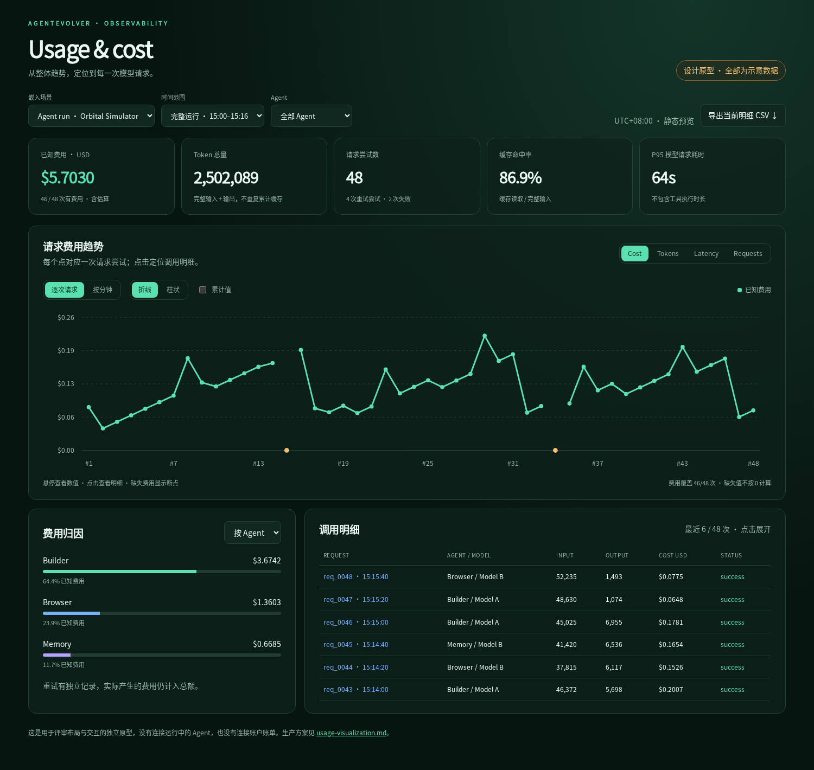
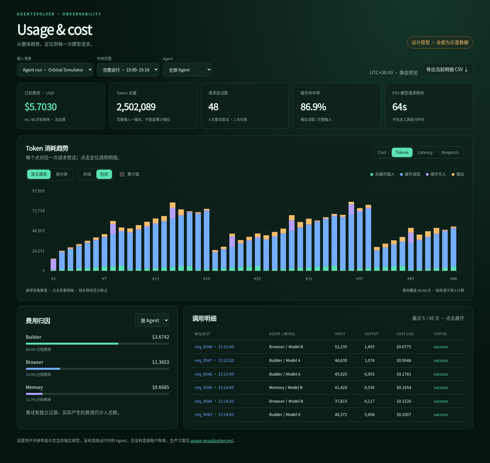
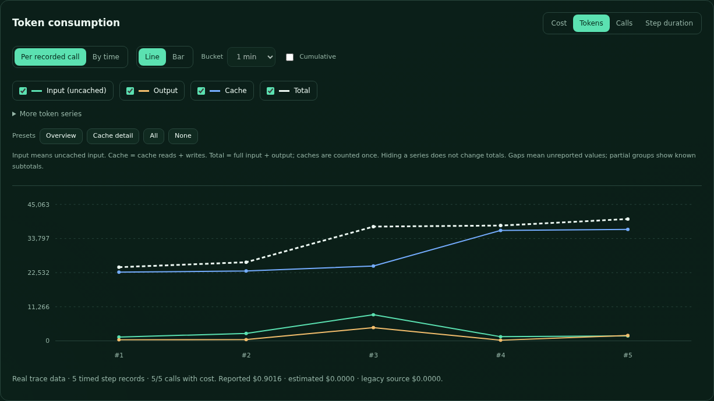
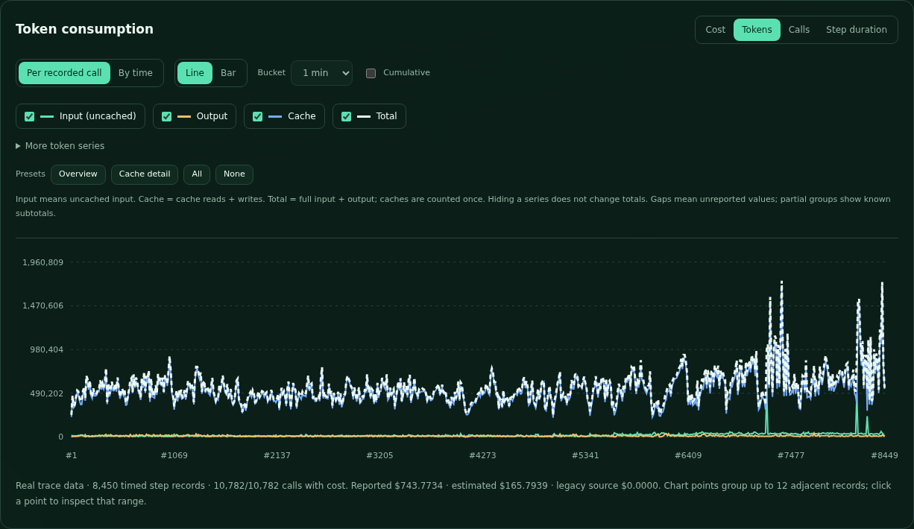

# Usage：可嵌入的模型用量与费用视图

状态：设计稿及实施路线。Run 与 Benchmark 已接入首版真实 trace Usage 图表；当前数据为明确标注的 legacy step 粒度，尚未实现 ModelContext 的完整逐 attempt 终态采集。具体覆盖范围见 [Usage 模块说明](../../agentevolver/visual/usage/README.md)。独立[交互原型](usage-assets/preview.html)使用明确标记的示意数据，不读取账户账单，不调用模型。

目标是在 9876 下的 Run、Benchmark 和其他页面复用一个 Usage 组件，回答：**什么时候花了多少、花在哪个模型和 Agent 上、对应哪次请求，以及为什么这次消耗较高。** 默认给出趋势，点击即可追溯逐次明细。当前仅有累计数字的 Model usage 卡片升级为可展开的分析区域。

## 1. 参考方向与现有问题

OpenAI 的公开 Usage 文档提供按时间窗口、模型等维度聚合的接口，并区分 Usage 和 Costs；使用量与财务成本不一定完全一致。因此本方案借鉴时间筛选、维度分组与费用钻取，而不把本地估算费用称为账户实际扣款。[OpenAI Usage API](https://platform.openai.com/docs/api-reference/usage)

`platform.openai.com/usage` 本身需要账户会话，本次未读取其私有账户页面。原型基于本项目配色与公开接口概念设计。

代码审查发现，下列问题必须与图表一起解决：

| 当前实现 | 发现 | 设计处理 |
|---|---|---|
| `visual/run/server.py` 的 `TraceReader.consume` | 从 `agent_call` 累计 step 级用量 | 历史数据标为 step 粒度；新数据从模型边界取得请求级记录 |
| `visual/benchmark/server.py` 的 `_trace_usage` | 另写一套 trace 扫描及累加 | 两个页面改为读取同一个 Usage 投影 |
| 两个页面的缓存比例 | Run 分母包含 cache write，Benchmark 的当前分母没有包含 | 按 Model 层的完整输入定义统一计算 |
| 页面费用字段 | 分别使用 `cost`、`cost_usd`，来源与缺失信息展示不足 | 统一金额、币种、来源、覆盖率 |
| `hook/default/trace.py` 的 POST_STEP | step 的耗时可能含工具执行 | 不作为模型请求耗时；单独记录请求开始与结束 |
| `trace/types.py` 的 `model_request_event` | 有请求快照、attempt、route，但缺少统一的请求结束事件配对 | 使用请求事件 ID 配对开始和终态 |
| RequestSnapshot | snapshot ID 是内容寻址，不是一次调用的 ID | 相同内容调用两次也保留两笔记录 |
| Benchmark 历史结果 | 可能只有 spend 汇总，或既有结果汇总又有 trace | 标注来源覆盖范围，按 attempt 去重；没有时间点就不生成曲线 |

逐次请求采集需要覆盖主 Agent、子 Agent、模型重试、fallback、记忆压缩、LLM judge 等实际走 ModelContext 的调用。旧记录无法可靠补齐这些信息，不能把缺失补成 0。

## 2. 页面设计

### 2.1 默认布局

Usage 在 Run 和 Benchmark 中占一整行，不再挤在右侧的小卡片中。窄容器使用 compact 模式，保留摘要和一张可切换的趋势图，明细按需展开。

```text
Usage & cost                              实时 / 已结束 · 数据更新时间
范围 [当前 run] 时间 [完整运行] 时区 [本地] Agent [全部] Model [全部]
更多筛选 [用途 / 状态 / attempt / 费用来源]                   导出

已知费用       完整 Token 总量      请求尝试数      缓存命中率      P95 请求耗时
来源与覆盖率   输入/缓存/输出细分   成功/失败/在途  分母口径说明    样本覆盖率

[Cost / Tokens / Requests / Latency / Cache]
[逐次请求 / 时间汇总] [折线 / 柱状] [增量 / 累计] [分组方式]
┌──────────────────────── 趋势图 + 缩放 ────────────────────────┐
│ 悬停：该点或该时间桶的明细；点击：筛选下面的请求列表           │
└──────────────────────────────────────────────────────────────┘

按 Model / Agent / 用途 / Task 的费用归因        最昂贵请求 / 重试 / 缺失用量

调用明细：时间、Agent、Model、输入/缓存/输出、费用、来源、耗时、状态
点击一行 → 请求详情抽屉 → 现有 Request viewer / 对应 Agent step
```

筛选器中的范围由嵌入页面绑定：Run 默认整个 Agent 树，也可只看选中 Agent 的直接调用；Benchmark 默认当前实验的全部 attempt，可切换本次续跑。选择“包含子 Agent”时基于请求所属节点的集合统计，不相加父节点的含子项汇总，避免重复。

### 2.2 图表定义

| 指标 | 逐次请求视图 | 时间汇总视图 | 重要交互 |
|---|---|---|---|
| Cost | 单次费用折线或柱状；reported / estimated 有来源标识 | 每桶费用柱状、累计已知费用折线 | 高费用点钻取；缺失费用断点；部分覆盖提示 |
| Tokens | 未缓存输入、缓存读取、缓存写入、输出的堆叠柱状，或各项折线 | 四类 token 按时间累加 | 独立开关图例；观察上下文及输出增长 |
| Requests | 请求序列中的状态、attempt 和路由 | 每桶请求数，区分成功、失败、取消、在途 | 查看重试与 fallback；区分逻辑调用和请求尝试 |
| Latency | 每次模型请求耗时；TTFT 在可采集时展示 | P50 / P95 或明确标注的均值 | 展示样本数，不把工具执行时长计入 |
| Cache | 缓存读取、写入和完整输入构成 | 每桶缓存命中率及对应输入量 | 比例按 token 加权，支持与费用对照 |

Tokens 与 USD 使用不同图表或独立切换，不在同一条纵轴混画。时间粒度自动选择，可手动切换 5 秒、1 分钟、5 分钟、1 小时、1 天；逐次请求横轴使用顺序号并在 tooltip 显示真实时间。

逐次费用图默认按请求开始时间排序，终态到达后回填该请求点；时间费用图明确采用“请求完成时间”，新数据晚到会更新对应的历史桶。请求量可切换开始/完成口径；在途请求只有开始记录，不提前估成已结算费用。需要改变时间口径时在图题中明确显示。

累计表示“当前筛选范围内的累计已知值”。全程累计另设明确选项，不把此前费用偷偷加入一段时间的局部曲线。耗时和命中率不提供累计相加。

### 2.3 调用明细与追溯

默认表列：开始时间、Agent、实际模型、请求状态、完整输入、输出、费用、费用来源、请求耗时。更多列可展开：

- 逻辑调用 ID、请求 ID、step、attempt、fallback route、provider response ID。
- 请求模型与实际路由模型；provider；调用用途。
- 未缓存输入、cache read、cache write、完整输入、输出、推理 token、provider 原始总量。
- 费用数值、币种、reported / estimated / unknown、使用的定价版本。
- 请求开始/结束、TTFT、重试等待；可确定语义时才提供生成速度。
- benchmark task ID、attempt ID、任务结果；主 Agent 与所属子 Agent。
- 缺失字段原因、错误类别与简短信息、原始 Request viewer 链接。

推理 token 通常是输出的子集，不额外叠加到输出总量。未提供推理细分的 provider 显示未报告。Token 来源和费用来源分别记录：提供 token 并不代表提供了费用。

“为什么贵”首先给出事实归因：大输入、大输出、缓存构成、重试次数、采用的费率。若没有足够信息，不自动归因为 Agent 低效；进化发布、压缩等事件标记只能说明时间关联，不能单凭曲线宣称节省由进化造成。

## 3. 模块职责与数据链路



| 层 | 应承担的职责 | 边界 |
|---|---|---|
| `model` | 请求身份、provider 调用状态、原始及规范化用量、费用来源、模型时延 | 沿用统一 TokenUsage 与 pricing；不画图 |
| `trace` | 持久记录、增量回放、请求去重、Usage 派生索引 | 是事实及派生统计来源；不依赖 visual |
| `visual/usage` | 查询参数、范围绑定、图表聚合及 DTO、共享前端组件 | 只读展示；不重新定价，不执行 Agent 或评测 |
| `visual/run` | 绑定 session、Agent 树、Request viewer 导航 | 不再自己计算一套费用和缓存比例 |
| `visual/benchmark` | 绑定实验、task、attempt、结果来源和续跑范围 | 成绩规则仍由 benchmark 管理；页面只关联已有结果 |
| `paths` / deployment / gateway | 路径管理、静态资源、已有页面部署与路由 | 使用现有能力，不新增 Usage 常驻服务或固定端口 |

不在 WebsiteBuilderAgent、Agent 基类、DeployTool、各 example run 脚本中增加用量汇总逻辑。采集发生在统一模型调用边界，所有调用者自然受益。

拟新增的目录与复用点：

```text
agentevolver/
  model/context.py                补全统一请求事件配对
  trace/types.py                  请求结束事实的 schema
  trace/usage.py                  新增 UsageProjector，复用 ProjectionRunner
  trace/projection.py             注册已有投影机制，不另建 manager
  visual/usage/
    __init__.py                   UsageView 与资源入口
    types.py                      UsageScope、查询、响应 DTO
    server.py                     只读查询及通用 HTTP 适配
    app.js                        mountUsage()，图表与明细交互
    style.css                     局部作用域样式与主题变量
    vendor/                       固定版本图表库及许可证
    README.md                     嵌入方式与统计语义
  visual/run/                     接入 scope、相对路径 API、组件挂载
  visual/benchmark/               同上；补充 attempt 来源绑定
```

Trace 已有 `ProjectionRegistry`、`ProjectionRunner` 和 watermark。本方案复用这些接口维护投影；派生索引放在 PathManager 管理的 trace projections 层级，按需要增加明确的路径 key。原始 trace 可重放，索引可重建，不在 workspace 或 visual 目录下生成运行数据。

## 4. 每次请求究竟记什么

### 4.1 调用身份与生命周期

1. 进入一次逻辑模型调用时生成 `logical_call_id`。每次框架发起的 provider 尝试生成独立 `request_id`，可直接使用开始事件的 TraceEvent ID。
2. `model_request` 记录开始事实：作用域、请求快照、路由、attempt、时间。snapshot ID 仍只标识内容。
3. 正常返回或流式终止时记录请求终态，显式引用 request ID。错误、取消、超时也有终态；没有返回用量时标为 unknown。
4. 投影按 request ID 合并事实。补到的终态更新原请求，重复回放不增加一笔消费。
5. `agent_call` 继续表达 step 结果，但在同一覆盖范围已有请求明细时，不再作为第二份费用加入。`agent_end` 的累计值也不再次相加。

开始事件产生到实际网络发送之间失败，应记录为本地拒绝/未发出；不能称为远端已处理。SDK 内部不可见的自动重试目前不保证一一对应物理 HTTP 请求，必须将采集粒度标为 `framework_attempt`，不能承诺捕获了所有底层 HTTP 往返。

流式调用只在确认的用量终态结算，文本增量不累计成重复费用。取消时 provider 已报告的部分用量可以记录，并标明终止状态。后台 create / retrieve / cancel 操作区分 API 操作与模型生成；轮询同一个生成结果不得反复计费。记忆压缩等辅助调用也从同一模型采集路径进入，按显式用途标签分组。

### 4.2 请求行 DTO 示例

以下是目标结构示意，不代表已实现的接口：

```json
{
  "request_id": "event_001",
  "logical_call_id": "call_001",
  "session_id": "session_001",
  "agent_id": "process_001",
  "parent_agent_id": null,
  "step": 12,
  "benchmark_task_id": null,
  "benchmark_attempt_id": null,
  "purpose": "task.execution",
  "requested_model": "configured-model",
  "provider": "provider-name",
  "routed_model": "actual-model",
  "attempt": 1,
  "route_index": 0,
  "started_at": "2026-09-08T07:00:00Z",
  "finished_at": "2026-09-08T07:00:08Z",
  "status": "succeeded",
  "latency_ms": 8000,
  "ttft_ms": null,
  "tokens": {
    "uncached_input": 1000,
    "cache_read": 8000,
    "cache_write": 1000,
    "context_input": 10000,
    "output": 500,
    "reasoning": null,
    "total": 10500
  },
  "usage_status": "reported",
  "unreported_fields": ["reasoning", "ttft_ms"],
  "cost": {
    "amount": "0.020000",
    "currency": "USD",
    "source": "estimated",
    "pricing_revision": "revision-at-request-time"
  },
  "granularity": "framework_attempt",
  "source": {"trace_event_id": "event_002", "snapshot_id": "content_hash"}
}
```

Agent process ID 与 benchmark task ID 分开。当前 trace 的 `task_id` 不能直接当作 SWE 题号。Benchmark 页由已有实验记录补充 task/attempt 关联，不根据名字猜测。

规范化字段的“未报告”须保留在采集侧。当前 TokenUsage 的一些字段默认 0，无法仅凭旧序列化结果恢复字段是否曾被 provider 提供；旧数据需要显式标为未知细分或 legacy，而不是承诺完整覆盖。HTTP 展示只返回白名单字段，不把请求正文、API key 或响应 header 原样放进统计接口。

## 5. 统计口径：两张页面必须完全一致

### 5.1 Tokens 与缓存

现有 `model/types.py::TokenUsage` 中，`input_tokens` 指未缓存输入，`context_input_tokens` 指完整输入。这与一些 provider 原始字段的命名不同，视图统一消费规范化语义。

```text
完整输入 = context_input_tokens（有效时）
        否则使用已确认互斥的 uncached + cache read + cache write
Token 总量 = 完整输入 + 输出
缓存命中率 = Σ cache read / Σ 完整输入
```

若完整输入已知而缓存拆分不完整，堆叠图增加“输入未细分”部分，不能用不完整拆分冒充完整输入。拆分之和与完整输入冲突时显示数据质量提示并保留原始事实，不用负数修平。命中率样本必须同时具备分子和分母，展示覆盖的请求数；分母为 0 时比例是未适用，不是 0%。

不要再将 cache read 加到完整输入上；不要将 reasoning 再加到已经包含它的输出上；不要对各次缓存百分比做算术平均。

### 5.2 费用

- `reported`：模型 provider/代理返回的金额；保留是谁报告的。这仍不等于最终账户账单。
- `estimated`：沿用 Model pricing 在调用时计算的估算；保存模型映射、费率版本及适用条件。视图不维护第二套价格表，也不使用今日价格重算历史。
- `unknown`：没有可用金额；显示 `—` 和缺失笔数。明确报告的 0 则是真实的已知零值。
- 摘要显示已知费用总额、reported 与 estimated 各自小计，以及有费用/已终止请求覆盖率；在途另列。
- 有已知费用的失败、取消和重试都计入消费；请求成功不代表任务成功，任务失败也不代表没有费用。
- 后端金额聚合使用十进制定点语义，响应金额为 decimal 字符串。图表转换为浮点仅用于绘制。不同币种分组，默认不自动折算。

Provider 只报告总费用时不伪造输入/输出费用拆分。可依据已知费率附带“估算构成”，但必须与 reported 总额分开展示。

### 5.3 时间与覆盖率

事件保存 UTC；UI 默认浏览器时区，可切 UTC。时间范围采用 `[from, to)`，bucket 起点与时区规则明确，避免边界重复。耗时使用单调时钟测量；缺失 TTFT、生成 token 计时或取消尾部数据时，不反推伪精确速度。

空桶只有在确认观测完整、确实无请求时显示 0；采集中断或记录不可读显示未知。部分费用桶显示已知小计及覆盖率。分位数从该桶真实请求样本计算，不平均多个小桶的 P95。

## 6. 历史数据与 Benchmark 续跑

这是防止“图表漂亮但费用重复”的重点。

| 数据条件 | 展示方式 |
|---|---|
| 新版请求开始与终态配对 | 逐次请求明细、真实模型时延、精确来源 |
| 旧版 `agent_call` 有 tokens/cost | 可以画 step 时间序列，标明 legacy step；不声称是物理请求或模型耗时 |
| 旧 attempt 只有 spend 汇总 | 显示历史汇总条目；不分摊到虚构的调用或时间桶 |
| 同一 attempt 同时有结果和完整明细 | 明细优先，结果用于核对，不再相加 |
| 同一 attempt 只有部分明细 | 只在同版本、同口径且可证明覆盖包含关系时计算未明细化余量；否则显示待对账差异，不能用 max(total-live, 0) 掩盖冲突 |
| 结果被拷贝到续跑目录 | 按原始 attempt 身份及 trace 事件身份去重，不按文件路径认成新消费 |

Benchmark 区分“全部历史 attempt 消费”“本次续跑消费”“尚无逐次明细的历史消费”。任务成绩仍按 benchmark 的既定结果语义展示，费用则累计实际不同 attempt 的消耗。只筛选最近一天时，无法确定日期的旧汇总不会混入这一天；它留在单独的历史小计中。

历史 task 的同题重试必须有不同 attempt ID；目录搬迁副本必须保留原始身份。没有可靠身份时先暴露来源不确定性，不能凭题号吞掉不同重试，也不能凭路径重复累计副本。

## 7. 嵌入接口与部署

### 7.1 前端：一个组件入口

```javascript
import { mountUsage } from "./usage/app.js";

const usage = mountUsage(document.querySelector("#usage"), {
  endpoint: "./api/usage",
  layout: "full",       // full | compact
  initialFilters: { range: "all" },
  onSelectCall(call) {
    // 宿主可跳转现有 Request viewer；默认使用组件内详情抽屉。
  }
});

usage.setFilters({ agentIds: [selectedAgentId], includeChildren: true });
// 页面切换或销毁时：usage.destroy();
```

组件负责生命周期、请求取消、响应过期保护、图表 resize 和主题。CSS 以组件根节点限定作用域；同页挂载多个实例不共享全局筛选状态。不要求宿主使用 React/Vue，不用 iframe 来解决自身样式污染。

建议生产图表采用固定版本、随页面资源打包的 Apache ECharts；支持的图表和交互以实际版本验收。当前 visual 是纯 HTML/CSS/JS、无前端外部依赖的实现，这里属于增加一个 UI 专用本地依赖，需要同时记录版本和许可证，不从 CDN 运行时拉取。[Apache ECharts](https://echarts.apache.org/en/feature.html)

本目录原型使用原生 SVG 演示布局和交互，不是提前引入生产图表依赖。

### 7.2 后端：相同接口，不同查看范围

宿主在服务启动时构造 `UsageView(scope)`；scope 是服务端可信的 session/attempt 描述，不允许浏览器传任意 trace 文件路径。Run 与 Benchmark 只做范围与导航绑定，不新增各自的用量算法。

一个相对路径入口，根据 `view` 查询不同投影：

```text
GET ./api/usage?view=overview&from=...&to=...&metric=cost&bucket=1m&group_by=model
GET ./api/usage?view=calls&cursor=...&limit=100&sort=cost_desc
GET ./api/usage?view=call&id=event_001
GET ./api/usage?view=export&format=csv&revision=...
```

`overview` 一次返回同一筛选条件下的 summary、series、breakdown、coverage 和 revision；明细分页携带这个 revision，保证卡片、图表和列表来自同一个读取快照。响应提供 schema_version、source watermarks、过滤器、时间口径及数据新鲜度。revision 过期时明确要求刷新，不静默混用快照。

可用筛选：时间、Agent ID、是否包含子节点、模型、provider、用途、请求状态、task、attempt、费用来源。分页、排序、group_by、bucket 都采用枚举和上限；分页以稳定排序键加 request ID 排序，避免同时间戳重复或漏页。

CSV/JSON 导出与当前筛选和 revision 一致，包含来源/缺失/粒度信息，不导出 credential 或 prompt 正文；CSV 字符串按表格公式注入规则处理。

所有静态资源和 API 使用相对 URL，适配 `/s/<site>/...` 的 9876 网关前缀。RunMonitor 与 BenchmarkMonitor 当前需要打包页面资源并注册路由，接入时同时更新资源清单和 handler，不能只加一个 script 标签。

已经部署的页面通常持有旧资源副本，修改源码不会自动升级这些副本。发布新 Usage 时通过现有 deployment 流程更新相应监控站点，保持其 trace/结果绑定，不需要重跑已结束的 Agent。

## 8. 性能与可靠性

- 使用现有 Trace 提交序列和 projection watermark 增量读取。派生数据写入成功后再推进 watermark；损坏或版本变更可从原始事件重建。
- 不在每 5 秒刷新时扫描整个实验历史。请求索引按 session/attempt、时间、Agent、模型建立查询路径；相同范围的桶聚合可缓存。
- 图表默认最多约 1,000 个桶，调用明细每页 100 条；分组默认 Top 8 + Other，并可钻取全部。缩放后向服务端查询更细粒度。
- 时间桶聚合守恒：费用和 tokens 使用 sum，请求数 count，比例按分子分母重新算。不能用折线抽点结果计算总消费。
- 活跃前台页面默认 5 秒刷新；后台降频，已结束历史页停止自动刷新，提供手动刷新。失败退避并显示“最后成功更新”，不把读取失败画成零消费。
- 统计与图表不阻塞模型调用。新增遥测遵循现有 trace 持久化策略；投影或渲染失败不能触发新的模型重试。
- 键盘可打开调用详情、关闭抽屉、使用筛选器；颜色以外还要有文字/标记。表格提供图形数据的可访问替代，窄屏允许横向滚动。

## 9. 实施顺序与验收

### 第一阶段：统一数据口径及真实请求采集

补请求开始/终态 ID 配对；统一 buffered、stream、fallback、compaction 路径；复用 TokenUsage 和 pricing；建立版本化 UsageProjector；处理 legacy step 和汇总覆盖关系。先证明同一 scope 的费用、tokens 与原始记录一致。

### 第二阶段：同时接入 Run 和 Benchmark

实现共享 UsageView 和前端组件，交付费用/Token 折线与柱状、摘要、筛选、请求详情、来源覆盖率和导出。替换现有重复 metrics 累计逻辑。先在已停止的真实 session 与历史 benchmark 目录上验收，再通过 9876 检查资源与路由。缺少新版事件的旧运行继续明确显示 legacy 粒度。

### 第三阶段：扩展分析

补全 TTFT、用途细分、费用结构、跨实验比较及中央 Usage 页。进化前后成本比较必须匹配任务和模型条件，不能仅比较两段时间的消费总额。中央页仍复用同一个组件和查询契约，不新建另一套 dashboard。

### 必须通过的检查

| 范围 | 验证内容 |
|---|---|
| 请求与重试 | 两次内容相同的请求仍为两笔；同一终态重复回放仅一笔；失败再成功/fallback 不漏算 |
| 流式与后台 | 流增量不重复计费；取消部分用量保留；retrieve 同一响应不重复计费 |
| 统计 | cached input 不重复；reasoning 不重复；cache write 在统一分母中；0 费用与未知费用区别明确 |
| 历史 | copied attempt 去重；真实 retry 保留；只有汇总不伪造时间点；部分明细不双计 |
| 模型覆盖 | 主子 Agent、压缩、judge 的调用进入同一投影；未知用途保留 unknown |
| 查询 | 同 revision 下 summary 等于明细/非重叠历史汇总；图表桶合计一致；时区边界无重漏 |
| UI | 逐次/时间、折线/柱状、filters、drill-down、CSV、双组件、窄屏和键盘访问 |
| 部署 | Run 与 Benchmark 均能从 `/s/<site>/` 请求资源/API；共享网关与其他站点正常 |

## 10. 本轮可评审内容

- 本设计稿：模块边界、真实请求事实、Token/费用口径、历史兼容、接口与接入顺序。
- [独立交互原型](usage-assets/preview.html)：示意 48 次请求，可切费用/Token/耗时/请求数、折线/柱状、逐次/按分钟、时间范围与 Agent；可打开请求详情、切换归因维度和导出示意 CSV。
- 原型截图：[费用折线](usage-assets/preview.png)、[Token 堆叠柱状](usage-assets/tokens-preview.png)。
- 浏览器检查：费用曲线、四类 Token 堆叠、按分钟聚合、点击钻取、详情抽屉、筛选、归因分组、CSV 导出和窄屏布局均已检查，无 JavaScript 页面错误。检查只针对独立原型。





上面的独立原型继续使用示意数据。实际 Run/Benchmark 已接入共享 Usage 组件，提供真实历史记录的图表与明细；逐 attempt 终态采集、持久化索引、TTFT 和跨请求分页快照固定尚未完成，不能将本设计的全部内容视为已实现。


## 已部署的首版效果

Run 和历史 SWE Pro 页面已部署共享组件，使用真实记录验证：

- [Run 实际页面截图](usage-assets/run-usage-real.png)：5 条完成记录，166,368 Tokens，已知费用 $0.9016。
- [Benchmark 实际页面截图](usage-assets/benchmark-usage-real.png)：带时间记录与无时间汇总分开展示，支持按模型与 Agent 归因。
- 52 项相关离线测试通过；实际 9876 页面完成 Token 堆叠、详情、CSV、双实例隔离和窄屏检查，无页面脚本错误。历史 Benchmark 首次加载约 8 秒，随后一次查询约 0.35 秒（本次机器与数据快照的实测，不是性能保证）。
- website 运行保持停止；这些展示与验证没有重新启动 Agent。

## Token 多曲线更新

实际 Run 和 Benchmark 已更新为共享的可选多曲线视图：

- 默认同时显示 Input（未缓存）、Output、Cache（read + write）和 Total（完整输入 + 输出）。每条曲线可独立勾选，支持 Overview、Cache detail、All、None 快捷组合。
- 展开 More token series 可选择 Cache read、Cache write、Full input、Unclassified input 和 Reasoning。Reasoning 属于 Output，完整输入已包含缓存，均不再次加进 Total。
- 勾选只影响图表显示和纵轴缩放，不改变摘要或导出统计。选择在组件轮询、筛选和图表模式切换后保持；浏览器整页重载恢复默认。
- 分组柱分别比较所选指标；堆叠柱只叠加互不重叠的分量，Total、Full input、Reasoning 作为参考线。选择 Cache 后再选择其 read/write 明细时，明细也作为参考线，避免重复叠加。
- 时间汇总与累计模式按每个字段分别计算。缺失值保留空缺，部分覆盖显示已知小计及覆盖记录数，输入明细冲突时不生成误导性堆叠。
- Run 的 5 条真实完成记录核对结果：Input 15,365，Output 7,195，Cache 143,808，Total 166,368。Benchmark 的无时间历史汇总继续计入摘要，不伪造为图表点。
- 60 项相关测试通过（含 3 项浏览器测试），并在两处真实 9876 站点检查自动刷新保留选择、累计明细、分组/堆叠、图例颜色、390px 窄屏及控制台。浏览器回归使用与 Run 相同的 CSP；监控更新未启动 Agent。




