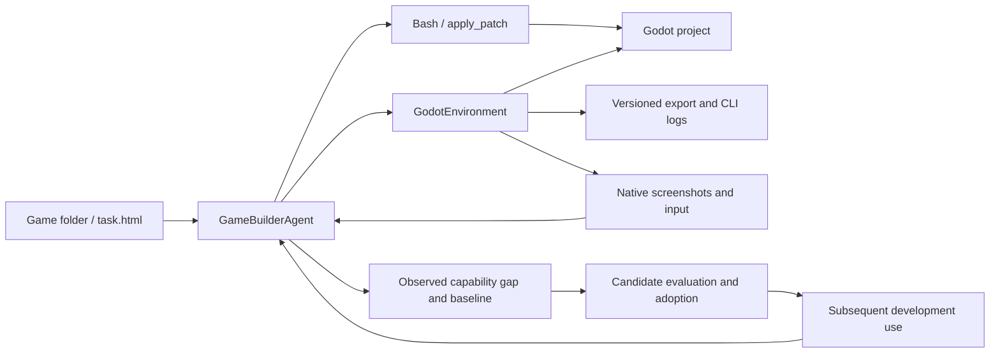

# Godot game development

One `game_builder_agent` designs, implements, plays and improves a Godot game. It also
investigates reusable agent capabilities when development exposes an evidenced limitation.
There are no user, persona or reviewer agents in this configuration.

## Task documents

Each game has its own directory containing an HTML development brief. The
brief describes the game: story, world, characters, mechanics, content, milestones and
acceptance requirements. Integration documentation belongs in this README.

| Task | Brief | Scope |
| --- | --- | --- |
| Tidebound Echoes: The Island Covenant | [tidebound_echoes/task.html](tidebound_echoes/task.html) | Original 3D creature-companion RPG; six regions, twelve chapters and consequential choices |

The HTML is a task specification, not a playable game or a claim of completed content.
It can be read directly in a browser or through the task loader. Presentation is shared
through `agentevolver/visual/task/task.css` and `task.js`, referenced from the HTML head.
The brief contains no embedded styles or scripts; keep these relative resources available
when moving or serving the document. Runtime previews use the same assets.

## Existing Agent integrations and Docker assessment

Research update, 2026-09-09: existing Godot MCP backends should be evaluated before
extending the initial CLI adapter with a custom input/screenshot bridge. The following
assessment comes from upstream documentation, Dockerfiles and test source, not a local
installation or executed compatibility test.

| Candidate | Relevant capability | Docker and adoption boundary |
| --- | --- | --- |
| [beremaran/godot-agent-loop](https://github.com/beremaran/godot-agent-loop) | Run/stop, viewport images, scene/UI observation, held input and bounded scenario/verification operations | Selected runtime backend; its E2E container informed our docker/godot image. We pin and build its source rather than assume an upstream production image. |
| [Erodenn/godot-mcp-runtime](https://github.com/Erodenn/godot-mcp-runtime) | Runtime bridge for screenshots, input sequences and live engine queries; also headless scene operations | Its [Dockerfile](https://github.com/Erodenn/godot-mcp-runtime/blob/main/Dockerfile) packages Node/MCP but does not install Godot or a rendering display. A complete game container still needs those. |
| [Vollkorn-Games/godot-mcp](https://github.com/Vollkorn-Games/godot-mcp) | Scene/script authoring, interactive runtime, mouse/keyboard/gamepad input, screenshots and GUT invocation | Broad alternative. Its package metadata still references Coding-Solo, so verify the exact repository revision and package provenance rather than treating identically named packages as interchangeable. |
| [hybridindie/godot-mcp](https://github.com/hybridindie/godot-mcp) | Python MCP plus editor addon and runtime probe; editor mutations, input and profiling | The [server Dockerfile](https://github.com/hybridindie/godot-mcp/blob/main/infra/Dockerfile) contains the MCP service, not the engine. A separate [CI runner image](https://github.com/hybridindie/godot-mcp/blob/main/infra/runner.Dockerfile) adds Godot. Runtime input requires the probe and an editor debug session. |
| [torte/godot-agents-devcontainer](https://github.com/torte/godot-agents-devcontainer) | Agent development container using satelliteoflove/godot-mcp and an LSP companion | Its documented interactive editor runs on the host. The container has a headless CLI but no display server. Useful workspace/addon integration reference, not a self-contained rendered game environment. |

### Why Godot Agent Loop was selected

Its current source declares Godot 4.7+ and Node 22+. The
[tool catalog](https://github.com/beremaran/godot-agent-loop/blob/main/docs/tools.md)
separates player input/observation from privileged runtime mutation. It explicitly
removed generic file CRUD and several older command names; an adapter must discover
the actual pinned schema, not copy tool names from old tutorials. Generic file
operations belong to the existing Bash tool in the base container; the Godot
environment does not need a second file read/write/list API.

There is inspectable evidence beyond a feature list:

- [Dockerfile](https://github.com/beremaran/godot-agent-loop/blob/main/tests/e2e/docker/Dockerfile): Ubuntu, Godot, Node and rendering dependencies.
- [Docker E2E launcher](https://github.com/beremaran/godot-agent-loop/blob/main/scripts/run-e2e-docker.sh): starts Xvfb inside the container and invokes the real-engine suite.
- [Representative E2E source](https://github.com/beremaran/godot-agent-loop/blob/main/tests/e2e/representative-path.test.ts): authors a fixture on disk, calls MCP through a real client, launches Godot and exercises sustained input with independent observations.

These upstream tests are separate from our verification. Their representative authored
movement fixture is 2D. Our integration adds a 3D scene, camera and visual-input cases;
the local results below cover those fixtures, not the full campaign.

### Shared workspace architecture

Use **the base Docker container plus a Godot Docker container**, sharing one
session workspace. GameBuilder uses the existing `bash_tool` for file operations
and `godot_environment` for engine operations.

| Component | Responsibility |
| --- | --- |
| Base Docker + `bash_tool` | Read, search and write project files; run general development commands; maintain the session plan |
| Godot Docker + `godot_environment` | Import, launch, stop, export, collect logs, capture frames and deliver player input through the MCP bridge |
| GameBuilder lifecycle + Godot runtime | Bind the workspace, prepare base Bash routing, maintain MCP and clean up owned containers |

Both containers mount the **same source directory at its canonical runtime path**
with compatible UID/GID permissions. Canonical paths preserve absolute links in
prompts, plan.md and logs. This is a bind mount, not a synchronization job.
[Docker bind mount documentation](https://docs.docker.com/engine/storage/bind-mounts/)

The base also mounts session plan/log/extension directories. Bash selects its base
container through a workspace-scoped route, without changing global execution env vars.
Framework and shared-extension references are mounted read-only when available.
The host-run default base is `python:3.12-slim`; override base_image when development
needs additional packages. When AgentEvolver already runs inside Model X, its base
is reused and peer mount sources use the existing host/container path translation.
The owned base defaults to `base_network=bridge` so it can fetch fonts and assets;
use `none` for offline authoring. Python urllib is available for HTTPS downloads;
curl and git are not bundled in the minimal base. The Godot container stays offline.

The Godot container owns the engine, MCP runtime and an actual rendering context
such as Xvfb/Mesa. Preserve MCP image content in model observations. Shared files
alone provide neither screenshots nor player input, and process/bridge readiness
does not prove successful gameplay. After source changes, explicitly import/reload
or restart as needed before observing the updated game. Coordinate source writes
with imports and exports, and clean up owned processes on exit and cancellation.

The Agent still owns `plan.md` and the shared evolution workflow. `job` is unnecessary
when Bash uses bounded foreground commands and Godot owns long-running game processes;
the existing external-container Bash backend does not support background or TTY mode.
`browser_environment` is unnecessary for native game play once the Godot observation
and input path is wired. Web export may remain an optional distribution target, rather than the required
route for every development iteration. MCP is the backend protocol, Docker packages
the execution dependencies, and Environment is the Agent-facing lifecycle/API.

**Current implementation status:** the demo and GameBuilder now mount only
`godot_environment`; `job`, `browser_environment`, browser image routing and the
Web-preview deploy tool are absent. Docker/MCP native startup, screenshots, combined
keyboard/mouse input, Unicode text, dragging, scrolling, double-clicks, gamepad,
touch, runtime inspection, stop and cleanup are implemented. The
real-engine integration test authors a 3D fixture through base Bash, reads it from
Godot Docker, checks movement through telemetry and rendered pixels, clicks a button,
checks model image routing, rejects invalid source and tests restart/cleanup.
This is environment verification; it does not deliver or certify the campaign.

## Current integration architecture

Godot belongs in **Environment**, with **GameBuilderAgent** owning development decisions
and **Skill** owning reusable methods. This is an architectural judgment based on the
repository's ECP lifecycle and Godot's editor CLI, which supports imports, script execution
and exports. [Official CLI documentation](https://docs.godotengine.org/en/stable/tutorials/editor/command_line_tutorial.html)

| Component | Responsibility |
| --- | --- |
| `agent/actor/game_builder_agent.py` | Solo planning, development, visual self-play and capability experiments; MetaAgent with child agents disabled |
| `environment/default/godot/` | Shared Docker pair, MCP lifecycle, native images/input, CLI checks and diagnostics |
| Existing Bash and apply_patch tools | General inspection and source authoring; no Godot-specific state added to bash.py |
| `skill/game/godot_game_development_skill/` | Content architecture, production methods, self-play and verification guidance |
| Existing adoption, extension and task evolution modules | Candidate versions, comparison, keep/rollback and subsequent-use evidence |

Paths above are relative to `agentevolver/`.



The native backend uses Godot Agent Loop pinned to
`b5fa8cb17bdb14f16ec6ae8d7d62a56a3beaf128`, Godot 4.7-stable and Node 22.14.0.
The Dockerfile verifies official binary checksums and installs MCP dependencies from
the upstream lockfile. MCP stdio contexts belong to one persistent async owner task.
Xvfb starts directly: Ubuntu's xvfb-run merges child stderr into stdout, which corrupts
the MCP stream. Writable XDG cache/data paths support an unprivileged container user.
The `-input2` image also applies `docker/godot/extend-input.mjs`, a checked local
extension for persistent mouse buttons, double-click flags and modifier-aware mouse
events. The patch verifies its source locations against the pinned revision and fails
the build on drift. CJK fonts support rendered Chinese text. This is our derived image,
not an unmodified upstream release.

## Visual play and platform choices

The primary target is a native **Godot 4 + GDScript** game. The task HTML is its
development brief. Web export is optional and does not require a browser environment
in the default demo. Any later Web delivery needs its own platform verification.

Native self-play uses rendered screenshots and ordinary player input through
godot_environment. get_state carries the most recent captured frame; observe refreshes it.
Held inputs need bounded duration and guaranteed release. Headless checks cannot
establish visual quality or enjoyment. Teleports and debug quest setters are
diagnostics, not evidence of successful play. Software rendering validates this input
and observation path, not physical-GPU performance or player enjoyment.

### Player interaction API

`press_keys` holds up to eight keys together, for example movement plus sprint.
`type_text` sends Unicode keyboard events to a focused text control. `input_sequence`
combines key down/up, shortcuts, mouse down/up/motion, drag, scroll, double-click,
gamepad buttons/axes, multi-touch, existing InputMap action strengths and bounded waits.
Captured-camera motion uses relative mouse deltas. Inputs are native Godot events;
the adapter does not expose generic evaluation or hidden scene/quest mutation.

A sequence validates all steps before execution and returns an input trace plus a
rendered frame. It accepts at most 32 steps, 10 seconds of explicit waits and a
15-second total deadline. By default it releases all held controls. Retaining inputs
across calls requires `release_at_end=false`; explicitly use `release_inputs` afterward.
The default 10-second idle lease also releases retained controls while preserving the
game. `input_state` reads actual input state. Transport failure/cancellation closes the
engine; game exit through its own UI is recognized on subsequent observation.

Full argument examples and limits are in
[ENVIRONMENT.md](../../../agentevolver/environment/default/godot/ENVIRONMENT.md).
This API operates the game window through screenshots and inputs. Audio listening,
host-native dialogs, human desktop streaming and physical controller feedback are
outside the implemented interaction contract.

## Engine environment contract

- Construction, initialization and state observation do not start Godot; explicit actions do.
- Docker is the default backend. Build its pinned image first; it never pulls images
  automatically. backend=local uses binary_path/GODOT_BIN/PATH for CLI-only operation.
- Projects and exports stay inside the task workspace. Exports use a fresh empty revision
  directory outside the source project so old outputs cannot hide failures.
- Commands use argv, session/project locks, deadlines, process cleanup and archived diagnostics.
  Nonzero exits, timeouts and engine ERROR logs fail the action.
- `check_script` parses one script. A clean headless exit is not an assertion pass; assertion
  scripts need completion evidence. A nonempty export does not prove that a game works.
- Docker containers expose no host display, network ports or Docker socket. The base
  owns file authoring and Godot owns the engine; cancellation removes uncertain engine
  state. Session close removes both owned containers, preserving sources and artifacts.
- The image includes matching Linux debug/release templates for its architecture;
  the build verifies the official template archive before extracting those binaries.
  Other platform templates and physical-GPU validation are outside this test scope.

## Living implementation plan

`task.html` defines the project specification. GameBuilder creates the detailed design
and maintains one `plan.md` at the exact runtime `plan-context` path. This is the session's
`plan/plan.md`, beside its `workspace/`, not another file inside the game source tree.
The agent explicitly enables `use_plan`; the launcher defaults to `--plan-mode auto`,
which maintains a plan without an approval gate. An explicit `off` override disables
the automatic planning obligation.

The plan records the selected milestone, scene/module architecture, data/save schemas,
quest transitions, important gameplay/UI decisions, and work items with stable IDs,
dependencies, implementation notes, changed files, evidence, blockers and next steps.
It distinguishes implementation, technical verification and actual play. Large design
documents, content ledgers and historical evidence are linked from concise summaries.

GameBuilder is instructed to update it after meaningful implementation, verification,
self-play, blockers and design changes, before acting on changed requirements, and at
handoff. The existing plan manager rereads the file every agent step and projects changes
into context, including after compaction. This is agent-authored progress tracking, not
automatic inference from Git changes or a semantic guarantee that every status is correct.
The context projection is bounded to 16,000 characters; keep the current plan concise
and read linked/full documents when needed. Deferred testing must remain visibly pending.

## Agent-system evolution

A missing feature is a product task. A reusable operation that current methods cannot meet
reliably or within the stated budget can justify capability evolution. A blocked quest may
only need a condition fix. If a real baseline instead exposes an inability to check
cross-chapter reachability, a reusable quest-graph validator may merit evaluation. Save
migrations, reproducible 3D input and balance analysis are other possible investigations,
not predefined failures.

The default launcher enables `evolution.require_verified_improvement`. The existing runtime
audit requires pre-registration observation/baseline calls, evaluation of the exact candidate
version, an independent case, a passing keep decision and subsequent real use recorded through
adoption. Game content, engine installation, a prompt edit or registration alone cannot satisfy
it. Failed candidates must be rolled back or unloaded. Without a justified verified improvement,
that outcome remains unmet; never invent a gap to claim success.

The audit establishes provenance and lifecycle, not the semantic correctness of self-evaluation.
Game milestone/self-play fields are task instructions; this change adds no automatic campaign
coverage or enjoyment grader. Website release-count/self-review policies do not apply here.

## Build, verify and run

Use the existing AgentEvolver Python environment from the repository root:

```bash
docker build -t agentevolver/godot:4.7-b5fa8cb-input2 docker/godot
docker pull python:3.12-slim
GODOT_TEST_ARTIFACTS=output/godot-verification python -m pytest tests/test_godot_environment.py -m integration -q
python -m examples.run_game_development_demo
```

The default is **M1: a complete playable opening slice plus the full campaign plan**.
It does not claim to deliver the whole game. Request full campaign development with
`--milestone campaign`; completion still depends on the available run budget.

| Option | Purpose |
| --- | --- |
| `--task-dir PATH` | Another game directory containing task.html |
| `--task-file PATH` | Override the HTML brief |
| `--milestone vertical_slice` | Deliver M1 and retain the full campaign design; default |
| `--milestone campaign` | Request M3, with earlier milestones as intermediate work |
| `--evolution required` | Require verified capability improvement evidence; default |
| `--evolution opportunistic` | Investigate opportunities without requiring an adopted improvement to finish |
| `--model NAME` | Select a configured model that accepts screenshots |
| `--print-task` | Render task text without starting the agent or engine |

Configuration: `configs/game_development_demo.py`. Entry point:
`examples/run_game_development_demo.py`. Docker/MCP tests require no model credentials.
The actual GameBuilder run needs working model credentials and uses GPT-6 Astra by default.
`--godot-bin PATH` explicitly selects the local CLI-only backend, without native play.
Test artifacts contain before/after frames and result.json. The test also exports a
Linux executable and runs it headlessly with a completion marker. A full campaign,
graphical play of the exported executable and other platforms remain separate checks.

### Verified environment result

On 2026-09-09, Linux x86_64 with Docker 28.3.3 and Godot
`4.7.stable.official.5b4e0cb0f`: **26 tests passed** across
`test_godot_environment.py`, `test_bash_archive.py`, `test_browser_attachments.py`
and `test_vision_routing.py`. The integration used real containers and the real engine.

The fixture moved approximately 2 world units through held-key input, stopped after
release, and changed color after a button click. The Linux export's independent
headless execution reached `FIXTURE_READY`. Cancellation, MCP and
CLI deadlines removed the engine; final session cleanup left neither owned container.
The interaction fixture additionally verified diagonal sprinting, Unicode text entry,
Ctrl shortcuts, held keyboard plus mouse, slider dragging, scrolling, double-clicks,
Shift-click, relative camera rotation, gamepad buttons/axes, multiple touches and
InputMap strength. Mouse button combinations preserve other held buttons and clear
released drag state. Invalid sequences and idle expiration released held controls.
The in-game Quit button was followed by successful observation of exit and restart.
Local evidence is in `output/godot-verification/`: `result.json`, `interaction-result.json`,
`before.png`, `after-movement.png`, `after-click.png` and `complete-interaction.png`.
The built engine image ID was
`sha256:aaef58edaf189459af8fc38a177992079f310598d16221957fdaf553d1d003cb`.
These results cover the fixture and software-rendered environment, not the campaign,
an LLM-driven development run, GPU performance or other export platforms.

## Additional official references

- [Resources](https://docs.godotengine.org/en/stable/tutorials/scripting/resources.html): structured reusable game content.
- [Saving games](https://docs.godotengine.org/en/stable/tutorials/io/saving_games.html): persistence APIs; migration/recovery requirements are project decisions.
- [3D formats](https://docs.godotengine.org/en/stable/tutorials/assets_pipeline/importing_3d_scenes/available_formats.html): glTF/GLB interchange avoids an implicit Blender dependency on execution hosts.

Sources consulted on 2026-09-09. Pin an installed engine version and check its documentation.
