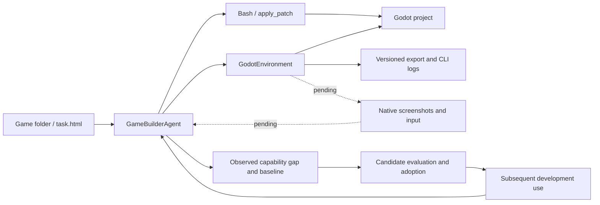

# Godot game development

One `game_builder_agent` designs, implements, plays and improves a Godot game. It also
investigates reusable agent capabilities when development exposes an evidenced limitation.
There are no user, persona or reviewer agents in this configuration.

## Task documents

Each game has its own directory containing an HTML development brief. The
brief describes the game: story, world, characters, mechanics, content, milestones and
acceptance requirements. Integration documentation belongs in this README.

| Task | Brief | Scope |
| --- | --- | --- |
| Tidebound Echoes: The Island Covenant | [tidebound_echoes/task.html](tidebound_echoes/task.html) | Original 3D creature-companion RPG; six regions, twelve chapters and consequential choices |

The HTML is a task specification, not a playable game or a claim of completed content.
It can be read directly in a browser or through the task loader. Presentation is shared
through `agentevolver/visual/task/task.css` and `task.js`, referenced from the HTML head.
The brief contains no embedded styles or scripts; keep these relative resources available
when moving or serving the document. Runtime previews use the same assets.

## Existing Agent integrations and Docker assessment

Research update, 2026-09-09: existing Godot MCP backends should be evaluated before
extending the initial CLI adapter with a custom input/screenshot bridge. The following
assessment comes from upstream documentation, Dockerfiles and test source, not a local
installation or executed compatibility test.

| Candidate | Relevant capability | Docker and adoption boundary |
| --- | --- | --- |
| [beremaran/godot-agent-loop](https://github.com/beremaran/godot-agent-loop) | Run/stop, viewport images, scene/UI observation, held input and bounded scenario/verification operations | First candidate for our runtime backend; its repository includes an Xvfb + Godot + Node E2E container. That is a testing recipe, not a production image already integrated here. |
| [Erodenn/godot-mcp-runtime](https://github.com/Erodenn/godot-mcp-runtime) | Runtime bridge for screenshots, input sequences and live engine queries; also headless scene operations | Its [Dockerfile](https://github.com/Erodenn/godot-mcp-runtime/blob/main/Dockerfile) packages Node/MCP but does not install Godot or a rendering display. A complete game container still needs those. |
| [Vollkorn-Games/godot-mcp](https://github.com/Vollkorn-Games/godot-mcp) | Scene/script authoring, interactive runtime, mouse/keyboard/gamepad input, screenshots and GUT invocation | Broad alternative. Its package metadata still references Coding-Solo, so verify the exact repository revision and package provenance rather than treating identically named packages as interchangeable. |
| [hybridindie/godot-mcp](https://github.com/hybridindie/godot-mcp) | Python MCP plus editor addon and runtime probe; editor mutations, input and profiling | The [server Dockerfile](https://github.com/hybridindie/godot-mcp/blob/main/infra/Dockerfile) contains the MCP service, not the engine. A separate [CI runner image](https://github.com/hybridindie/godot-mcp/blob/main/infra/runner.Dockerfile) adds Godot. Runtime input requires the probe and an editor debug session. |
| [torte/godot-agents-devcontainer](https://github.com/torte/godot-agents-devcontainer) | Agent development container using satelliteoflove/godot-mcp and an LSP companion | Its documented interactive editor runs on the host. The container has a headless CLI but no display server. Useful workspace/addon integration reference, not a self-contained rendered game environment. |

### Why evaluate Godot Agent Loop first

Its current source declares Godot 4.7+ and Node 22+. The
[tool catalog](https://github.com/beremaran/godot-agent-loop/blob/main/docs/tools.md)
separates player input/observation from privileged runtime mutation. It explicitly
removed generic file CRUD and several older command names; an adapter must discover
the actual pinned schema, not copy tool names from old tutorials. Generic file
operations belong to the existing Bash tool in the base container; the Godot
environment does not need a second file read/write/list API.

There is inspectable evidence beyond a feature list:

- [Dockerfile](https://github.com/beremaran/godot-agent-loop/blob/main/tests/e2e/docker/Dockerfile): Ubuntu, Godot, Node and rendering dependencies.
- [Docker E2E launcher](https://github.com/beremaran/godot-agent-loop/blob/main/scripts/run-e2e-docker.sh): starts Xvfb inside the container and invokes the real-engine suite.
- [Representative E2E source](https://github.com/beremaran/godot-agent-loop/blob/main/tests/e2e/representative-path.test.ts): authors a fixture on disk, calls MCP through a real client, launches Godot and exercises sustained input with independent observations.

These are upstream test implementations, not a passing result for AgentEvolver or for
our 3D campaign. The representative authored movement fixture is 2D; we must add a
3D scene, camera and visual-input case for this integration. Pin the selected source,
engine, templates and image before adopting them.

### Revised target architecture

Use **the base Docker container plus a Godot Docker container**, sharing one
session workspace. GameBuilder uses the existing `bash_tool` for file operations
and `godot_environment` for engine operations.

| Component | Responsibility |
| --- | --- |
| Base Docker + `bash_tool` | Read, search and write project files; run general development commands; maintain the session plan |
| Godot Docker + `godot_environment` | Import, launch, stop, export, collect logs, capture frames and deliver player input through the MCP bridge |
| Session launcher | Bind the same host workspace into both containers, publish consistent paths and manage container lifetime |

Both containers should mount the **same source directory** at `/workspace` with
compatible write permissions. Two unrelated directories named `/workspace` do not
share files. This is a bind mount, not a copy or a synchronization job.
[Docker bind mount documentation](https://docs.docker.com/engine/storage/bind-mounts/)

The launcher must map the host session workspace to `/workspace` consistently in
tool instructions and engine requests. `AGENTEVOLVER_EXEC_WORKDIR` sets Bash's
working directory; it does not translate absolute host paths inside commands.
Because the framework's `plan/plan.md` and Bash log archives live beside the
workspace, the base container also needs access to those session paths. Preserve
the exact plan path supplied by the runtime, or implement an explicit mapping for
both the agent and plan manager; mounting only project sources is insufficient.

The Godot container owns the engine, MCP runtime and an actual rendering context
such as Xvfb/Mesa. Preserve MCP image content in model observations. Shared files
alone provide neither screenshots nor player input, and process/bridge readiness
does not prove successful gameplay. After source changes, explicitly import/reload
or restart as needed before observing the updated game. Coordinate source writes
with imports and exports, and clean up owned processes on exit and cancellation.

The Agent still owns `plan.md` and the shared evolution workflow. `job` is unnecessary
when Bash uses bounded foreground commands and Godot owns long-running game processes;
the existing external-container Bash backend does not support background or TTY mode.
`browser_environment` is unnecessary for native game play once the Godot observation
and input path is wired. Web export may remain an optional distribution target, rather than the required
route for every development iteration. MCP is the backend protocol, Docker packages
the execution dependencies, and Environment is the Agent-facing lifecycle/API.

Before calling the migration complete, add integration coverage for: creating and
reading project files through base-container Bash and observing the same content
from the Godot container; maintaining the runtime plan; launching a 3D fixture through
MCP; observing a nonblank frame; moving/clicking through player input and observing the
result; stop/restart; rejected out-of-workspace paths; failed startup; and container/
process cleanup. Reading or setting a node property alone does not prove player input.

**Current implementation status:** the demo and GameBuilder now mount only
`godot_environment`; `job`, `browser_environment`, browser image routing and the
Web-preview deploy tool have been removed from this demo. The Godot adapter still
supports local CLI operations only. Shared base/Godot Docker execution and native
screenshots/input are not wired or tested. Visual-play acceptance remains blocked;
removing dependencies does not implement their replacement. No packages or images
were installed, services started or tests run for this change.

## Current integration architecture

Godot belongs in **Environment**, with **GameBuilderAgent** owning development decisions
and **Skill** owning reusable methods. This is an architectural judgment based on the
repository's ECP lifecycle and Godot's editor CLI, which supports imports, script execution
and exports. [Official CLI documentation](https://docs.godotengine.org/en/stable/tutorials/editor/command_line_tutorial.html)

| Component | Responsibility |
| --- | --- |
| `agent/actor/game_builder_agent.py` | Solo planning, development, visual self-play and capability experiments; MetaAgent with child agents disabled |
| `environment/default/godot/` | Project selection, engine discovery, imports, parsing, bounded headless runs, exports and diagnostics |
| Existing Bash and apply_patch tools | General inspection and source authoring; no Godot-specific state added to bash.py |
| `skill/game/godot_game_development_skill/` | Content architecture, production methods, self-play and verification guidance |
| Existing adoption, extension and task evolution modules | Candidate versions, comparison, keep/rollback and subsequent-use evidence |

Paths above are relative to `agentevolver/`.



A local CLI adapter covers imports, parsing and exports, but it does not provide the
unified native play loop requested for this demo. The MCP assessment above supersedes
the earlier preference to implement that runtime control ourselves. Godot's
`EditorDebuggerPlugin` is an editor extension point; existing community bridges build
additional runtime control on top of engine facilities. The current adapter does not
yet implement such a bridge.
[Official debugger plugin API](https://docs.godotengine.org/en/stable/classes/class_editordebuggerplugin.html)

## Visual play and platform choices

The primary target is a native **Godot 4 + GDScript** game. The task HTML is its
development brief. Web export is optional and does not require a browser environment
in the default demo. Any later Web delivery needs its own platform verification.

Native self-play must use rendered screenshots and ordinary player input through
godot_environment once the runtime bridge and model image routing are implemented.
Held inputs need bounded duration and guaranteed release. Headless checks cannot
establish visual quality or enjoyment. Teleports and debug quest setters are
diagnostics, not evidence of successful play. The current adapter cannot supply
native visual-play evidence; keep those acceptance items pending.

## Engine environment contract

- Construction, initialization and state observation do not start Godot; explicit actions do.
- Configure an editor executable through `godot_environment.binary_path`, `GODOT_BIN`, or
  `godot`/`godot4` on PATH. Record its actual version and install matching templates separately.
- Projects and exports stay inside the task workspace. Exports use a fresh empty revision
  directory outside the source project so old outputs cannot hide failures.
- Commands use argv, session/project locks, deadlines, process cleanup and archived diagnostics.
  Nonzero exits, timeouts and engine ERROR logs fail the action.
- `check_script` parses one script. A clean headless exit is not an assertion pass; assertion
  scripts need completion evidence. A nonempty export does not prove that a game works.
- This is a local execution adapter, not an OS sandbox. Scripts/plugins have the engine process's
  permissions. `AGENTEVOLVER_EXEC_CONTAINER` is currently rejected because the shared-mount
  and Godot container adapter are not wired. Nothing is downloaded or upgraded automatically.

## Living implementation plan

`task.html` defines the project specification. GameBuilder creates the detailed design
and maintains one `plan.md` at the exact runtime `plan-context` path. This is the session's
`plan/plan.md`, beside its `workspace/`, not another file inside the game source tree.
The agent explicitly enables `use_plan`; the launcher defaults to `--plan-mode auto`,
which maintains a plan without an approval gate. An explicit `off` override disables
the automatic planning obligation.

The plan records the selected milestone, scene/module architecture, data/save schemas,
quest transitions, important gameplay/UI decisions, and work items with stable IDs,
dependencies, implementation notes, changed files, evidence, blockers and next steps.
It distinguishes implementation, technical verification and actual play. Large design
documents, content ledgers and historical evidence are linked from concise summaries.

GameBuilder is instructed to update it after meaningful implementation, verification,
self-play, blockers and design changes, before acting on changed requirements, and at
handoff. The existing plan manager rereads the file every agent step and projects changes
into context, including after compaction. This is agent-authored progress tracking, not
automatic inference from Git changes or a semantic guarantee that every status is correct.
The context projection is bounded to 16,000 characters; keep the current plan concise
and read linked/full documents when needed. Deferred testing must remain visibly pending.

## Agent-system evolution

A missing feature is a product task. A reusable operation that current methods cannot meet
reliably or within the stated budget can justify capability evolution. A blocked quest may
only need a condition fix. If a real baseline instead exposes an inability to check
cross-chapter reachability, a reusable quest-graph validator may merit evaluation. Save
migrations, reproducible 3D input and balance analysis are other possible investigations,
not predefined failures.

The default launcher enables `evolution.require_verified_improvement`. The existing runtime
audit requires pre-registration observation/baseline calls, evaluation of the exact candidate
version, an independent case, a passing keep decision and subsequent real use recorded through
adoption. Game content, engine installation, a prompt edit or registration alone cannot satisfy
it. Failed candidates must be rolled back or unloaded. Without a justified verified improvement,
that outcome remains unmet; never invent a gap to claim success.

The audit establishes provenance and lifecycle, not the semantic correctness of self-evaluation.
Game milestone/self-play fields are task instructions; this change adds no automatic campaign
coverage or enjoyment grader. Website release-count/self-review policies do not apply here.

## Running later

Use the existing AgentEvolver Python environment from the repository root:

```bash
python -m examples.run_game_development_demo --godot-bin /absolute/path/to/godot
```

The default is **M1: a complete playable opening slice plus the full campaign plan**.
It does not claim to deliver the whole game. Request full campaign development with
`--milestone campaign`; completion still depends on the available run budget.

| Option | Purpose |
| --- | --- |
| `--task-dir PATH` | Another game directory containing task.html |
| `--task-file PATH` | Override the HTML brief |
| `--milestone vertical_slice` | Deliver M1 and retain the full campaign design; default |
| `--milestone campaign` | Request M3, with earlier milestones as intermediate work |
| `--evolution required` | Require verified capability improvement evidence; default |
| `--evolution opportunistic` | Investigate opportunities without requiring an adopted improvement to finish |
| `--model NAME` | Select a configured model that accepts screenshots |
| `--print-task` | Render task text without starting the agent or engine |

Configuration: `configs/game_development_demo.py`. Entry point:
`examples/run_game_development_demo.py`. Prerequisites are a Godot 4 editor, matching export
templates and working model credentials for the current local CLI path. The native
self-play milestone additionally requires the pending Docker/MCP integration.

No engine, test, browser or development run was started while authoring this change, as
requested. Import/export compatibility and the complete integration remain unverified.

## Additional official references

- [Resources](https://docs.godotengine.org/en/stable/tutorials/scripting/resources.html): structured reusable game content.
- [Saving games](https://docs.godotengine.org/en/stable/tutorials/io/saving_games.html): persistence APIs; migration/recovery requirements are project decisions.
- [3D formats](https://docs.godotengine.org/en/stable/tutorials/assets_pipeline/importing_3d_scenes/available_formats.html): glTF/GLB interchange avoids an implicit Blender dependency on execution hosts.

Sources consulted on 2026-09-09. Pin an installed engine version and check its documentation.
