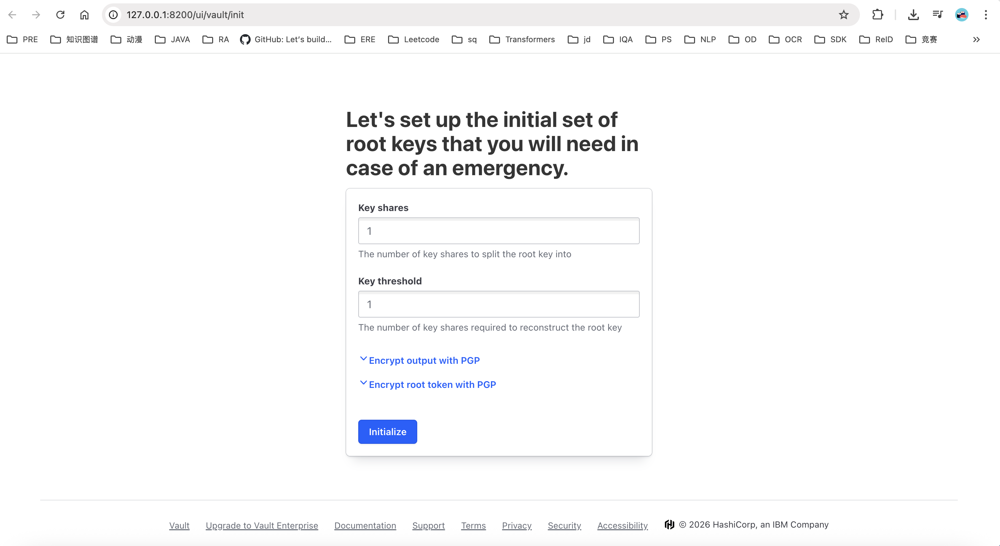
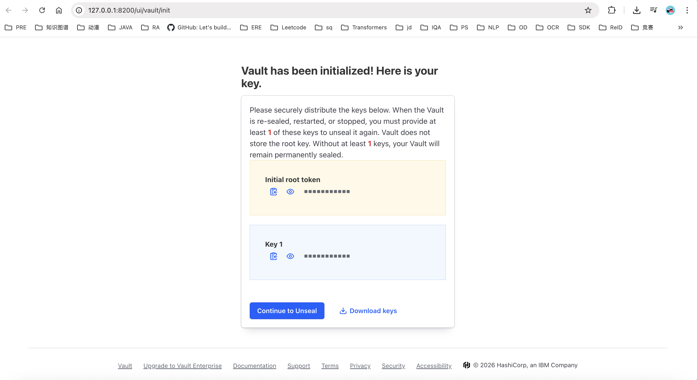
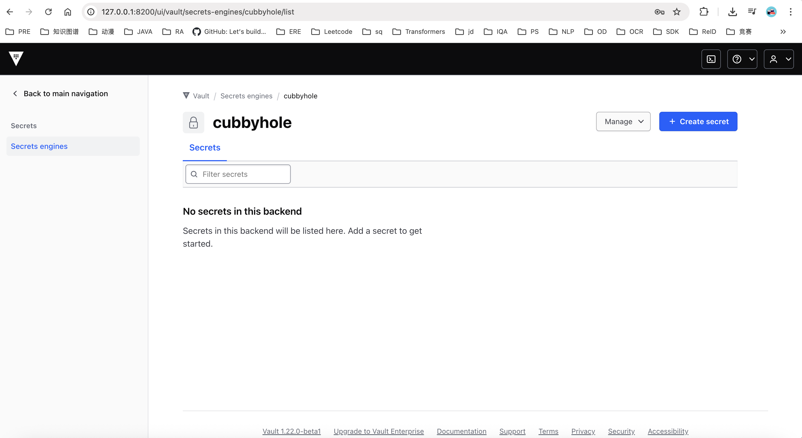

# Preface

All API keys in this project are managed centrally via the secret manager **Vault**, rather than being written entirely into `.env` — this is a necessary measure to prevent key leakage. Accordingly, this document first covers installing and configuring the secret manager (Vault), then installing opencode, then setting up the Python environment, and finally provides some additional configuration for reference.

> 🌐 中文版请见 [INSTALL_zh.md](INSTALL_zh.md)

# 1. Install the API Key Manager (Vault)

## Step 1:

```bash
1. If already installed, just start the service
vault server -config=/mnt/agent-framework/<your user path>/myapp/vault/config/vault.hcl > /mnt/agent-framework/<your user path>/myapp/vault/vault.log 2>&1 &

2. If not installed yet, use the install script
cd scripts
chmod +x install_vault.sh
./install_vault.sh /mnt/agent-framework/<your user path>/myapp # starts the service locally at http://127.0.0.1:8200 by default. When VSCode connects to the server it forwards the port automatically, so just click the popup in VSCode to open http://127.0.0.1:8200 and reach the frontend
```

## Step 2: Set the number of unseal key shares to 1
Set **Key shares** to **1** and **Key threshold** to **1**, then click **Initialize**.


## Step 3:
You will see two keys — one **Initial root token** and one login/unseal verification key **unseal token key1**. Be sure to record them!!! You can also save them locally (click **Download Keys** to download the JSON file).

It is recommended to put the **Initial root token** into the `.env` at the project root:
```bash
VAULT_ADDR='http://127.0.0.1:8200'
VAULT_TOKEN="<initial root token>"
UNSEAL_TOKEN='<unseal token key1>'
SECRET_ENGINE_PATH='cubbyhole/env'
```



Then click **Continue to Unseal**.

## Step 4:
The key to enter is **unseal token key1**.


## Step 5:
The key to enter is the **Initial root token**.


## Step 6:
Login succeeds. You will see a secret engine named **cubbyhole/** — click **View**.


## Step 7:
Click **Create secret** and set path to **env**, so it matches **SECRET_ENGINE_PATH='cubbyhole/env'** in `.env`.


## Step 8:
Fill in **key: value** pairs, then click **Save** — configuration is done. You may also paste a correctly formatted JSON blob directly, as below.


The keys to fill in should include:
```bash
{
  "AWS_CLAUDE_API_BASE": "internal aws-claude base url (required)",
  "AWS_CLAUDE_API_KEY": "internal aws-claude api key (required)",
  "FIRECRAWL_API_BASE": "official Firecrawl base url, e.g. https://api.firecrawl.dev/v2 (required)",
  "FIRECRAWL_API_KEY": "official Firecrawl api key (required)",
  "INT_OPENROUTER_API_BASE": "internal openrouter base url (required)",
  "INT_OPENROUTER_API_KEY": "internal openrouter api key (required)",
  "JINA_BASE_URL": "internal jina base url (required)",
  "JINA_API_KEY": "internal jina api key (required)",
  "SERPER_BASE_URL": "internal serper base url (required)",
  "SERPER_API_KEY": "internal serper api key (required)",
  "OPENROUTER_API_BASE": "official openrouter base url, e.g. https://openrouter.ai/api/v1 (optional)",
  "OPENROUTER_API_KEY": "official openrouter api key (optional)"
}
```


## Step 9: Verify the configuration works
```
export VAULT_ADDR='http://127.0.0.1:8200'
export VAULT_TOKEN='your Initial root token'
vault kv get -field=OPENROUTER_API_KEY cubbyhole/env

The output is the content of your OPENROUTER_API_KEY:
abcabc...
```

# 2. Install opencode

If you have already installed opencode, you only need to make sure `opencode.json` is correct.

vim /mnt/agent-framework/<your user path>/myapp/opencode/opencode.json

```json
{
  "$schema": "https://opencode.ai/config.json",
  "permission": {
    "bash": "allow",
    "edit": "allow",
    "write": "allow"
  },
  "provider": {
    "anthropic": {
      "options": {
        "baseURL": "internal aws-claude base url (required)",
        "apiKey": "internal aws-claude api key (required)"
      },
      "models": {
        "claude-opus-4-6": {
          "options": {
            "thinking": { "type": "adaptive" },
            "output_config": { "effort": "high" }
          }
        },
        "claude-opus-4-8": {
          "options": {
            "thinking": { "type": "adaptive" },
            "output_config": { "effort": "high" }
          }
        }
      }
    }
  },
  "model": "anthropic/claude-opus-4-8"
}
```

Notes:
- The provider name **must** be `anthropic` (not `aws-claude`). This tells opencode to use the `@ai-sdk/anthropic` package, which automatically filters empty text blocks and prevents Bedrock 400 errors;
- `thinking.type = "adaptive"` + `output_config.effort = "high"` is the reasoning format for AWS Bedrock Claude Opus 4.x (direct Anthropic API uses `"type": "enabled"` + `budgetTokens` — they differ);
- If you want to use the openrouter route, configure it like this:
  ```json
  {
    "$schema": "https://opencode.ai/config.json",
    "permission": {
      "bash": "allow",
      "edit": "allow",
      "write": "allow"
    },
    "provider": {
      "openrouter": {
        "options": {
          "baseURL": "official or internal openrouter base url",
          "apiKey": "official or internal openrouter api key"
        },
        "models": {
          "anthropic/claude-opus-4.6": {},
          "anthropic/claude-opus-4.7": {}
        }
      },
      "anthropic": {
        "options": {
          "baseURL": "internal aws-claude base url (required)",
          "apiKey": "internal aws-claude api key (required)"
        },
        "models": {
          "claude-opus-4-6": {
            "options": {
              "thinking": { "type": "adaptive" },
              "output_config": { "effort": "high" }
            }
          },
          "claude-opus-4-8": {
            "options": {
              "thinking": { "type": "adaptive" },
              "output_config": { "effort": "high" }
            }
          }
        }
      }
    },
    "model": "openrouter/anthropic/claude-opus-4.6"
  }
  ```

> Security note: the apiKey in `opencode.json` is stored in plaintext. Make sure the file is not exposed to untrusted users (`chmod 600 opencode.json` recommended).

## Step 1:

```bash
cd scripts
chmod +x install_opencode.sh
./install_opencode.sh /mnt/agent-framework/<your user path>/myapp
```

## Step 2: Verify the configuration works
```
opencode run 'hello world'

If you see output like the following, it works:

> build · claude-opus-4-6

Hello! How can I help you today? If you need assistance with a software engineering task, feel free to describe what you're working on.
```

# 3. Set up the Python environment

## Step 1:
```bash
conda create -n agent python=3.12
conda activate agent
pip install -r requirements.txt

# install playwright
pip install playwright
playwright install

# install browser-use
pip install browser-use
browser-use install
```

## Step 2:

Make sure `.env` contains the following:
```bash
VAULT_ADDR='http://127.0.0.1:8200'
VAULT_TOKEN="<initial root token>"
UNSEAL_TOKEN='<unseal token key1>'
SECRET_ENGINE_PATH='cubbyhole/env'
```

# 4. Misc

```bash
1. Test a model call
curl -X POST "https://xxx/v1/responses" \
  -H "Content-Type: application/json" \
  -H "Authorization: Bearer xxx" \
  -d '{
    "model": "gpt-5.4-pro",
    "input": "hello",
    "max_output_tokens": 2048
  }'

curl -X POST "https://xxx/v1/chat/completions" \
  -H "Content-Type: application/json" \
  -H "Authorization: Bearer xxx" \
  -d '{
  "model": "openai/gpt-5.4",
  "messages": [
    {
      "role": "user",
      "content": "Hello"
    }
  ],
  "temperature": 0.7,
  "max_tokens": 2048
}'
```
